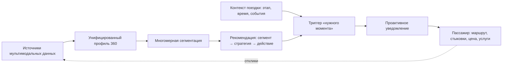

# 01. Описание системы

## Краткое описание

Платформа унифицированного профиля пассажира (УПП) — это сквозной слой клиентских данных между системами оператора ВСМ, холдинга «РЖД» и смежных транспортных сервисов. Платформа собирает разрозненные транзакционные, поведенческие и мобильностные данные пассажира в единую «золотую запись» (Customer 360), строит по ней многомерные мультимодальные признаки и сегменты и **проактивно доставляет персонализированную рекомендацию транспортной услуги в релевантный момент поездки**.

Главный результат для пассажира — релевантное предложение мультимодальной услуги (маршрут «дверь — дверь», стыковка, адресная цена, допуслуга, операционное предупреждение), пришедшее тогда, когда оно полезно, и объяснимое через сегмент и контекст поездки. Главный результат для оператора ВСМ — управляемый клиентский профиль как актив: рост конверсии, среднего чека, доли повторных продаж и пожизненной ценности клиента (LTV).

## Проблема

Клиентские данные железнодорожного транспорта фрагментированы между разрозненными системами: ядро продаж (АСУ «Экспресс»), программа лояльности «РЖД Бонус», мобильное приложение «РЖД Пассажирам», биометрическая посадка, CRM пригородных компаний и партнёрские каналы агрегаторов [2]. Каждая система видит «своего» пассажира: один человек распадается на несколько несвязанных записей, и сквозной путь клиента «дверь — дверь» построить нельзя. Это напрямую бьёт по конверсии в покупку, среднему чеку за счёт сопутствующих услуг, доле повторных продаж и LTV — то есть по метрикам, критичным для окупаемости ВСМ; при этом бесшовная мультимодальная мобильность — целевой ориентир Транспортной стратегии РФ до 2030 года [1].

Существующая программа лояльности решает другую задачу: она сегментирует пассажиров одномерно (уровни по сумме баллов и числу поездок), ретроспективно (вознаграждает за прошлые траты) и мономодально (видит только поездки одного оператора). Систематический обзор персонализации на общественном транспорте подтверждает, что зрелая персонализация требует единого профиля и контекста поездки, а не только истории трат [3].

Вторая половина проблемы — момент и канал. Даже точная рекомендация бесполезна, если она показана не вовремя: предложение такси ценно за несколько минут до прибытия, предложение вагона-ресторана — в поезде, а не после высадки, предупреждение о переносе — сразу при сбое, а навязчивое повторение уже отклонённого предложения снижает доверие. Поэтому система должна не только знать, *что* предложить, но и определять, *когда* и *стоит ли вообще* отправлять уведомление, и доставлять его надёжно.

Концептуальной рамкой для «что, когда и стоит ли» служит организационно-технологическая модель бесшовного обслуживания пассажиров ВСМ [39]: полный путь пассажира «дверь — дверь» разбит на 12 этапов (от решения о поездке до маршрута к месту назначения), сервисные действия разделены на четыре класса (базовые, операционные, помощи, персонализированные), и для каждого класса задано интерпретируемое правило применения. Платформа переводит эту модель в исполняемую архитектуру: этап пути ведётся в контексте поездки, правила — в решающем ядре рекомендательного контура [ADR-0018].

Третья сложность: ВСМ запускается с нуля в 2028 году и не имеет собственной истории взаимодействий. Классические коллаборативные рекомендательные модели в этих условиях не дают персонализацию первым пассажирам (проблема холодного старта) [12, 16]. Платформа должна закрывать этот разрыв переносом знаний из смежных транспортных контуров.

## Целевые пользователи

Система обслуживает конечного благополучателя, программных потребителей и операторов данных:

- **Пассажир** — конечный благополучатель: получает проактивные рекомендации маршрута и услуг и операционные уведомления, управляет согласиями на обработку данных.
- **Приложение и кассы ВСМ** — программные потребители и канал доставки: запрашивают профиль и рекомендации, отображают проактивные уведомления, возвращают отклики пассажира.
- **Бортовой и вокзальный сервисный контур** — потребитель сегмента и предпочтений и канал доставки уведомлений на этапах «вокзал — поезд — прибытие».
- **Аналитик / маркетолог оператора ВСМ** — настраивает сегменты, сервисные стратегии и правила выдачи, оценивает эффект по бизнес-метрикам.
- **Data steward (распорядитель данных)** — контролирует качество «золотой записи», правила разрешения сущностей и инциденты идентичности.
- **Оператор платформы (DevOps/ML)** — следит за конвейерами, обучением моделей, шиной событий, таймерами триггеров и здоровьем сервисов.

## Как пользователь получает результат

Результат доставляется по двум каналам: синхронному (потребитель запрашивает профиль и рекомендации — pull) и проактивному (платформа сама инициирует уведомление в нужный момент — push). Срок доступности профиля — постоянный для активного пассажира; проактивное уведомление имеет окно актуальности, привязанное к этапу поездки.

## Границы MVP

Входит в MVP:

- приём данных из источников железнодорожного и смежного транспорта потоково и пакетно (streaming + batch) с идемпотентностью по `source_event_id`;
- разрешение сущностей (entity resolution) и формирование «золотой записи» пассажира с устойчивым `passenger_id` (MDM-ядро);
- якорение идентичности на подтверждённой учётной записи Госуслуг и ЕБС; ИНН не используется как сквозной ключ;
- управление согласиями и правовыми основаниями обработки (`consent-service`), включая ограничение и удаление обработки по 152-ФЗ;
- построение четырёх групп признаков: транзакционных (RFM), поведенческих, мультимодально-мобильностных и ценностных (LTV);
- ось мультимодальной мобильности как отдельное измерение профиля и сегментации;
- пакетная многомерная сегментация (k-means / иерархическая / GMM) с выбором числа сегментов по метрикам качества и назначением сегментов;
- преодоление холодного старта переносом знаний (cross-domain) для пассажиров без истории ВСМ;
- рекомендация как связка «сегмент → сервисная стратегия → класс действия» с контекстной фильтрацией по этапу поездки и доступности услуги;
- **проактивный контур: триггеры по времени и событиям поездки, проверка eligibility (согласие, право этапа, правило паузы/частоты), сквозная доставка уведомления и фиксация результата доставки**;
- цикл обратной связи: показы, клики, конверсии и отказы возвращаются в журнал событий;
- API чтения профиля и сегмента (Customer 360) для потребителей;
- версионирование моделей и определений сегментов, воспроизводимость сегментации.

Не входит в MVP:

- прямое управление продажами, бронированием и платежами (это контур систем-потребителей);
- собственный пользовательский интерфейс конечного пассажира, кроме экрана управления согласиями (отображение уведомлений — на стороне приложения и бортового контура);
- онлайн-дообучение глубоких моделей в реальном времени (в MVP — пакетное переобучение по расписанию);
- интеграция со всеми возможными партнёрами сразу — в MVP фиксируется минимальный набор источников и каналов доставки;
- кросс-граничный обмен данными и работа вне правового контура РФ.

## Критерии успеха MVP

- По пассажиру из нескольких источников формируется одна «золотая запись» с устойчивым `passenger_id`, и это проверяемо на тестовой популяции.
- Профиль содержит мультимодальную ось мобильности, которой нет в программе лояльности, и эта ось влияет на сегмент (различимость по silhouette/Davies — Bouldin выше, чем у RFM-only) [4].
- Пассажир без истории ВСМ получает осмысленный предсегмент и рекомендации «с первого дня» за счёт переноса знаний, а не значение по умолчанию [12].
- Проактивное уведомление приходит в окне «нужного момента» (например, за 20 ± 0,5 мин до прибытия), не нарушая согласие и правило паузы; повторная доставка не дублирует уведомление.
- Обработка не нарушает правовой контур: межоператорская связка выполняется только при согласии, реализуемы ограничение и удаление обработки.
- Производные витрины (`profile-store`, `feature-store`) восстановимы из источников истины (`identity-graph`, `data-lake`).
- Архитектура допускает добавление новых источников, признаков, сегментов, каналов доставки и потребителей без полной переработки конвейера.
