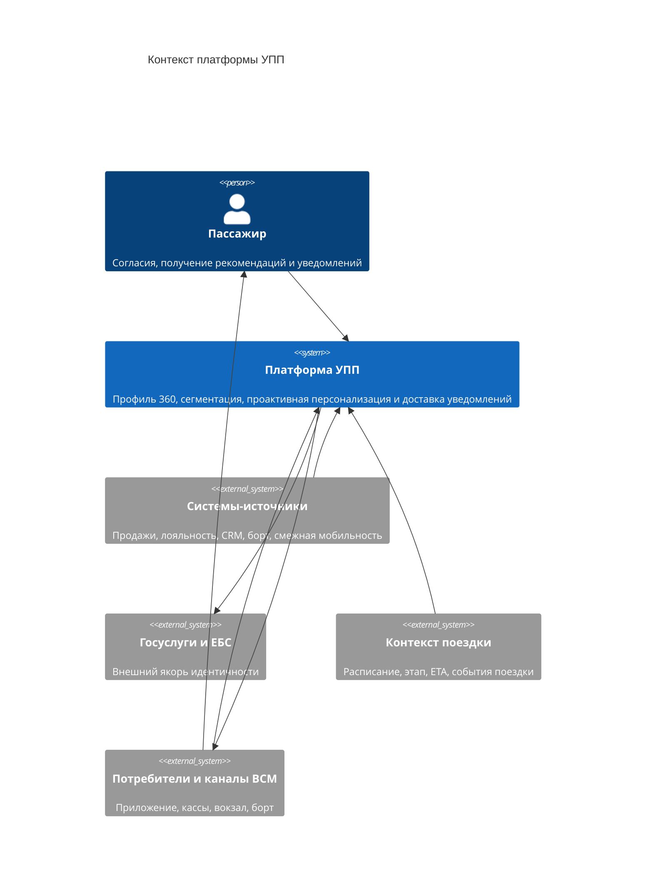

# 02. Контекст и границы

## Системная граница

Платформа УПП рассматривается как backend-слой клиентских данных и персонализации. Внутри границы находятся приём данных, разрешение идентичности, согласия, построение признаков, сегментация, перенос знаний, рекомендации, проактивные триггеры и доставка уведомлений. Снаружи остаются системы-источники данных (продажи, лояльность, CRM, борт, смежная мобильность), внешний якорь идентичности (Госуслуги, ЕБС) и системы-потребители, которые одновременно служат каналами отображения уведомлений (приложение, кассы, вокзальный и бортовой сервис).

Платформа не продаёт билеты и не управляет сервисными действиями физически: она поставляет профиль, рекомендацию и **готовое к доставке уведомление**, а конечное отображение происходит в интерфейсе потребителя. При этом решение «что, когда и стоит ли отправлять» принадлежит платформе.

## Внешние акторы и системы

- **Пассажир** управляет согласиями и получает проактивные уведомления и рекомендации.
- **Системы-источники** (АСУ «Экспресс», «РЖД Бонус», «РЖД Пассажирам», CRM, бортовой сервис, смежная мобильность: аэроэкспресс, метро, такси/каршеринг) передают события транзакций, поездок и мобильности; ориентир для межоператорских контрактов продаж и дистрибуции — отраслевой стандарт UIC OSDM [17].
- **Госуслуги и ЕБС** — внешний якорь идентичности: подтверждают принадлежность записей одному человеку.
- **Системы-потребители и каналы доставки** (приложение и кассы ВСМ, вокзальный и бортовой сервис) запрашивают профиль и рекомендации, отображают уведомления и возвращают отклики.
- **Источник контекста поездки** передаёт расписание, текущий этап, ETA и события (задержка, посадка, прибытие), на которые опирается триггер «нужного момента».

## C4 Context

| Откуда | Куда | Зачем |
|---|---|---|
| Пассажир | Платформа УПП | Даёт и отзывает согласия, получает рекомендации и уведомления |
| Системы-источники | Платформа УПП | Передают события транзакций, поездок и мобильности (streaming + batch) |
| Платформа УПП | Госуслуги и ЕБС | Подтверждает якорь идентичности при разрешении сущностей |
| Контекст поездки | Платформа УПП | Передаёт расписание, текущий этап, ETA и события для триггеров |
| Платформа УПП | Потребители и каналы ВСМ | Отдаёт профиль, рекомендации и готовые к доставке уведомления |
| Потребители и каналы ВСМ | Платформа УПП | Возвращают отклики (показ, клик, конверсия, отказ) и подтверждения доставки |
| Потребители и каналы ВСМ | Пассажир | Физически отображают уведомление пассажиру |

## Входы и выходы системы

- **Входы:** события источников (`source_event_id`), пакетные выгрузки, подтверждения якоря идентичности, согласия пассажира, контекст и события поездки (`trip_id`, этап, ETA), отклики на рекомендации, подтверждения доставки.
- **Выходы:** «золотая запись» и профиль 360 по API, назначения сегментов, рекомендации с объяснением, **намерения на уведомление (`NotificationIntent`) и доставленные уведомления**, статусы исполнения согласий (ограничение/удаление).

## Что входит в MVP и что вынесено за границы

Входит в MVP (внешние зависимости):

- минимальный набор систем-источников железнодорожного и смежного транспорта;
- якорь Госуслуг и ЕБС;
- источник контекста поездки (расписание/ETA/события);
- приложение и бортовой контур как каналы доставки.

Вынесено за пределы MVP (будущие расширения):

- полный охват всех партнёров и операторов смежной мобильности;
- кросс-граничный обмен данными;
- дополнительные каналы доставки (SMS-агрегатор, мессенджеры, голосовые ассистенты) — добавляются позже без изменения контура принятия решения о выдаче;
- прямое управление продажами и платежами (остаётся за системами-потребителями).

## Типичные ошибочные ситуации на границе

- Событие источника приходит повторно или вне порядка — гасится идемпотентностью по `source_event_id`.
- Якорь идентичности недоступен — запись ведётся в контуре одного источника до подтверждения.
- Контекст поездки запаздывает или меняется (перенос, отмена) — таймеры триггеров пересчитываются.
- Канал доставки недоступен — уведомление повторяется по политике доставки или истекает по окну актуальности.
