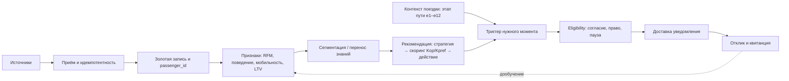

# 03. Требования

## Функциональные требования

| Код | Требование | Приоритет | Проверка |
|---|---|---|---|
| FR-001 | Система принимает события источников потоково и пакетно (streaming + batch) и приводит их к канонической событийной модели | Must | Интеграционный тест приёма потока и выгрузки |
| FR-002 | Приём идемпотентен по `source_event_id`: повторное событие не дублируется в журнале и не применяется дважды | Must | Тест повтора события |
| FR-003 | Система выполняет разрешение сущностей детерминированно (подтверждённые ключи) и вероятностно (Феллеги — Сантер) | Must | Тесты merge/split, набор «две записи → один пассажир?» [24, 25] |
| FR-004 | Система формирует «золотую запись» с устойчивым `passenger_id` и хранит lineage источника каждого поля | Must | Проверка золотой записи и происхождения значений |
| FR-005 | Data steward может подтвердить или откатить спорное слияние без потери исходных записей | Should | Сценарий ручного merge/split через Steward API |
| FR-006 | Система ведёт согласия по источнику и цели обработки; обработка мультимодальных признаков возможна только при действующем согласии | Must | Сценарии с согласием и без |
| FR-007 | Система исполняет ограничение и удаление обработки (152-ФЗ [13]) каскадно по всем хранилищам | Must | E2E отзыва согласия и права на забвение |
| FR-008 | Система строит четыре группы признаков: транзакционные (RFM [18, 19]), поведенческие, мультимодально-мобильностные, ценностные (LTV) | Must | Проверка вектора признаков в feature store |
| FR-009 | Ось мультимодальной мобильности рассчитывается по смежным видам транспорта и участвует в сегментации как отдельное измерение | Must | Сверка вклада оси в различимость сегментов [4, 7] |
| FR-010 | Система выполняет пакетную сегментацию (k-means / иерархическая / GMM) и выбирает число сегментов по silhouette и Davies — Bouldin | Must | Воспроизводимый прогон сегментации |
| FR-011 | Назначение сегмента пассажиру доступно онлайн и идемпотентно по версии модели | Must | Проверка онлайн-назначения и версии |
| FR-012 | Пассажир без истории ВСМ получает предсегмент переносом знаний из смежных доменов (`segment_source = transfer`) | Must | Сценарий холодного старта и смены `segment_source` [12, 16] |
| FR-013 | Рекомендация формируется как связка «сегмент → сервисная стратегия → класс действия» с фильтрацией по контексту поездки и доступности услуги | Must | Проверка таблицы стратегий и контекстной фильтрации |
| FR-014 | Система создаёт **триггер по времени поездки** (например, T−20 мин до прибытия) с durable-таймером | Must | Тест срабатывания таймера и точности окна |
| FR-015 | Система создаёт **триггер по событию поездки** (задержка, посадка, прибытие, перенос) | Must | Тест реакции на событие и пересчёта таймеров |
| FR-016 | Перед отправкой система проверяет eligibility: действующее согласие, право класса действия на этапе, правило паузы/частоты | Must | Сценарии «слать / не слать» |
| FR-017 | Система доставляет уведомление каналу со семантикой at-least-once и дедупликацией по `dedupe_key`; канал обязан быть идемпотентным приёмником и гасить повтор по `intent_id` | Must | Тест повторной доставки без дублирования у пассажира |
| FR-018 | Система фиксирует результат доставки (`DeliveryReceipt`) и принимает отклик пассажира (показ, клик, конверсия, отказ) | Must | Проверка квитанции и записи отклика |
| FR-019 | После заданного числа отказов от класса действия система ставит этот класс на паузу для пассажира (правило паузы) | Must | Сценарий «два отказа → предложение не повторяется» |
| FR-020 | Потребитель может прочитать профиль 360 и сегмент пассажира по API | Must | API-сценарий чтения профиля |
| FR-021 | Модели и определения сегментов версионируются; сегментация воспроизводима при тех же признаках, конфигурации и seed | Must | Golden-тест воспроизводимости |
| FR-022 | Совпадение общего телефона, email или платёжного токена не приводит к автоматическому слиянию разных лиц (защита от семейных/общих билетов); слияние требует подтверждённого якоря или ручного разбора | Must | Тест-кейсы «общий контакт → не один пассажир» |
| FR-023 | Платформа ведёт **этап пути** пассажира как координату из 12 этапов «дверь — дверь» (решение о поездке → … → маршрут до места назначения) [39], проецируя грубые фазы контракта `trip_event` на этапы модели (таблица проекции — раздел 07); классы действий имеют права на этапы | Must | Проверка смены этапа, проекции фаз и прав класса на этапе |
| FR-024 | Решение о выдаче действия классов `операционный` и `дополнительный` вычисляется по интерпретируемому показателю целесообразности (Kop / Kpref) с порогом; входные параметры, веса и итог журналируются для объяснимости [ADR-0018] | Must | Golden-тест скоринга: фиксированные входы → фиксированный показатель |

## Продуктовые правила

### Сегменты, стратегии и классы действий

Сегменты — пример целевого набора первой итерации, опирающийся на практику сегментации пассажиров по данным поездок и смарт-карт [6] и на неоднородность предпочтений в интегрированных мультимодальных перевозках [23]; итоговый состав определяется прогоном сегментации (FR-010). Колонка «класс действия» связывает сегмент с правилами выдачи.

| Сегмент | Профиль (оси) | Сервисная стратегия | Класс действия |
|---|---|---|---|
| Деловой регуляр | F↑ R↑, низкая ценовая чувствительность | приоритетная посадка, бизнес-зал, такси к прибытию | дополнительный |
| Мультимодальный коммьютер | поезд + метро + аэроэкспресс | сквозной маршрут, парковка, MaaS-связка | дополнительный |
| Семейный с детьми | сезонность, багаж, групповые билеты | сопровождение, места рядом, питание | помощь |
| Турист выходного дня | M↑, редкие поездки, отклик на пакеты | пакеты «билет + город», предложения в пути | дополнительный |
| Новый / редкий | история мала, `segment_source = transfer` | welcome-сценарий, информирование, без давления | базовый |

### Классы сервисного действия и правила выдачи

Четыре класса и правила их применения следуют модульной организационно-технологической модели бесшовного обслуживания [39]; архитектурное решение о её принятии как ядра рекомендательного контура — [ADR-0018](adr/0018-модульная-модель-выбора-сервисных-действий.md).

| Класс | Когда включается | Правило выдачи | Подавляется правилом паузы | Примеры |
|---|---|---|---|---|
| `базовый` | минимум этапа поездки | по этапу, без расчёта | нет | билет, статус, информирование, навигация |
| `операционный` | риск сервисного разрыва: сбой, перенос, дефицит времени | `Kop ≥ θop` и ресурс доступен | нет | уведомление о задержке, рекомендация входа/парковки при малом запасе времени |
| `помощь` | потребность пассажира и доступность ресурса | `Need = 1 ∧ Ahelp = 1`; при дефиците ресурса приоритет `Phelp` | частично | ЦСМ, сопровождение, багаж |
| `дополнительный` | релевантность по сегменту, предпочтениям и контексту | `Kpref ≥ θpref` и услуга доступна | да | питание в пути, парковка, такси/каршеринг к прибытию |

### Модульная модель выбора сервисного действия

Состав действий для этапа `e` и пассажирского сценария `p`: `S(e, p) = Sb(e) ∪ Sop(e, p) ∪ Shelp(e, p) ∪ Spref(e, p)` [39].

Показатели целесообразности (параметры нормированы в [0; 1], веса и пороги — версионируемая конфигурация, стартово задаются экспертно и калибруются по откликам):

- `Kop = a1·T + a2·U + a3·N − a4·H − a5·Cres` — снижение временных потерь, неопределённости и риска нарушения маршрута против пользовательской нагрузки и нагрузки на ресурс;
- `Phelp = b1·M + b2·D + b3·Q` — ограничение мобильности, сложность этапа, срочность;
- `Kpref = c1·Mpref + c2·Ctx + c3·L − c4·H − c5·I` — совпадение с предпочтениями, контекст поездки и доступность услуги против нагрузки на пассажира и риска навязчивости.

Пример (сценарий «предложение в вагоне-ресторане» на этапе «досуг и питание в поезде»): при весах `c = (0,35; 0,25; 0,20; 0,10; 0,10)` и входах `Mpref = 0,9`, `Ctx = 0,8`, `L = 1,0`, `H = 0,1`, `I = 0,2` показатель `Kpref = 0,685 ≥ θpref = 0,40` — предложение формируется; если пассажир ранее отказывался от класса или до прибытия мало времени, вход `I`/`Ctx` меняется и предложение не формируется [39].

Разделение ответственности: скоринг выполняет `recommendation-service`, «жёсткие» запреты (согласие, право этапа, пауза, тихие часы, лимит) — eligibility в `trigger-service` (см. раздел [05](05-архитектура.md)).

### Правило паузы и частоты (frequency capping)

| Правило | Значение (MVP) | Где применяется | Как проверить |
|---|---|---|---|
| Пауза после отказов | 2 отказа от класса `дополнительный` → пауза 14 дней по этому классу | `trigger-service` (eligibility) | Сценарий двух отказов |
| Лимит проактивных уведомлений на поездку | не более 3 класса `дополнительный` на один `trip_id` | `trigger-service` | Тест счётчика на поездку |
| Тихие часы | не отправлять `дополнительный` в 23:00–07:00 (искл. `операционный`) | `trigger-service` | Тест окна тихих часов |
| Окно актуальности | уведомление истекает, если момент пройден (этап сменился) | `trigger-service` + `notification-service` | Тест истечения intent |
| Подавление при инциденте | активный операционный инцидент по поездке (задержка, перенос, отмена) подавляет класс `дополнительный` по этому `trip_id` до разрешения инцидента — пассажиру в сбой не продают услуги [42] | `trigger-service` (eligibility) | Сценарий «задержка → предложение такси не отправляется» |

`операционный` класс (сбой/перенос) не подавляется правилом паузы и тихими часами: критическое уведомление о поездке доставляется всегда при действующем согласии.

## Нефункциональные требования

Числовые пороги ниже (p95, задержки, доступность) — **целевые ориентиры**, заданные для проверяемости, а не выведенные из ёмкостного расчёта; они валидируются нагрузочными тестами и калибруются на апробации.

| Код | Требование | Приоритет | Проверка |
|---|---|---|---|
| NFR-001 | Онлайн-сервисы не выполняют тяжёлое обучение и пакетную обработку синхронно | Must | Архитектурное ревью, интеграционные тесты |
| NFR-002 | Потеря события после успешного приёма недопустима | Must | Тесты отказов gateway, шины и потребителей |
| NFR-003 | Источники истины — `identity-graph` (мастер-данные) и `data-lake` (поведение); `event-bus` источником истины не является | Must | Проверка восстановления состояния из источников |
| NFR-004 | Производные витрины (`profile-store`, `feature-store`) восстановимы перестроением из источников истины | Must | Учебный прогон rebuild |
| NFR-005 | Повторная доставка сообщения из `event-bus` не ломает состояние профиля | Must | Тест идемпотентности потребителя |
| NFR-006 | Чтение профиля и сегмента: p95 < 50 мс, p99 < 150 мс | Should | Нагрузочный тест `profile-service` |
| NFR-007 | Ответ рекомендации (pull): p95 < 200 мс | Should | Нагрузочный тест `recommendation-service` |
| NFR-008 | Точность «нужного момента»: проактивное уведомление по времени срабатывает в окне ±30 с от целевой точки | Must | Тест точности таймера |
| NFR-009 | Доставка — at-least-once с дедупликацией по `dedupe_key` (платформа) и по `intent_id` (канал-приёмник); при идемпотентном приёмнике двойного показа пассажиру нет | Must | Тест повторной доставки и дедупликации на канале |
| NFR-010 | Stateless-сервисы и потребители масштабируются горизонтально без локального состояния | Must | Тест перезапуска и добавления реплик |
| NFR-011 | Проверка согласия атомарна и предшествует любому построению мультимодального признака | Must | Конкурентный тест согласие/обработка |
| NFR-012 | Таймеры триггеров durable: переживают перезапуск `trigger-service` без потери и без двойного срабатывания | Must | Тест восстановления таймеров после рестарта |
| NFR-013 | Доступность serving-контура (профиль, рекомендации, доставка) ≥ 99,9%; приём событий продолжается при кратковременной недоступности отдельных потребителей | Must | Тест частичных отказов |
| NFR-014 | Признаки обучения и serving берутся из одного источника (train/serve consistency) | Must | Сверка offline/online признаков |
| NFR-015 | Сегментация воспроизводима при фиксированных входах и seed | Should | Golden-тест |
| NFR-016 | Задержка «событие источника → отражение в онлайн-профиле»: p95 < 5 с | Should | Замер сквозной задержки потока |
| NFR-017 | Качество связывания контролируется: на размеченной популяции — precision/recall связывания и доля ложных слияний; спорные пары идут в ручной разбор, а не авто-слияние | Must | Метрики связывания (раздел 11) |

## Основные сценарии

## Ошибочные и альтернативные сценарии первой итерации

- Событие источника повреждено, не проходит валидацию или приходит вне порядка.
- Якорь идентичности (Госуслуги/ЕБС) недоступен — связка откладывается.
- Спорное вероятностное слияние требует ручного разбора (`identity-service` + Steward API).
- Согласие отсутствует или отозвано — мультимодальные признаки не строятся, профиль обезличивается.
- Контекст поездки изменился (перенос/отмена) после постановки таймера — таймеры пересчитываются или снимаются.
- Eligibility запретил отправку (тихие часы, лимит, пауза) — уведомление не создаётся, причина журналируется.
- Канал доставки недоступен — повтор по политике; при истечении окна актуальности intent помечается `expired`.
- Пассажир дважды отклонил предложение — класс ставится на паузу; повтор не отправляется.
- Версия модели в serving устарела относительно `model-registry` — назначение не перезаписывает более свежее.

## Допущения и зафиксированные учебные значения

Чтобы базовый контракт MVP был проверяемым, ранее открытые параметры зафиксированы как учебные значения (подлежат уточнению при внедрении).

| Параметр | Учебное значение MVP | Чем проверяется |
|---|---|---|
| Формат событий контекста поездки | JSON-событие `trip_event` (`trip_id`, `event_type`, `eta`, `stage`, `occurred_at`, `source_event_id`, …); полная схема — приложение раздела [07](07-данные-и-хранилища.md) | Контрактный тест (раздел 11) |
| Минимальный набор каналов доставки | мобильное приложение (push) и бортовой/вокзальный экран; SMS и мессенджеры — вне MVP | Тест доставки по каналу |
| SLA доступности serving | 99,5% для учебного MVP (целевой ориентир 99,9% — NFR-013) | Замер доступности |
| Целевая пиковая нагрузка | ≈ 23 млн пассажиров/год ≈ 63 тыс./сутки; порядок онлайн-потока — сотни событий/с в пик, проектный запас до ~1–2 тыс. событий/с с учётом пакетных подгрузок; масштабируется партициями Kafka по `passenger_id` | Нагрузочный тест |
| Пороги правила паузы | 2 отказа → пауза 14 дней, лимит 3 на поездку (стартовые) | Сценарии паузы |

Вывод пиковой нагрузки (чтобы число не было «на глаз»): 23 млн пассажиров/год ÷ 365 ≈ 63 тыс./сутки; при ~20–40 событиях на поездку (покупка, этапы поездки, смежная мобильность, отклики) — ≈ 1,3–2,5 млн событий/сутки ≈ десятки событий/с в среднем за активные ~16 ч; пиковый коэффициент ~10× → **сотни событий/с в пик**, плюс пакетные подгрузки источников — отсюда проектный запас до ~1–2 тыс. событий/с. Это умеренная нагрузка, которую реплицируемое онлайн-ядро держит без выделения сервисов (см. [ADR-0016]).

Остаются открытыми (проверяются на следующей итерации):

- Нужен ли отдельный статус частичного отзыва согласия по источникам (`partially_restricted`)?
- Финальная калибровка порогов правила паузы по данным апробации.
