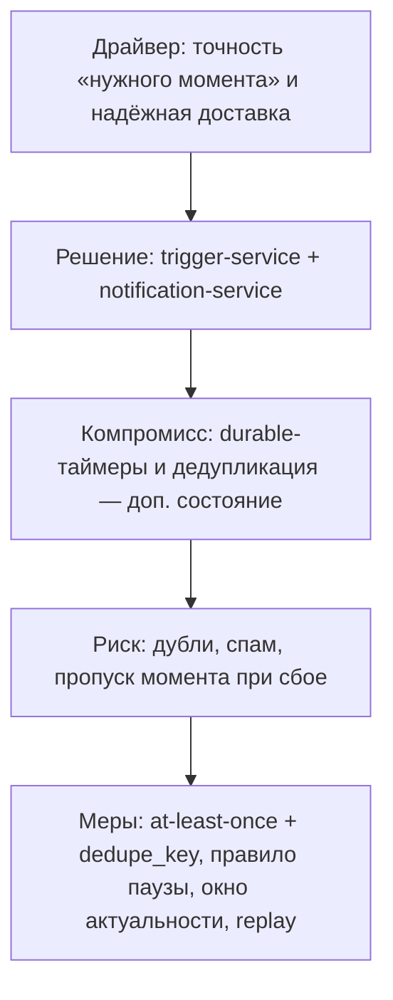

# 04. Архитектурные драйверы

## Ключевые драйверы

| Драйвер | Почему важен | Влияние на архитектуру | Проверка |
|---|---|---|---|
| Отказоустойчивость данных | Потеря клиентского события недопустима, профиль — актив | Реплицируемый журнал (`event-bus`), источники истины отделены от витрин, восстановление перестроением | Тесты отказов и rebuild [ADR-0001, ADR-0002] |
| Скорость онлайн-выдачи | Профиль и рекомендация нужны в интерактивном времени | Serving по KV/документным витринам, тяжёлое обучение вынесено в batch | Нагрузочные тесты p95 (NFR-006, NFR-007) |
| Точность «нужного момента» | Ценность уведомления зависит от времени доставки | Отдельный `trigger-service` с durable-таймерами и реакцией на события | Тест точности окна ±30 с [ADR-0008] |
| Надёжная доставка без навязчивости | Уведомление нельзя потерять и нельзя дублировать/спамить | At-least-once + идемпотентная дедупликация + правило паузы в eligibility | Тесты повторной доставки и паузы [ADR-0009] |
| Единый идентификатор пассажира | Без устойчивого `passenger_id` профиль распадается | MDM-ядро: детерминированное + вероятностное разрешение сущностей | Тесты merge/split [ADR-0003] |
| Правовой контур 152-ФЗ | Межоператорские данные обрабатываются только законно | `consent-service` как gate, якорь на Госуслугах/ЕБС, без ИНН как ключа | Сценарии согласий [ADR-0004] |
| Мультимодальная новизна | Ось мобильности — научный вклад работы | Отдельная группа признаков и измерение сегментации, сравнение с RFM-only | Метрики различимости [ADR-0010] |
| Холодный старт ВСМ | Сервис запускается без истории взаимодействий | Контур переноса знаний, `segment_source = transfer → native` | Сценарий cold-start [ADR-0005] |
| Объяснимость сервисных решений | «Почему предложили» должно быть воспроизводимо для пассажира, оператора и регулятора; ML-ранжировщик не обучить без откликов | Модульная интерпретируемая модель выбора действий: классы сервисов, скоринг Kop/Kpref с порогом, журналирование входов и весов [39] | Golden-тест скоринга (FR-024) [ADR-0018] |
| Согласованность train/serve | Расхождение признаков ломает качество моделей | Единый feature store (offline + online) | Сверка offline/online [ADR-0006] |
| Воспроизводимость моделей | Сегменты и рекомендации должны быть объяснимы | `model-registry`, версии моделей и определений сегментов, фиксированный seed | Golden-тесты (NFR-015) |
| Горизонтальное масштабирование | Пик нагрузки при ≈ 23 млн пассажиров/год | Stateless-сервисы, партиционирование шины по `passenger_id` | Тест добавления реплик (NFR-010) |
| Эволюция контрактов событий | Источники и каналы добавляются со временем | Реестр схем событий, версионирование сообщений | Контрактные тесты (раздел 11) |

## Главные компромиссы

- Событийная потоково-пакетная архитектура сложнее синхронного монолита, но даёт отказоустойчивость, replay и независимое масштабирование стадий.
- Разделение источников истины и витрин усложняет согласованность (eventual consistency), но позволяет перестраивать витрины и не терять данные.
- Apache Kafka как журнал даёт долговечность и replay ценой более высокой эксплуатационной сложности и хвостовой задержки по сравнению с лёгким брокером; для роли журнала данных это оправдано [ADR-0007].
- Отдельный `trigger-service` с durable-таймерами добавляет сервис и состояние таймеров, но без него «нужный момент» неточен.
- At-least-once доставка проще exactly-once, но требует идемпотентной дедупликации на стороне доставки.
- Вероятностное разрешение сущностей повышает полноту связывания ценой ложных слияний — отсюда обратимость merge и Steward API.
- Пакетное переобучение сегментации проще онлайн-обучения, но сегмент обновляется с задержкой каденса; для MVP это приемлемо.
- Правило паузы и тихие часы снижают конверсию отдельных показов, но повышают доверие и долгосрочную ценность; `операционный` класс из-под правила выведен.
- Интерпретируемый скоринг выбора действий (Kop/Kpref) объясним и работает с первого дня без истории откликов, но требует экспертной настройки весов; после накопления откликов сравнивается с ML-ранжированием [ADR-0018].

## Карта влияния ключевого драйвера

## Решения, оформленные ADR

- [ADR-0001: Событийная потоково-пакетная архитектура](adr/0001-событийная-потоково-пакетная-архитектура.md)
- [ADR-0002: Разделить источники истины и производные витрины](adr/0002-разделить-источники-истины.md)
- [ADR-0003: Разрешение сущностей — детерминированное + вероятностное](adr/0003-разрешение-сущностей.md)
- [ADR-0004: Якорь идентичности и согласие (152-ФЗ)](adr/0004-якорь-идентичности-и-согласие.md)
- [ADR-0005: Перенос знаний для холодного старта](adr/0005-перенос-знаний-для-холодного-старта.md)
- [ADR-0006: Online + offline feature store](adr/0006-online-offline-feature-store.md)
- [ADR-0007: Брокер — Apache Kafka, NATS как альтернатива](adr/0007-брокер-kafka-vs-nats.md)
- [ADR-0008: Сервис триггеров с durable-таймерами](adr/0008-сервис-триггеров-durable-таймеры.md)
- [ADR-0009: Семантика доставки и правило паузы](adr/0009-семантика-доставки-и-правило-паузы.md)
- [ADR-0010: Ось мультимодальной мобильности в сегментации](adr/0010-ось-мультимодальной-мобильности.md)
- [ADR-0011: Механизм durable-таймеров](adr/0011-механизм-durable-таймеров.md)
- [ADR-0012: Стирание данных — крипто-шреддинг](adr/0012-стирание-данных-крипто-шреддинг.md)
- [ADR-0013: Деградация пути отправки и DLQ конвейера](adr/0013-деградация-пути-отправки-и-dlq-конвейера.md)
- [ADR-0014: Zero-trust и mTLS между сервисами](adr/0014-zero-trust-mtls-между-сервисами.md)
- [ADR-0015: Lakehouse для больших данных и геораспределение по ЦОД](adr/0015-lakehouse-и-геораспределение-цод.md)
- [ADR-0016: Гранулярность — модульный монолит для онлайн-ядра](adr/0016-гранулярность-модульный-монолит.md)
- [ADR-0017: Протокол надёжного приёма событий](adr/0017-протокол-надёжного-приёма.md)
- [ADR-0018: Модульная интерпретируемая модель выбора сервисных действий](adr/0018-модульная-модель-выбора-сервисных-действий.md)
