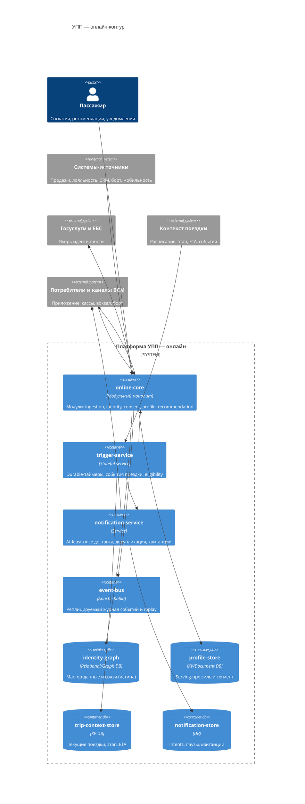
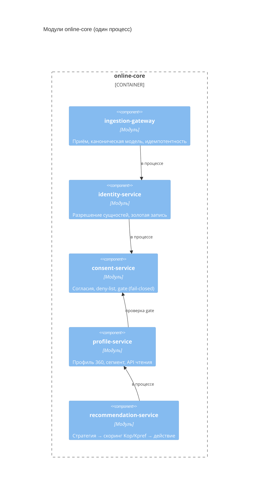
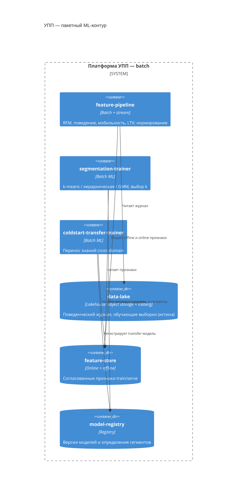
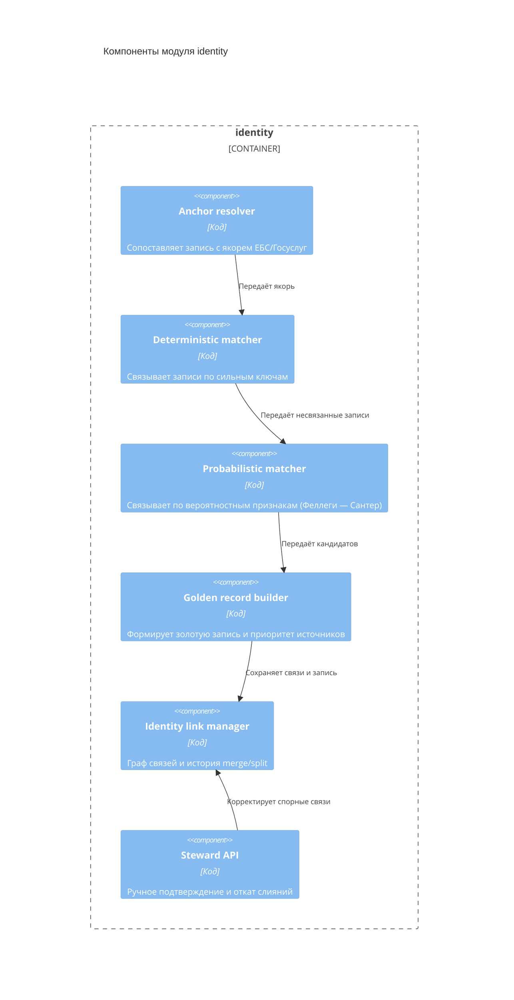
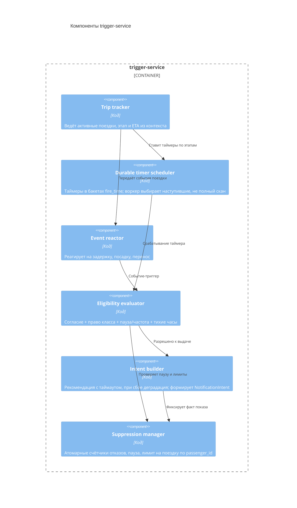
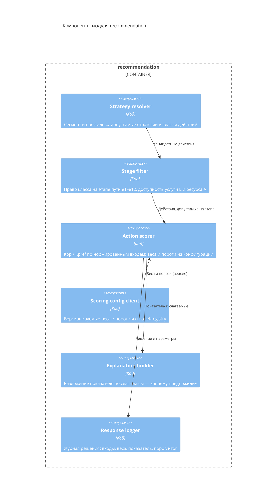

# 05. Архитектура

## Архитектурный стиль

Платформа УПП строится как **событийная (event-driven) потоково-пакетная система** вокруг общей шины событий [ADR-0001]. Онлайн-контур обеспечивает приём событий, разрешение идентичности, обновление профиля, низколатентные рекомендации и точные по времени проактивные уведомления. Пакетный контур по расписанию строит признаки, обучает сегментацию и перенос знаний.

Важно про гранулярность: контейнеры онлайн-ядра ниже — это **логические модули**, а не обязательно отдельные сервисы. В MVP онлайн-ядро развёртывается как **модульный монолит**, а отдельными процессами выделены только компоненты, которые этого требуют по драйверу (пакетные тренеры, `trigger-service`, `notification-service`, инфраструктура). Это сознательный выбор против преждевременной декомпозиции и «распределённого монолита» [ADR-0016].

Источник истины разделён: `identity-graph` хранит мастер-данные и связи идентичности, `data-lake` — неизменяемый поведенческий журнал; `profile-store`, `feature-store`, `trip-context-store`, `notification-store` и назначения сегментов — производные витрины, восстановимые из источников истины [ADR-0002]. Шина `event-bus` (Apache Kafka) доставляет события и даёт replay, но источником истины не считается [ADR-0007]. Любая обработка мультимодального признака возможна только при действующем согласии (gate `consent-service`).

## Контейнеры: онлайн-контур (serving и проактивная доставка)

Здесь показаны **деплои** (один процесс `online-core` + отдельные `trigger-service`, `notification-service`, инфраструктура), а не логические модули — согласовано с [ADR-0016]. Стрелки — сетевые границы; вызовы между модулями внутри `online-core` сетевыми не являются. Внутреннее устройство `online-core` — на компонентной диаграмме ниже.

## Модули online-core

Швы для будущего выделения (см. [ADR-0016]): **read-serving** (`profile-service` + `recommendation-service`) — первый кандидат на отдельный деплой по трафику чтения; **ingest+identity** (`ingestion-gateway` + `identity-service`) — второй, под объём записи; **`consent-service`** остаётся встроенной быстрой проверкой (deny-list-кэш), а не сетевым сервисом на горячем пути.

Ниже — **сетевые связи деплоев** (вызовы между модулями внутри `online-core` идут в процессе и в таблице не показаны); детали обращения к `event-bus` и витринам также в разделе [данных](07-данные-и-хранилища.md) и на диаграмме [развёртывания](08-развертывание.md).

| Откуда | Куда | Зачем |
|---|---|---|
| Системы-источники | `online-core` (ingestion) | Передают события транзакций, поездок и мобильности |
| `online-core` | `event-bus` | Публикует канонические события и читает их между модулями |
| `online-core` (identity) | Госуслуги и ЕБС | Подтверждает якорь идентичности |
| `online-core` (identity) | `identity-graph` | Хранит «золотую запись» и связи (источник истины) |
| `online-core` (profile) | `profile-store` | Обновляет и читает serving-профиль |
| Контекст поездки | `trigger-service` | Передаёт расписание, этап, ETA и события поездки |
| `trigger-service` | `online-core` (recommendation, consent) | Запрашивает рекомендацию для момента и проверяет согласие |
| `trigger-service` | `trip-context-store` | Хранит активные поездки и durable-таймеры |
| `trigger-service` | `notification-service` | Передаёт `NotificationIntent` к доставке |
| `notification-service` | Потребители и каналы ВСМ | Доставляет уведомление (at-least-once, дедуп) |
| `notification-service` | `notification-store` | Хранит intents, паузы и квитанции |
| Потребители и каналы ВСМ | `online-core` (recommendation) | Запрашивают рекомендации (pull) |
| Потребители и каналы ВСМ | `event-bus` | Возвращают отклики (показ, клик, конверсия, отказ) |

## Контейнеры: пакетный ML-контур (offline)

Связь контуров: `feature-pipeline` пишет online-признаки, которые читают `profile-service` и `recommendation-service`; `segmentation-trainer` и `coldstart-transfer-trainer` регистрируют модели в `model-registry`, а назначения сегментов передаются в `profile-service` → `profile-store`. `ingestion-gateway` и потребители пишут события в `data-lake` через `event-bus` (Kafka Connect-приёмник).

## Ответственность контейнеров

Ниже — ответственность по логическим частям. Первые пять (`ingestion-gateway`, `identity-service`, `consent-service`, `profile-service`, `recommendation-service`) — модули `online-core` (один деплой), остальные — отдельные сервисы и хранилища.

| Контейнер / модуль | Ответственность |
|---|---|
| `ingestion-gateway` (модуль) | Приём событий и выгрузок, каноническая модель, идемпотентность по `source_event_id` (через `ingest-dedup-store` с TTL), базовая валидация |
| `identity-service` (модуль) | Детерминированное и вероятностное разрешение сущностей, граф связей, «золотая запись», устойчивый `passenger_id`, merge/split |
| `consent-service` (модуль) | Согласия и правовые основания по источнику и цели, gate обработки (deny-list, fail-closed), ограничение и удаление (152-ФЗ) |
| `profile-service` (модуль) | Профиль 360, текущие признаки и сегмент, `segment_source`, API чтения; **онлайн-применение зарегистрированной transfer-модели** для предсегмента холодных пользователей (cold-start serving) |
| `feature-pipeline` | Четыре группы признаков, нормирование, запись в offline и online feature store, обучающие выборки |
| `segmentation-trainer` | Пакетная кластеризация, выбор числа сегментов, назначение сегментов, регистрация модели |
| `coldstart-transfer-trainer` | **Пакетное** обучение переноса знаний (cross-domain) и регистрация transfer-модели в `model-registry`; онлайн-инференс не выполняет |
| `recommendation-service` (модуль) | Связка «сегмент → стратегия → класс действия» и **модульная модель выбора** [ADR-0018]: скоринг `Kop`/`Kpref` против порога, контекстная фильтрация по этапу пути, объяснение (разложение показателя по слагаемым), журнал откликов |
| `trigger-service` | Durable-таймеры по этапам поездки (бакеты `fire_time`), реакция на события, eligibility, формирование `NotificationIntent`; события поездки приходят с ключом `trip_id` и **репартиционируются по `passenger_id`**, апдейты `SuppressionState` атомарны |
| `notification-service` | Доставка at-least-once, дедупликация по `dedupe_key`, повторы, DLQ, квитанции `DeliveryReceipt`; требует идемпотентного приёмника (канал гасит повтор по `intent_id`) |
| `event-bus` (Kafka) | Доставка событий, партиционирование по `passenger_id`, replay; не источник истины |
| `data-lake` | Истина по поведению: неизменяемый журнал и обучающие выборки |
| `identity-graph` | Истина по мастер-данным: «золотая запись» и связи идентичности |
| `profile-store` | Производная витрина serving-профиля и сегмента для быстрого чтения |
| `feature-store` | Согласованные признаки обучения и serving (offline + online) |
| `model-registry` | Версии моделей сегментации, переноса и стратегий, определения сегментов |
| `trip-context-store` | Текущие поездки, этап, ETA и durable-таймеры, индексированные по бакетам `fire_time` |
| `notification-store` | `NotificationIntent`, состояние пауз (`SuppressionState`), квитанции доставки |
| `ingest-dedup-store` | Виденные `source_event_id` с TTL для идемпотентного приёма |
| `key-store` | Ключи шифрования на субъект (`passenger_id`) для крипто-шреддинга при удалении (152-ФЗ) |

## Ключевые политики

| Политика | Где реализуется | Почему здесь | Как проверить |
|---|---|---|---|
| Идемпотентность приёма | `ingestion-gateway` | Все события проходят одну границу входа | Тест повтора по `source_event_id` |
| Разрешение сущностей и приоритет якорей | `identity-service` | Единственная точка формирования «золотой записи» | Тесты merge/split, метрики связывания |
| Gate обработки по согласию | `consent-service` + `feature-pipeline` + `trigger-service` | Признаки и уведомления невозможны без правового основания | Сценарии с согласием и без |
| Eligibility выдачи уведомления | `trigger-service` | Решение «слать/не слать» централизовано и воспроизводимо | Сценарии «слать/не слать», тесты паузы |
| Точность момента (durable-таймеры) | `trigger-service` + `trip-context-store` | Таймеры в бакетах `fire_time` переживают рестарт без потери/дублей; партиция по `passenger_id` | Тест восстановления и точности окна |
| Семантика доставки | `notification-service` + канал | At-least-once + дедуп по `dedupe_key` (платформа) и `intent_id` (канал-приёмник) | Тест повторной доставки и дедупа канала |
| Каденс сегментации | `segmentation-trainer` + `profile-service` | Обучение пакетное, назначение онлайн по версии | Проверка расписания и онлайн-назначения |
| Стабильность меток сегментов | `segmentation-trainer` + `model-registry` | Метки маппятся old→new по overlap/центроидам; downstream ключуется на стабильный `segment_code`; split/merge и смена k обрабатываются явно (раздел 07) | Тест маппинга, split/merge и стабильности меток |
| Политика холодного старта | `coldstart-transfer-trainer` (обучение) + `profile-service` (онлайн-инференс) | Обучение пакетное, применение transfer-модели онлайн; переход `transfer → native` | Сценарий смены `segment_source` |
| Согласованность train/serve | `feature-store` | Признаки обучения и serving из одного источника | Сверка offline/online |
| Интерпретируемый выбор сервисного действия | `recommendation-service` (скоринг) + `trigger-service` (запреты eligibility) | Скоринг и «жёсткие» правила разделены: показатель объясним, запреты авторитетны; веса и пороги — версионируемая конфигурация в `model-registry` | Golden-тест скоринга (FR-024), сценарии «слать/не слать» [ADR-0018] |

## Компоненты модуля identity

Модуль `identity` — критическая часть `online-core`: от корректности «золотой записи» зависят все признаки, сегменты и рекомендации.

### Качество связывания и спорные случаи

Связывание — самый ответственный шаг: ложное слияние объединяет данные разных людей (инцидент приватности), а пропущенная связь дробит профиль. Поэтому вероятностный матчинг (Феллеги — Сантер) использует **два порога** [24, 25]:

- выше верхнего порога — автоматическая связка;
- ниже нижнего — записи считаются разными;
- между порогами — серая зона (clerical review): спорные пары идут в Steward API на ручное подтверждение, а не сливаются автоматически.

Для масштаба применяется **блокинг**: сравниваются не все пары, а кандидаты внутри блоков по грубому ключу (например, нормализованный телефон или префикс документа), иначе число сравнений квадратично [25, 36].

Отдельно обрабатываются **семейные и общие билеты** — главный источник ложных слияний на железной дороге: общий телефон, email или платёжный токен НЕ являются достаточным основанием для слияния разных физических лиц. Такие совпадения дают только «кандидат на связку» и требуют подтверждённого якоря (Госуслуги/ЕБС) либо ручного разбора.

Качество связывания измеримо (раздел 11): на размеченной тестовой популяции — precision/recall связывания и доля ложных слияний (false-merge rate); на проде без ground truth — доля пар в серой зоне, частота split-операций и аудит выборок clerical review [36].

## Компоненты trigger-service

`trigger-service` — сердце проактивного контура: он отвечает за «когда» и «стоит ли» отправлять уведомление и за устойчивость таймеров к сбоям.

| Откуда | Куда | Зачем |
|---|---|---|
| Trip tracker | Durable timer scheduler | Ставит таймер «нужного момента» по ETA и этапу |
| Durable timer scheduler / Event reactor | Eligibility evaluator | Передаёт кандидатный момент на проверку |
| Eligibility evaluator | Suppression manager | Проверяет паузу, лимит на поездку и тихие часы |
| Eligibility evaluator | Intent builder | Разрешает формирование уведомления |
| Intent builder | Suppression manager | Фиксирует показ для будущего правила паузы |

## Компоненты модуля recommendation

Модуль `recommendation` реализует решающее ядро — модульную интерпретируемую модель выбора сервисных действий [ADR-0018]: `S(e, p) = Sb ∪ Sop ∪ Shelp ∪ Spref` со скорингом `Kop`/`Kpref` против порога (см. продуктовые правила в разделе [03](03-требования.md)).

Разделение с eligibility в `trigger-service` намеренное: скоринг отвечает на вопрос «насколько действие целесообразно» и настраивается конфигурацией; eligibility применяет авторитетные запреты (согласие, пауза, тихие часы, лимит), которые не могут быть «перевешены» высоким показателем. Оба решения журналируются, поэтому любой показ или отказ от показа воспроизводим.

## Правила зависимостей

- Построение признаков и сегментация не зависят от HTTP-интерфейсов потребителей; работают по `data-lake` и `feature-store`.
- Онлайн-сервисы не выполняют тяжёлое обучение inline.
- Любая обработка мультимодальных признаков и любое уведомление проходят gate `consent-service`. Гейт проверяет `consent_version` и tombstone/deny-list по `passenger_id` и работает fail-closed: при устаревшем согласии или активном deny-list событие не применяется, а serving блокируется.
- `event-bus` не источник истины; состояние восстанавливается из `identity-graph` и `data-lake`, витрины перестраиваются.
- Решение о выдаче уведомления принимается только в `trigger-service` (eligibility); `notification-service` отвечает лишь за надёжную доставку, но не решает «слать ли».
- Вызовы на пути отправки (`trigger-service` → `recommendation-service`, `trigger-service` → `consent-service`) имеют таймауты и деградацию: при недоступности рекомендации класс `дополнительный` пропускается или берёт безопасный дефолт из кэша, а класс `операционный` доставляется в обход рекомендаций. Так медленная зависимость не блокирует «нужный момент».
- `trigger-service` партиционируется строго по `passenger_id`: все поездки и `SuppressionState` одного пассажира сериализуются на одной реплике, а апдейты счётчиков пауз атомарны — исключается гонка `decline_count` между параллельными поездками.
- Downstream-логика (стратегии, eligibility) ключуется на стабильный `segment_code`, а не на сырой номер кластера; сопоставление старых и новых сегментов между прогонами ведёт `segmentation-trainer` и хранит в `model-registry`. Так пользователь не «прыгает» между сегментами из-за переобучения.
- `recommendation-service` доверяет сегменту из `profile-store`, но сверяет версию модели в `model-registry`.
- Источник значения каждого поля «золотой записи» фиксируется для lineage и объяснимости.
