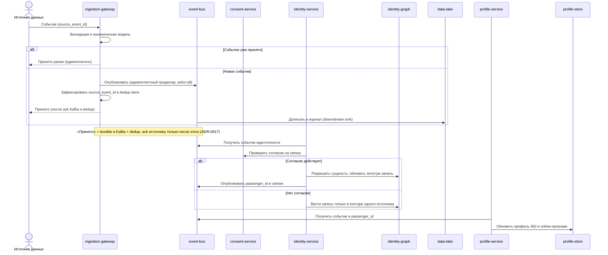
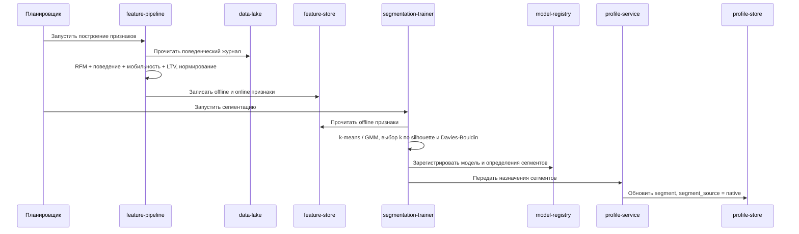
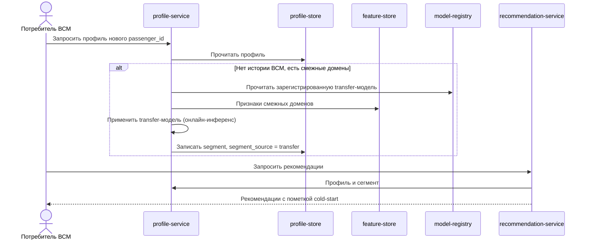
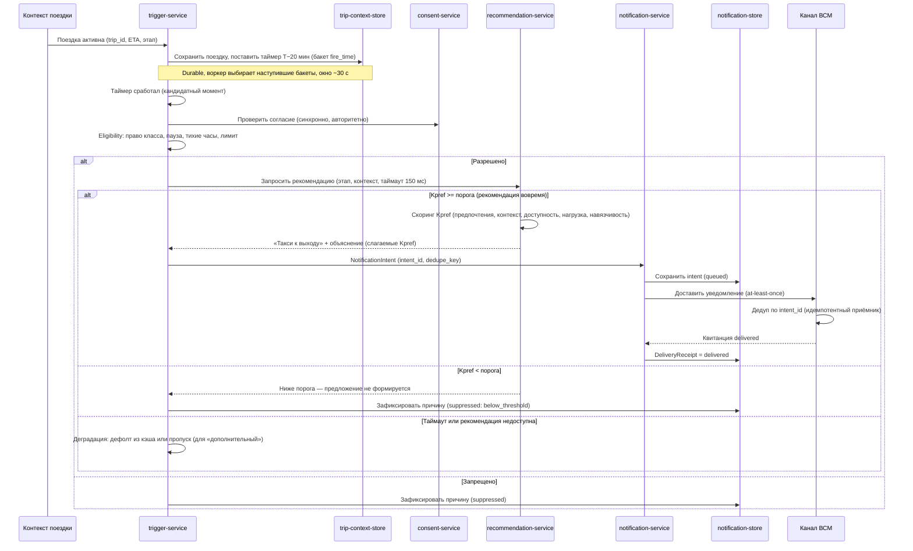
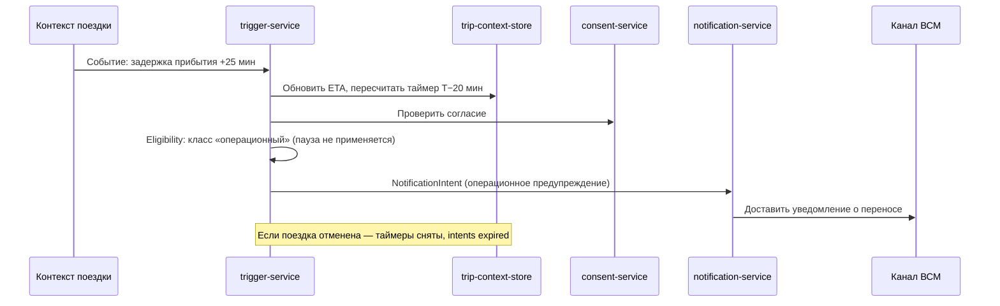
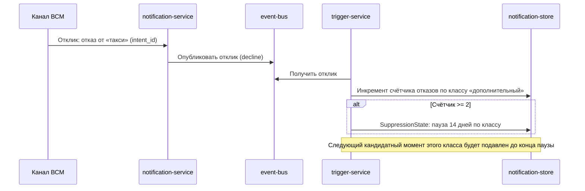
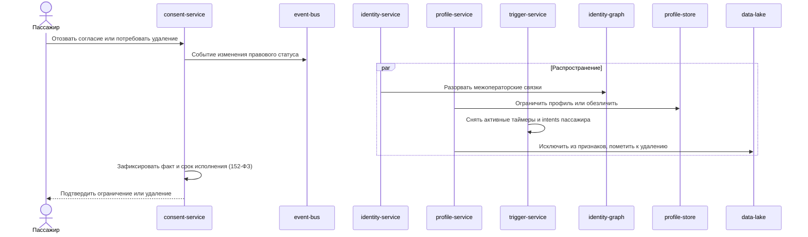
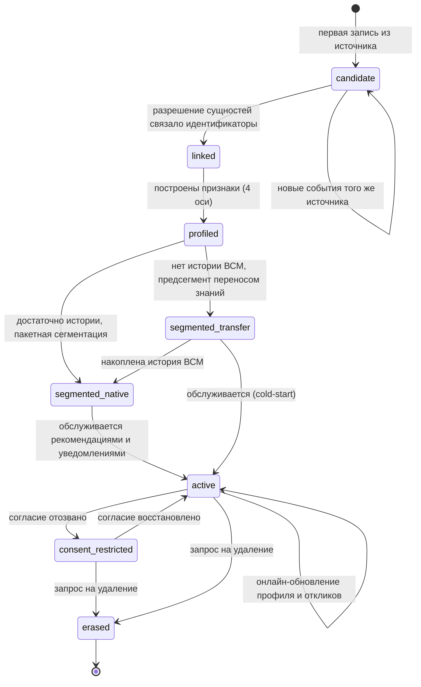
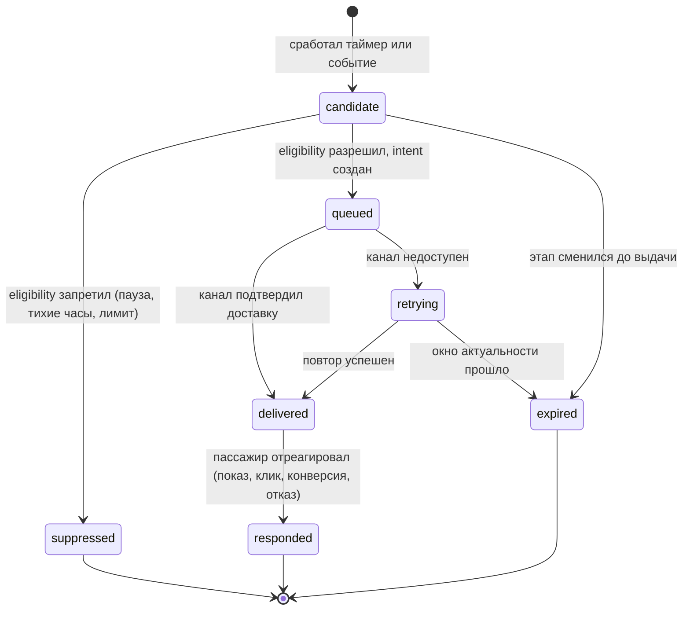

# 06. Сценарии и потоки

> Замечание по границам: участники `ingestion-gateway`, `identity-service`, `consent-service`, `profile-service`, `recommendation-service` — это **модули одного процесса `online-core`** (см. [ADR-0016](adr/0016-гранулярность-модульный-монолит.md)). Стрелки между ними на диаграммах — вызовы в процессе, а не сетевые. Настоящие сетевые границы — только к `event-bus`, `trigger-service`, `notification-service`, хранилищам и внешним системам.

## Приём события и обновление профиля (онлайн)

## Пакетная сегментация (offline)

## Холодный старт нового пассажира ВСМ

Важно: обучение transfer-модели — офлайн (`coldstart-transfer-trainer`, см. пакетную диаграмму в разделе 05). Здесь показан только **онлайн-инференс** уже зарегистрированной модели; его выполняет `profile-service`, а не пакетный тренер.

## Проактивное уведомление по времени поездки (ключевой сценарий)

Сценарий «за 20 минут до прибытия предложить такси» (класс `дополнительный`; действие относится к этапу «маршрут до места назначения», но выдаётся заранее — пока пассажир ещё в поезде). `trigger-service` ставит durable-таймер при входе поездки в активный контур и при срабатывании проходит eligibility, прежде чем сформировать `NotificationIntent`. `recommendation-service` внутри вычисляет `Kpref` [ADR-0018]: предложение формируется только при `Kpref ≥ θpref`.

## Персонализированное предложение в поезде (этап «досуг и питание»)

Поток идентичен ключевому сценарию выше, отличаются триггер и входы скоринга, поэтому диаграмма не дублируется. Триггер — событие посадки (этап пути сменился на «досуг и питание в поезде»); `trigger-service` ставит таймер на окно предложения (например, T+15 мин после отправления, вне тихих часов). `recommendation-service` считает `Kpref` для действия «предложение вагона-ресторана»: с числовым примером из раздела [03](03-требования.md) (`Kpref = 0,685 ≥ θpref = 0,40`) предложение формируется и доставляется на канал (push или бортовой экран). Контрпримеры, когда предложение **не** формируется:

- пассажир дважды отказался от класса `дополнительный` — eligibility подавляет кандидатный момент ещё до скоринга (пауза);
- до прибытия осталось меньше окна актуальности — вход `Ctx` падает, `Kpref < θpref`, фиксируется `suppressed: below_threshold`;
- услуга недоступна (вагон-ресторан закрыт, `L = 0`, `A = 0`) — действие отсекается фильтром этапа до скоринга.

## Реакция на задержку: пересчёт таймера и операционное уведомление

`операционный` класс не подавляется правилом паузы и тихими часами.

## Правило паузы после отказов

## Отзыв согласия и право на забвение

## Жизненный цикл PassengerProfile

## Жизненный цикл NotificationIntent

## Правила повторов и идемпотентности

- Повторное событие из `event-bus` сверяется с состоянием; уже применённое не применяется повторно (ключ `source_event_id`).
- Применение событий к профилю коммутативно и идемпотентно: при слиянии личностей события переносятся на общий `passenger_id`, и строгий порядок между ранее раздельными потоками (с разных партиций) не гарантируется — корректность профиля от порядка не зависит.
- Разрешение сущностей идемпотентно; merge обратим через Steward API (split) без потери исходных записей.
- Пакетный прогон сегментации воспроизводим при тех же признаках, конфигурации и seed.
- Метки сегментов между прогонами сопоставляются old→new по близости центроидов; downstream-логика ключуется на стабильный `segment_code`, поэтому пассажир не «прыгает» между сегментами из-за переобучения (правила split/merge и смены k — раздел [07](07-данные-и-хранилища.md)).
- Назначение сегмента онлайн идемпотентно по версии модели; устаревшая версия не перезаписывает более свежую.
- Срабатывание таймера идемпотентно: один `dedupe_key` на (`passenger_id`, `trip_id`, тип триггера); повтор не создаёт второй intent.
- Доставка at-least-once: канал может получить уведомление повторно; дубль гасится на двух уровнях — `dedupe_key` в платформе (не создаётся второй intent) и `intent_id` на канале (идемпотентный приёмник), поэтому пассажир не видит повтор.
- Изменение согласия применяется ко всем хранилищам и к активным таймерам; повторное событие согласия не меняет уже исполненный статус.
- Удаление или отзыв согласия создаёт **tombstone (deny-list) по `passenger_id`**: входящие события такого пассажира (включая поездки, пришедшие после запроса на удаление) не применяются к профилю и не идут в признаки, а serving — рекомендации и уведомления — блокируется. Каждое событие несёт `consent_version`; обработка **fail-closed**: при устаревшей или неизвестной версии согласия событие не применяется. Порядок `ConsentChanged` относительно входящих событий обеспечивается партиционированием шины по `passenger_id` (события одного пассажира строго упорядочены). Схема `ConsentChanged` — в приложении раздела [07](07-данные-и-хранилища.md).
- Отклик дописывается в журнал и влияет на serving (правило паузы) сразу, а на модели — со следующего пакетного дообучения.

## Открытые вопросы

- Снимать ли предсегмент `transfer` сразу при первом native-сегменте или сглаживать переход?
- Нужен ли статус `partially_restricted` для частичного отзыва согласия по отдельным источникам?
- Хранить ли счётчики паузы по классу действия или по конкретной услуге (гранулярность frequency capping)?
