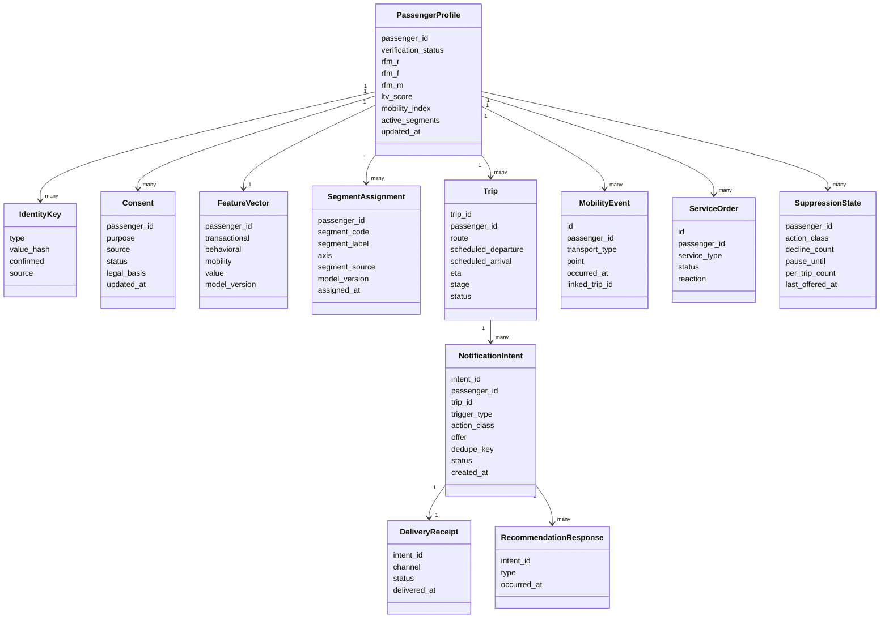

# 07. Данные и хранилища

## Источник истины

Истина разделена по двум осям. `identity-graph` — источник истины по мастер-данным: «золотая запись», идентификаторы и связи идентичности с историей merge/split. `data-lake` — источник истины по поведению: неизменяемый (append-only) журнал канонических событий и обучающие выборки, реализованный как **lakehouse** (объектное хранилище + табличный формат Apache Iceberg, см. ниже и [ADR-0015]). Всё остальное производно: `profile-store` (serving-профиль и сегмент), `feature-store` (признаки), `trip-context-store` (активные поездки и таймеры), `notification-store` (intents, паузы, квитанции), `model-registry` (версии моделей). При расхождении витрины чтения (`profile-store`, `feature-store`) перестраиваются из источников истины; операционные хранилища (`trip-context-store`, `notification-store`) несут оперативное состояние и дополнительно защищаются репликацией между ЦОД (см. раздел [08](08-развертывание.md)). `event-bus` хранит события ограниченное время для доставки и replay, но истиной не является [ADR-0002].

## Основные сущности



## Хранилища

| Хранилище | Что хранит | Почему здесь |
|---|---|---|
| `identity-graph` | «Золотая запись», `IdentityKey`, связи, история merge/split | Источник истины по мастер-данным, связи естественно ложатся на граф |
| `data-lake` | Append-only журнал событий (ПДн шифруются ключом субъекта), `MobilityEvent`, `ServiceOrder`, отклики, обучающие выборки | Источник истины по поведению, дешёвое долговременное хранение, аналитика |
| `profile-store` | `PassengerProfile`, `SegmentAssignment`, online-признаки для чтения | Низколатентное serving по `passenger_id` |
| `feature-store` | `FeatureVector` offline и online | Согласованность train/serve |
| `trip-context-store` | `Trip`, ETA, этап, durable-таймеры с индексом по бакетам `fire_time` | Быстрый доступ, устойчивость и точность таймеров |
| `notification-store` | `NotificationIntent`, `SuppressionState`, `DeliveryReceipt` | Дедупликация, паузы и аудит доставки |
| `ingest-dedup-store` | Виденные `source_event_id` с TTL | Идемпотентность приёма на границе входа |
| `key-store` | Ключи шифрования на субъект (`passenger_id`) | Крипто-шреддинг: удаление ключа стирает ПДн в журнале и бэкапах |
| `model-registry` | Версии моделей, определения сегментов, **конфигурация скоринга** (веса `a, b, c` и пороги `θop`, `θpref` модульной модели выбора действий [ADR-0018]) | Воспроизводимость, откат, объяснимость решения по версии |
| `event-bus` (Kafka) | Канонические события в пути, партиции по `passenger_id` | Доставка и replay, не истина |

## Ключи идемпотентности и происхождение

- `source_event_id` — внешний идентификатор события источника; виденные значения хранятся в `ingest-dedup-store` с TTL (окно возможных повторов), вне окна повтор гасится идемпотентными потребителями ниже по потоку. Гарантирует, что одно событие не применяется дважды.
- `passenger_id` — устойчивый внутренний идентификатор «золотой записи»; ключ партиционирования шины и serving-чтения.
- `dedupe_key` = (`passenger_id`, `trip_id`, `trigger_type`) — гарантирует, что один кандидатный момент порождает не более одного уведомления, даже при повторной доставке.
- `model_version` — версия модели/определения сегмента; защищает от перезаписи свежего назначения устаревшим.
- `consent_version` — версия согласия пассажира на момент события; обработка сверяет её с текущей и работает fail-closed при устаревшей или неизвестной версии.
- Tombstone / deny-list по `passenger_id` хранится в `identity-graph` (источник истины), а на горячем пути проверяется по **быстрому реплицируемому кэшу** (bloom-фильтр + KV) внутри `online-core`, чтобы не читать `identity-graph` на каждый вызов. Гейт обработки и serving проверяют deny-list до применения события и до выдачи рекомендаций/уведомлений; запись реплицируется между ЦОД, чтобы отзыв не «оживал» после переключения.
- Lineage: для каждого поля «золотой записи» хранится источник значения и время — для объяснимости и разбора инцидентов идентичности.

## Правила хранения

| Данные | Источник истины | Срок хранения (MVP) | Удаление / восстановление |
|---|---|---|---|
| Поведенческий журнал | `data-lake` | Долговременно; ПДн под ключом субъекта | Стирание крипто-шреддингом (удаление ключа в `key-store`); обучающие выборки перестраиваются |
| Золотая запись и связи | `identity-graph` | Пока активен пассажир | Разрыв связок и обезличивание при отзыве согласия |
| Профиль и сегмент | `profile-store` (производн.) | Пока активен | Перестраивается из источников истины |
| Признаки | `feature-store` (производн.) | По версии модели | Пересчёт `feature-pipeline` |
| Поездка и таймеры | `trip-context-store` | До завершения поездки + аудит | Снимаются при отмене/удалении |
| Intents, паузы, квитанции | `notification-store` | Окно аудита (напр. 90 дней) | Чистка по retention, метаданные показа сохраняются для правила паузы |
| Дедуп приёма | `ingest-dedup-store` | TTL окна повторов | Истекает по TTL |
| Ключи субъектов | `key-store` | Пока активен пассажир | Удаление ключа = крипто-стирание данных субъекта |
| Бэкапы источников истины | `identity-graph` / `data-lake` | Короткое окно (напр. 35 дней) | ПДн в бэкапах под ключом субъекта; удаление ключа делает их невосстановимыми |
| События в шине | `event-bus` | Окно retention Kafka (напр. 7–30 дней) | По истечении retention; истина остаётся в `data-lake` |

## Правила обработки уведомлений в данных

- `NotificationIntent` создаётся только после прохождения eligibility; причина подавления (`suppressed`) тоже журналируется для анализа.
- `SuppressionState` хранит счётчики отказов по классу действия, дату паузы (`pause_until`) и счётчик уведомлений на поездку (`per_trip_count`) — основа правила паузы и лимитов.
- `DeliveryReceipt` фиксирует факт и канал доставки; повторная доставка по тому же `dedupe_key` не создаёт новую запись показа.
- `RecommendationResponse` (показ/клик/конверсия/отказ) дописывается в `data-lake` для дообучения и немедленно влияет на `SuppressionState`.

## Хранение больших данных о поездках (lakehouse)

Поведенческие и мобильностные данные поездок — самый объёмный и быстрорастущий поток (порядок ≈ 23 млн пассажиров/год, помноженный на события каждого этапа поездки и смежной мобильности). Хранить их в обычной БД дорого и негибко, а «сырой» data lake не даёт ACID, эволюции схемы и воспроизводимости. Поэтому `data-lake` реализуется как **lakehouse**:

- **Объектное хранилище** (S3-совместимое: self-hosted Ceph/MinIO или суверенное облако) — дешёвое долговременное хранение больших объёмов; данные размещаются в РФ (152-ФЗ, без трансграничной передачи).
- **Открытый табличный формат Apache Iceberg** поверх объектного хранилища — ACID-таблицы, эволюция схемы и партиций, snapshot/time-travel для воспроизводимого переобучения и аудита [27, 30, 31].
- **Движки запросов** (Trino/Spark/Flink) отделены от хранения — вычисления масштабируются независимо от данных.
- **Партиционирование** журнала поездок — по дате события и маршруту/региону; ускоряет большие сканы (partition pruning) и упрощает локальность данных по ЦОД.
- **Tiering**: горячие данные (последние месяцы) — на быстром ярусе, холодные/исторические — на дешёвом объектном хранилище по lifecycle-политике.
- **Совместимость с крипто-шреддингом**: ПДн в таблицах шифруются ключом субъекта (`key-store`); удаление ключа стирает данные субъекта во всех снапшотах и копиях, не нарушая append-only [ADR-0012].

Почему не классическое хранилище данных (DWH) и не «сырой» lake: DWH дорог для огромных append-потоков и плохо хранит сырые события для ML; сырой lake не даёт ACID и управления схемой. Lakehouse совмещает дешёвое хранение сырых данных и табличные гарантии — это и есть «что-то лучше обычного data lake» [31]. Топология по нескольким ЦОД описана в разделе [08](08-развертывание.md); решение зафиксировано в [ADR-0015].

## Согласованность и миграции

- Между источниками истины и витринами действует eventual consistency; расхождение устраняется перестроением витрины.
- Если потребитель недоступен дольше retention Kafka, он не возобновляет чтение с устаревшего offset, а перестраивает витрину из `data-lake` (rebuild) и затем подключается к актуальному хвосту шины.
- Схемы событий версионируются в реестре схем; новые поля добавляются совместимо, потребители игнорируют неизвестные поля.
- При смене определения сегмента старые назначения остаются с прежним `model_version` до следующего прогона — историчность сегментации сохраняется.
- `SegmentAssignment` хранит стабильный `segment_code` (а не сырой id кластера): между прогонами новые кластеры сопоставляются старым по максимальному пересечению состава (Jaccard) и близости центроидов; сопоставление версионируется в `model-registry`. Downstream-логика зависит от `segment_code`, поэтому переобучение не вызывает «прыжков» пассажира между сегментами.
- Случаи split/merge и смены k обрабатываются явно (иначе чистого 1:1-маппинга нет): при уверенном **1:1** (overlap выше порога) код сохраняется; при **split** (один старый → два новых) код наследует наиболее похожий потомок, второй получает новый код, старый помечается `deprecated`; при **merge** (два старых → один) присваивается новый код, оба старых `deprecated`; при **смене k** нестабильные коды депрецируются с переходным периодом, в течение которого активны и старый, и новый. Для serving-линии число сегментов k может фиксироваться, чтобы стратегии не пересматривались каждый прогон; ресегментация с новым k проводится осознанно как версия определений сегментов.

## Приложение: контракты и схемы

Реальные контракты на границах процессов (на них опираются контрактные тесты в разделе 11). Версия схемы — в каждом сообщении; неизвестные поля потребители игнорируют (обратная совместимость).

**`trip_event` — событие контекста поездки → `trigger-service`** (обязательные: `schema_version`, `source_event_id`, `trip_id`, `event_type`, `occurred_at`):

```json
{
  "schema_version": "1.0",
  "source_event_id": "trip-src-8f3a2c",
  "trip_id": "TRP-2028-04-20-014",
  "passenger_id": "PSG-3a91",
  "event_type": "delay",
  "scheduled_arrival": "2028-04-20T17:15:00+03:00",
  "eta": "2028-04-20T17:40:00+03:00",
  "stage": "in_trip",
  "occurred_at": "2028-04-20T15:20:11+03:00",
  "consent_version": 7
}
```

`event_type` ∈ {`scheduled`,`boarding`,`delay`,`arrival`,`cancel`}; `stage` ∈ {`before`,`to_station`,`at_station`,`in_trip`,`arrival`}.

Поле `stage` контракта — **грубая фаза поездки от источника контекста** (5 значений), а не этап модели пути. Платформа проецирует фазы на 12 этапов «дверь — дверь» модели [39] (FR-023): `before` → этапы 1–2 (решение, покупка — уточняются событиями продаж, а не контекста поездки); `to_station` → этап 3; `at_station` → этапы 4–7 (внутри различаются событиями `event_type` и временем до отправления); `in_trip` → этап 8; `arrival` → этапы 9–12 (высадка, вокзал прибытия, выход, маршрут до цели — различаются временем от прибытия и событиями смежной мобильности). Проекция — детерминированная таблица в конфигурации `trigger-service`; права классов действий задаются на этапах модели, а не на фазах контракта.

**Profile read API — потребитель → `online-core` (модуль `profile-service`):**

```
GET /v1/passengers/{passenger_id}/profile?purpose=personalization
Authorization: Bearer <token>      # scope привязан к цели обработки

200 OK
{
  "passenger_id": "PSG-3a91",
  "segment_code": "BUS_REG",
  "segment_source": "native",
  "model_version": "seg-2028w16",
  "features": { "rfm_r": 0.8, "rfm_f": 0.9, "ltv_score": 0.7, "mobility_index": 0.6 },
  "consent_status": "active",
  "explanation": "деловой мультимодальный регуляр"
}
403  # нет согласия на цель или scope
404  # профиль не найден или пассажир в deny-list
```

Проверяются владение, scope по цели и deny-list (fail-closed).

**`NotificationIntent` — `online-core`/`trigger-service` → `notification-service`** (канал-приёмник дедуплицирует по `intent_id`):

```json
{
  "intent_id": "NI-7c10",
  "dedupe_key": "PSG-3a91|TRP-2028-04-20-014|t_minus_20",
  "passenger_id": "PSG-3a91",
  "trip_id": "TRP-2028-04-20-014",
  "action_class": "дополнительный",
  "offer": { "type": "taxi", "context": "arrival" },
  "valid_until": "2028-04-20T17:40:00+03:00",
  "created_at": "2028-04-20T17:20:00+03:00"
}
```

**`ConsentChanged` — модуль `consent-service` → шина** (revoke/erase → tombstone/deny-list; обработка fail-closed по `consent_version`):

```json
{
  "source_event_id": "consent-evt-55a1",
  "passenger_id": "PSG-3a91",
  "consent_version": 8,
  "change": "revoke",
  "purpose": "personalization",
  "occurred_at": "2028-04-20T18:00:00+03:00"
}
```

`change` ∈ {`grant`,`revoke`,`restrict`,`erase`}.

## Открытые вопросы

- Хранить ли историю переходов состояния `PassengerProfile` отдельной коллекцией событий идентичности?
- Гранулярность `SuppressionState`: по классу действия или по конкретной услуге?
- Нужен ли отдельный store для контекста поездки или его роль может выполнять секция `profile-store` с TTL?
