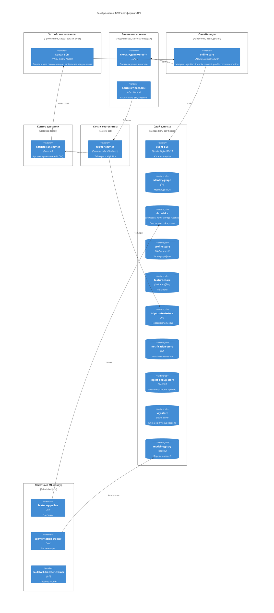
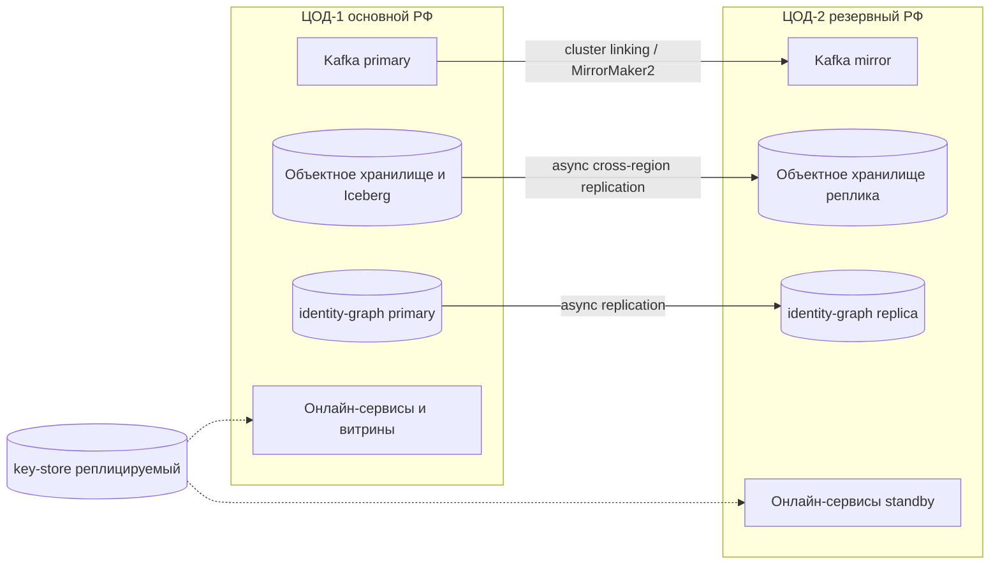

# 08. Развертывание

## Целевая среда

MVP разворачивается в оркестраторе контейнеров (Kubernetes) в защищённом контуре оператора. Stateless-сервисы масштабируются горизонтально за ingress; шина и хранилища выделены в слой данных; пакетный ML-контур запускается как задания по расписанию. Разделение онлайн- и пакетных нагрузок позволяет масштабировать их независимо и не мешать serving тяжёлым обучением.

Гранулярность развёртывания (см. [ADR-0016]): онлайн-ядро (`ingestion-gateway`, `identity-service`, `consent-service`, `profile-service`, `recommendation-service`) в MVP упаковано в **один развёртываемый модульный монолит** — на диаграмме ниже узел «Онлайн-кластер» содержит эти модули в одном процессе. Отдельными развёртываниями остаются `trigger-service`, `notification-service`, пакетные тренеры и инфраструктура — там это требуется по драйверу (состояние, каденс, изоляция ввода-вывода).

## C4 Deployment

| Откуда | Куда | Протокол | Зачем |
|---|---|---|---|
| Канал ВСМ | `online-core` (модуль recommendation) | HTTPS | Запрос рекомендаций (pull) |
| `notification-service` | Канал ВСМ | HTTPS / push | Доставка проактивного уведомления |
| Контекст поездки | `trigger-service` | События / HTTPS | Расписание, ETA, события поездки |
| `online-core` (модуль identity) | Госуслуги/ЕБС | HTTPS | Подтверждение якоря |
| `online-core` | `event-bus` | Kafka protocol (TLS) | Публикация и чтение событий |
| `trigger-service` | `trip-context-store` | DB protocol | Durable-таймеры и контекст |
| `trigger-service` | `notification-service` | HTTPS | Передача `NotificationIntent` |
| Пакетный контур | `data-lake` / `model-registry` | DB / Registry | Обучение и регистрация моделей |

## Stateless и stateful

- **Stateless** (горизонтально масштабируются, без локального состояния): онлайн-ядро `online-core` (модули ingestion/identity/consent/profile/recommendation) как **один деплой** и отдельно `notification-service`. Реплики добавляются по нагрузке; потребители Kafka объединены в consumer groups с партиционированием по `passenger_id`.
- **Stateful**: `trigger-service` хранит durable-таймеры (в `trip-context-store`), поэтому развёртывается как StatefulSet с партиционированием **строго по `passenger_id`** — так все поездки и `SuppressionState` одного пассажира сериализуются на одной реплике (нет гонок счётчика пауз). При потере реплики таймеры восстанавливаются из store по индексу бакетов `fire_time`, а не из памяти.
- **Слой данных** (stateful по природе): Kafka-кластер (RF=3, `min.insync.replicas=2`), `identity-graph`, `data-lake`, `profile-store`, `feature-store`, `trip-context-store`, `notification-store`, `ingest-dedup-store`, `key-store`, `model-registry` — резервируются и бэкапятся отдельно. `key-store` изолируется усиленно: его компрометация раскрывает ПДн, а удаление ключей — механизм крипто-стирания.

## Масштабирование и устойчивость

- Kafka партиционируется по `passenger_id`: сохраняется порядок событий одного пассажира и линейно растёт пропускная способность.
- Онлайн-чтение профиля/сегмента идёт по `profile-store` (KV), а не через шину — это держит p95 чтения низким (NFR-006).
- `online-core` масштабируется горизонтально (N реплик + автоскейл) — этого достаточно для целевого потока. При очень большой нагрузке выделяется **read-serving** (`profile-service` + `recommendation-service`) отдельным деплоем по трафику чтения, затем — `ingestion-gateway` + `identity-service` под объём записи; границы заданы интерфейсами, выделение без переписывания кода (см. [ADR-0016]).
- `notification-service` масштабируется по числу каналов и объёму доставки; повторы и DLQ изолируют «медленный» канал.
- Каждый обрабатывающий потребитель имеет `retry`-топик с экспоненциальным backoff и `dlq`-топик: ядовитое событие уходит в DLQ и не блокирует партицию (нет head-of-line blocking).
- Пакетные задания запускаются на отдельных узлах и не конкурируют за ресурсы с serving.
- Обновление сервисов — rolling update; потребители Kafka переживают перебалансировку без потери позиции (commit offsets). Простой потребителя дольше retention закрывается rebuild из `data-lake`, а не resume с offset.

## Конфигурация и секреты

- Конфигурация — через переменные окружения и ConfigMap; различия сред (`local`/`test`/`prod`) — в конфигурации, не в коде.
- Секреты (доступ к Kafka, БД, `key-store`, ключи к Госуслугам/ЕБС, ключи каналов доставки) — в секрет-менеджере (например, Vault/Kubernetes Secrets c шифрованием), не в репозитории и не в логах.
- Восток-западный трафик между деплоями (`online-core`, `trigger-service`, `notification-service`, пакетные задания) и к хранилищам — по взаимному TLS (mTLS) с идентичностью деплоев; вызовы модулей внутри `online-core` — в процессе, без mTLS; сетевая сегментация (network policies) ограничивает, кто к кому ходит (zero-trust, см. раздел 10 и [ADR-0014]).
- Схемы событий — в реестре схем; контракты потребителей проверяются в CI (раздел 11).

## Отличия сред

| Среда | Kafka | Хранилища | Внешние системы |
|---|---|---|---|
| local | single-broker | контейнеры | mock Госуслуг/ЕБС и контекста поездки |
| test | 3 broker | управляемые тест-инстансы | sandbox-API или фейки |
| prod | 3+ broker, RF=3 | резервируемые, с бэкапом | боевые API в защищённом контуре |

## Мульти-ЦОД и геораспределение

Большие данные о поездках хранятся в собственном lakehouse (объектное хранилище + Apache Iceberg, см. раздел [07](07-данные-и-хранилища.md)); все ЦОД — в РФ (152-ФЗ, без трансграничной передачи). Геораспределение строится по принципу **active-passive** с асинхронной репликацией: один ЦОД основной (приём и запись), второй — резервный (DR) для переключения при отказе [27, ADR-0015].

- **Объектное хранилище и lakehouse** реплицируются между ЦОД асинхронно; исторические данные неизменяемы, конфликтов записи нет, RPO определяется лагом репликации.
- **Kafka** зеркалируется в резервный ЦОД через cluster linking или MirrorMaker 2; для близких ЦОД с малым RTT возможен stretch-кластер.
- **identity-graph** (мастер-данные) — primary-write в основном ЦОД, асинхронная реплика в резервном; при отказе реплика повышается до основной.
- **Производные витрины** (`profile-store`, `feature-store`) — региональные и восстановимые: их не реплицируют как истину, а перестраивают из lakehouse после переключения. Это снимает кросс-ЦОД строгую согласованность с самого нагруженного пути чтения.
- **Операционные горячие хранилища** (`trip-context-store`, `notification-store`) несут оперативное состояние (активные таймеры, паузы), которое не выводится из истории полностью, поэтому реплицируются между ЦОД асинхронно с малым RPO; счётчики пауз дополнительно восстановимы из журнала откликов как страховка.
- **key-store** реплицируется в оба ЦОД; удаление ключа (крипто-шреддинг) распространяется на обе площадки — право на удаление исполняется глобально.
- **Локальность данных**: партиционирование по маршруту/региону держит поездки ближе к ЦОД, где они генерируются и потребляются.
- **Failover**: при потере основного ЦОД резервный становится основным, онлайн-сервисы поднимаются из standby, горячие витрины догоняются rebuild из lakehouse, пропущенные durable-таймеры обрабатываются с учётом окна актуальности.

### Целевые RPO/RTO и инварианты переключения

Значения — целевые учебные (калибруются при внедрении), но зафиксированы, а не оставлены «в эксплуатации».

| Хранилище | RPO (макс. потеря данных) | RTO (время восстановления) | Чем обеспечивается |
|---|---|---|---|
| `identity-graph` (истина, мастер-данные) | ≤ 5 мин | ≤ 30 мин | Async-реплика, promote реплики в основную |
| `data-lake` (истина, поведение) | ≤ 15 мин | ≤ 60 мин | Cross-region реплика объектного хранилища, append-only |
| `notification-store` (паузы, intents, квитанции) | ≤ 1 мин | ≤ 15 мин | Async-репликация с малым RPO |
| `trip-context-store` (активные durable-таймеры) | ≤ 1 мин | ≤ 15 мин | Async-репликация с малым RPO |
| `profile-store`, `feature-store` (производные) | не нормируется | ≤ 2 ч на rebuild | Перестроение из lakehouse |

Процедура failover: (1) детект потери основного ЦОД по кворуму/здоровью; (2) promote реплик `identity-graph` и объектного хранилища, активация Kafka-mirror; (3) подъём `online-core`, `trigger-service`, `notification-service` из standby в резервном ЦОД; (4) `trigger-service` перечитывает durable-таймеры из реплики `trip-context-store`; (5) перестроение `profile-store`/`feature-store` из lakehouse. Failback — обратный порядок с ресинхронизацией основного ЦОД в окно низкой нагрузки.

Инварианты после переключения:

- **Таймеры**: восстанавливаются из реплики `trip-context-store` (потеря ≤ RPO); сработавшие за время простоя точки не «выстреливают» задним числом — гасятся окном актуальности (`expired`), а не превращаются в спам.
- **Дубли**: повторная доставка intents после переключения не показывается пассажиру дважды — дедуп по `dedupe_key` (платформа) и `intent_id` (канал) работает и через failover.
- **Потерянные в окне RPO события** источников при их повторной отправке гасятся идемпотентностью по `source_event_id`; что не было переотправлено — принимается как RPO-потеря в пределах нормы.
- **Согласия и удаления**: `consent_version` и deny-list (см. раздел 06) реплицируются вместе с `notification-store`/`identity-graph`, поэтому отозванное согласие не «оживает» после переключения.

## Открытые вопросы

- Управляемые сервисы или self-hosted для Kafka, объектного хранилища и БД в боевом контуре оператора?
- Нужен ли переход от active-passive к active-active по мере роста нагрузки (целевые RPO/RTO уже зафиксированы выше).
