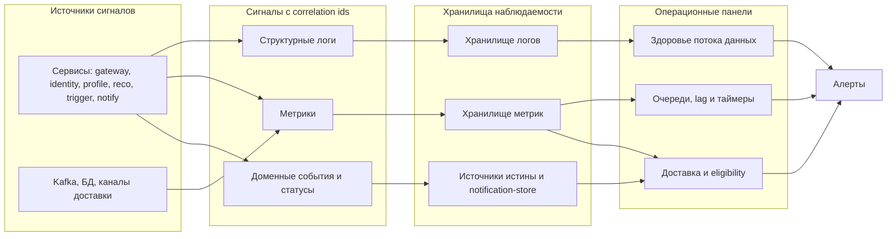

# 09. Надежность и эксплуатация

## Принцип

Отказоустойчивость — ключевой драйвер работы. Система проектируется так, что после успешного приёма событие не теряется, состояние восстанавливается из источников истины, а проактивные таймеры и доставка переживают перезапуск без потери и без дублирования. Онлайн-контур деградирует частично, а не целиком: сбой одного канала доставки или одного потребителя не останавливает приём данных.

## Отказы компонентов и реакция

| Отказ | Что происходит | Реакция системы |
|---|---|---|
| `ingestion-gateway` перезапустился во время приёма | Часть запросов не подтверждена | «Принято» = durable в Kafka (`acks=all`) + запись в dedup-store, ack источнику только после этого; клиент повторяет, дубль гасится по `source_event_id` ([ADR-0017]) |
| Брокер Kafka потерял узел | Лидер партиции переизбирается | RF=3 и `min.insync.replicas=2` сохраняют данные; продюсеры с `acks=all` не теряют события |
| Реплика `online-core` (потребитель шины: модули profile, identity и др.) упала | Часть событий не обработана | Consumer group переназначает партиции на живые реплики; обработка продолжается с последнего commit-offset |
| Ядовитое (битое) событие у потребителя | Партиция может встать (head-of-line) | `retry`-топик с backoff, затем `dlq`-топик и пропуск; партиция не блокируется; алерт по размеру DLQ |
| Потребитель недоступен дольше retention Kafka | События выпали из шины | Не resume с offset, а rebuild витрины из `data-lake`, затем — к хвосту шины |
| `identity-service` дал спорное слияние | Возможна ложная связка | Merge обратим, Steward API делает split; алерт по росту спорных слияний |
| `trigger-service` перезапустился | Таймеры в памяти потеряны | Восстановление из `trip-context-store` по индексу бакетов `fire_time`; пропущенные точки — с учётом окна актуальности |
| `online-core` (модуль recommendation) медленный или недоступен на сетевом вызове `trigger-service` → `online-core` | Риск промаха «нужного момента» | Таймаут в `trigger-service`; `дополнительный` — дефолт из кэша или пропуск; `операционный` — в обход рекомендаций |
| `online-core` (модуль consent) недоступен на пути отправки | Нельзя проверить согласие | Fail-closed: согласие не подтверждено — уведомление не отправляется |
| Кэш deny-list/согласий недоступен | Нельзя проверить право обработки и выдачи | Serving fail-closed (блок выдачи); приём буферизуется в Kafka и применяется после восстановления; локальный реплицируемый кэш (bloom + KV) снижает зависимость от `identity-graph` на горячем пути |
| Канал доставки недоступен | Уведомление не доставлено | Повтор по политике, затем DLQ; при истечении окна intent → `expired` |
| `notification-service` повторно доставил | Риск двойного показа | Дедуп по `dedupe_key` (платформа) и `intent_id` (идемпотентный приёмник канала) исключает повтор |
| `feature-store`/`profile-store` рассинхронизированы | Несвежий профиль | Перестроение витрины из источников истины |
| Контекст поездки запоздал/изменился | Таймер неточен | Пересчёт ETA и таймера; отмена снимает таймеры и intents |

## Зависшие задачи и таймеры

- Зависший durable-таймер обнаруживается по возрасту записи в `trip-context-store` (таймер давно должен был сработать, но не закрыт).
- Зависший `NotificationIntent` в статусе `queued`/`retrying` дольше окна актуальности переводится в `expired` фоновым сканером.
- Лаг потребителя Kafka (consumer lag) сверх порога — сигнал, что стадия не успевает; ведёт к алерту и автоскейлу реплик.

## Наблюдаемость

Диагностическая цепочка связывает сигналы по correlation id (`request_id`, `passenger_id`, `trip_id`, `intent_id`, `source_event_id`).

## Минимальный набор сигналов

| Тип сигнала | Что включить | Зачем |
|---|---|---|
| Логи | `request_id`, `passenger_id`, `trip_id`, `intent_id`, `source_event_id`, `stage`, `attempt`, `error_code` | Разбор одного случая по всей цепочке |
| Метрики потока | Consumer lag, возраст событий, задержка «событие → профиль» (NFR-016) | Раннее обнаружение деградации |
| Метрики проактивного контура | Точность окна таймера (NFR-008), доля `suppressed`/`expired`, успех доставки, повторы и DLQ | Здоровье «нужного момента» и доставки |
| Метрики идентичности | Доля связанных записей, спорные слияния, split-операции | Качество «золотой записи» |
| Доменные события | Переходы статусов профиля и intent, изменения согласий, ручные операции | Восстановление истории процесса |

## Операционные панели и решения

- **Здоровье потока данных:** lag и возраст событий → решение масштабировать потребителей или разбирать «застрявшую» партицию.
- **Очереди, lag и таймеры:** число активных таймеров, просроченные таймеры → решение проверить `trigger-service` и контекст поездки.
- **Доставка и eligibility:** доля доставленных/подавленных/просроченных, размер DLQ → решение по проблемному каналу и по калибровке правила паузы.

## Резервное копирование и восстановление

- `data-lake` и `identity-graph` (источники истины) бэкапятся регулярно; целевые RPO/RTO по хранилищам зафиксированы в разделе 08 (например, `identity-graph` RPO ≤ 5 мин / RTO ≤ 30 мин).
- Производные витрины не бэкапятся как истина — они перестраиваются из источников; проверяется учебным прогоном rebuild.
- Kafka хранит события в окне retention; долговременная истина гарантируется `data-lake` через приёмник (sink).
- `notification-store` бэкапится для аудита доставки и сохранения состояния пауз.

## Ручные действия оператора

- Найти все события одного процесса по `passenger_id`/`trip_id`/`intent_id`.
- Откатить ошибочное слияние идентичности (Steward API split).
- Снять/перепоставить таймеры поездки после ручной корректировки контекста.
- Перепроиграть (replay) события из Kafka/`data-lake` для перестроения витрины или дообучения.
- Временно отключить класс `дополнительный` для канала при инциденте, не затрагивая `операционный`.
- Выполнить failover на резервный ЦОД (promote реплик, активация Kafka-mirror, подъём standby) и failback по процедуре из раздела 08; проверить восстановление durable-таймеров и отсутствие двойных уведомлений.
- Разобрать инцидент deny-list: проверить попадание `passenger_id` в deny-list, актуальность кэша во всех репликах, и что serving по удаляемому пассажиру заблокирован.

## Открытые вопросы

- Пороги алертов точности таймера и доли подавленных уведомлений на этапе калибровки.
