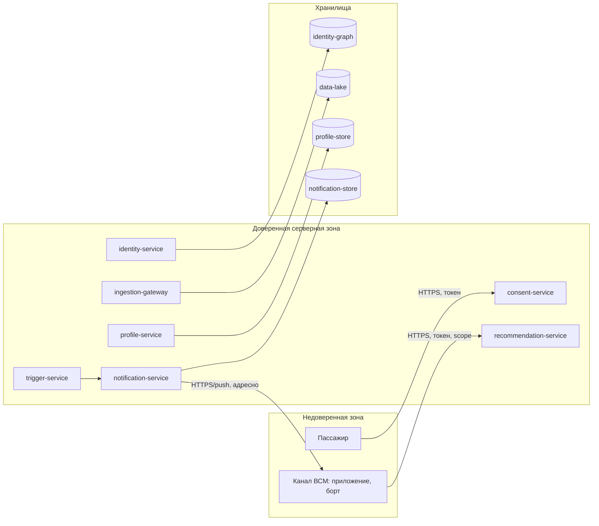

# 10. Безопасность

## Что защищаем

Платформа обрабатывает персональные данные пассажиров и связи между операторами, поэтому центральная задача безопасности — правовой контур 152-ФЗ [13] и недопущение утечки или несанкционированной связки данных. Защищаются: идентификаторы и «золотая запись», согласия, признаки и сегменты, контекст поездки, содержимое и адресность уведомлений.

## Роли и доступ

| Роль | Доступ | Ограничения |
|---|---|---|
| Пассажир | Свой профиль и согласия, отзыв и удаление | Только свои данные |
| Потребитель ВСМ (приложение/борт) | Профиль и рекомендации по `passenger_id` в рамках согласия | Сервисный аккаунт, scope по цели |
| Аналитик / маркетолог | Агрегаты, определения сегментов, метрики | Обезличенные данные, без доступа к сырым идентификаторам |
| Data steward | Граф связей, merge/split | Аудируемые операции |
| Оператор платформы (DevOps/ML) | Конфигурация, мониторинг, модели | Без доступа к незамаскированным ПДн |

## Аутентификация и авторизация

- Пользовательские и сервисные вызовы — по токенам (OIDC/JWT) с проверкой scope по цели обработки.
- Якорь идентичности подтверждается через Госуслуги и ЕБС; ИНН не используется как сквозной межоператорский ключ [ADR-0004].
- Доступ потребителя к профилю проверяется на владение и на действующее согласие для запрошенной цели.
- Каналы доставки аутентифицируются как сервисные клиенты `notification-service`; уведомление адресуется только подтверждённому каналу пассажира.

## Согласия и правовой контур (152-ФЗ)

- Обработка мультимодальных признаков и отправка персонализированных уведомлений возможны только при действующем согласии на соответствующую цель; gate — `consent-service`.
- Минимизация данных: идентификаторы хранятся в виде хэшей, ПДн маскируются; для аналитики используется обезличивание.
- Право на отзыв и удаление исполняется каскадно по всем хранилищам и активным таймерам (см. сценарий в разделе 06).
- Удаление в неизменяемом журнале и бэкапах обеспечивается **крипто-шреддингом**: ПДн событий шифруются ключом субъекта в `key-store`, удаление ключа делает данные невосстановимыми (см. [ADR-0012]).
- Производные артефакты (признаки, сегменты, обученные модели) тоже несут информацию о пассажире. При удалении: признаки и сегменты — производные и **выпадают при ближайшем пакетном пересчёте**; влияние на модели **затухает с плановым переобучением** без удалённых данных. Для строгого немедленного стирания влияния из модели применимы методы machine unlearning — отнесены к развитию [37].
- Гонка «согласие/удаление против входящих событий» закрыта правилом: отзыв/удаление ставит **tombstone (deny-list) по `passenger_id`**, каждое событие несёт `consent_version`, обработка и serving — **fail-closed** при устаревшей версии, порядок `ConsentChanged` обеспечивается партиционированием по `passenger_id`. Поэтому событие, пришедшее после запроса на удаление, не попадает в профиль и не используется в выдаче (см. раздел 06).
- Межоператорская связка без согласия не строится; допускаются только обезличенные агрегаты.

## Реестр обработки ПДн

Сводная матрица: тип данных → цель → правовое основание → срок хранения → способ удаления → доступ. Служит проверяемым контрактом приватности (ROPA), а не общими словами.

| Тип данных | Цель обработки | Правовое основание | Срок хранения | Способ удаления | Доступ |
|---|---|---|---|---|---|
| Идентификаторы (Госуслуги/ЕБС, телефон, email, билет — хэши) | Разрешение идентичности, единый профиль | Согласие + договор перевозки | Пока активен пассажир | Разрыв связок + крипто-шреддинг | `identity-service`, data steward |
| Поведение и поездки (транзакции, мобильность) | Признаки, сегментация, обучение | Согласие | Долговременно, под ключом субъекта | Крипто-шреддинг (удаление ключа) | `feature-pipeline`, аналитик (обезличенно) |
| Согласия и правовые статусы | Контроль законности обработки | 152-ФЗ | Срок аудита | По регламенту аудита | `consent-service`, аудит |
| Признаки и сегмент | Персонализация | Согласие | По версии модели | Пересчёт / обезличивание | `profile-service`, `recommendation-service` |
| Контекст поездки (ETA, этап) | Проактивные уведомления «в момент» | Согласие | До конца поездки + аудит | Снятие при завершении/удалении | `trigger-service` |
| Уведомления, отклики, паузы | Доставка и частотные правила | Согласие | Окно аудита (≈ 90 дней) | Чистка по retention | `trigger-service`, `notification-service` |
| Логи и диагностика | Эксплуатация и безопасность | Законный интерес | Короткий срок | Ротация | DevOps (без ПДн в открытом виде) |

## SLA исполнения удаления

Право на удаление исполняется по уровням артефактов с явными сроками (целевые учебные, финально утверждаются юридически). Ключевой инвариант: до полной очистки производных артефактов **deny-list блокирует serving**, поэтому данные удаляемого пассажира не участвуют в выдаче.

| Артефакт | Когда считается удалённым | Действие до завершения |
|---|---|---|
| Сырые ПДн (журнал, бэкапы) | Немедленно — крипто-шреддинг (удаление ключа субъекта в `key-store`) | — |
| Serving (профиль, рекомендации, уведомления) | Немедленно — deny-list по `passenger_id` | Профиль обезличен, выдача и уведомления заблокированы |
| Признаки и сегменты | ≤ каденс пересчёта (напр. ≤ 7 дней) | Производные, выпадают при следующем пакетном прогоне |
| Влияние на обученные модели | ≤ каденс переобучения (напр. ≤ 30 дней) | Затухает при переобучении без удалённых данных; строгое немедленное — machine unlearning [37] |

Итог: юридически пассажир считается удалённым из производных артефактов в течение каденса пересчёта/переобучения, а его данные не используются в выдаче с момента запроса (deny-list). Рекомендации по такому пассажиру не формируются до завершения очистки.

## Границы доверия и потоки данных

> Замечание по границам: `Gate`, `Consent`, `Identity`, `Profile`, `Reco` на диаграмме — **логические модули одного деплоя `online-core`** ([ADR-0016]); внутри него границы программные, без сети. Сетевые границы доверия — внешний периметр (пассажир, каналы, источники) и вызовы между деплоями `online-core` ↔ `trigger-service` ↔ `notification-service` и к хранилищам.

| Граница доверия | Что пересекает | Контроль |
|---|---|---|
| Пассажир → `online-core` (модуль consent) | Согласия, отзыв | TLS, аутентификация, аудит |
| Канал → `online-core` (модуль recommendation) | Запрос профиля/рекомендаций | Токен, scope по цели, проверка владения |
| `notification-service` → канал | Доставка уведомления | Адресность по подтверждённому каналу, дедуп, без лишних ПДн в payload |
| Источники → `ingestion-gateway` | События | Аутентификация источника, валидация, идемпотентность |
| `online-core` (модуль identity) → Госуслуги/ЕБС | Подтверждение якоря | TLS, защищённые секреты |

## Защита уведомлений

- В payload уведомления передаётся минимум: тип услуги и контекст этапа, без чувствительных идентификаторов.
- `dedupe_key` и `intent_id` — внутренние; наружу выдаётся только то, что нужно каналу для показа.
- Адресность проверяется: уведомление не может быть доставлено каналу, не принадлежащему пассажиру.
- Содержимое уведомлений не логируется в открытом виде; логируются идентификаторы и статусы.
- Ссылки и токены внутри уведомления — короткоживущие и подписанные; уведомление не несёт секретов и не является каналом авторизации.

## Внутренние границы доверия (zero-trust)

- Восток-западный трафик **между деплоями** (`online-core`, `trigger-service`, `notification-service`, пакетные задания) и к хранилищам — по взаимному TLS (mTLS) с проверяемой идентичностью; «доверенной внутренней сети» нет. Вызовы между модулями внутри `online-core` идут в процессе и mTLS не требуют (см. [ADR-0014], [ADR-0016]).
- Сетевые политики задают минимум привилегий: какой сервис к какому хранилищу и сервису может обращаться (например, в `notification-store` пишут только `trigger-service` и `notification-service`).
- `key-store` (ключи крипто-шреддинга) изолирован отдельно, доступ к нему минимален и аудируется; его компрометация раскрывает ПДн.
- Сертификаты и ключи ротируются автоматически.
- На пути отправки `consent-service` работает fail-closed: если согласие нельзя подтвердить, уведомление не отправляется.

## Секреты и что нельзя логировать

- Секреты (Kafka, БД, ключи Госуслуг/ЕБС, ключи каналов) — в секрет-менеджере, не в коде и не в логах.
- Нельзя писать в логи: незамаскированные ПДн, содержимое биометрии, полные значения идентификаторов, тело персональных уведомлений.
- В логах — только хэши/идентификаторы, коды ошибок и статусы.

## Основные угрозы и меры

| Угроза | Мера |
|---|---|
| Несанкционированная связка данных между операторами | Gate согласия, якорь, аудит связок |
| Доступ к чужому профилю | Проверка владения и scope, тесты прав доступа |
| Утечка через payload уведомления | Минимизация payload, адресность, без ПДн |
| Подмена источника событий | Аутентификация источника и валидация |
| Спам и навязчивость как канал злоупотребления | Правило паузы, лимиты, тихие часы, отдельный контроль `операционного` класса |
| Компрометация секрета канала | Ротация ключей, изоляция канала, DLQ |
| Перебор и скрейпинг профилей через API | Rate limiting и квоты на потребителя, scope и проверка владения, детектор аномалий доступа |
| Боковое перемещение внутри сети | mTLS и сетевые политики (zero-trust), изоляция `key-store` |
| Чтение ПДн из бэкапа после удаления | Крипто-шреддинг: данные в бэкапе под ключом субъекта |

## Открытые вопросы

- Нужен ли отдельный режим согласия для проактивных уведомлений отдельно от обработки признаков?
- Какой объём метаданных доставки допустимо хранить для аудита без избыточного накопления ПДн?
