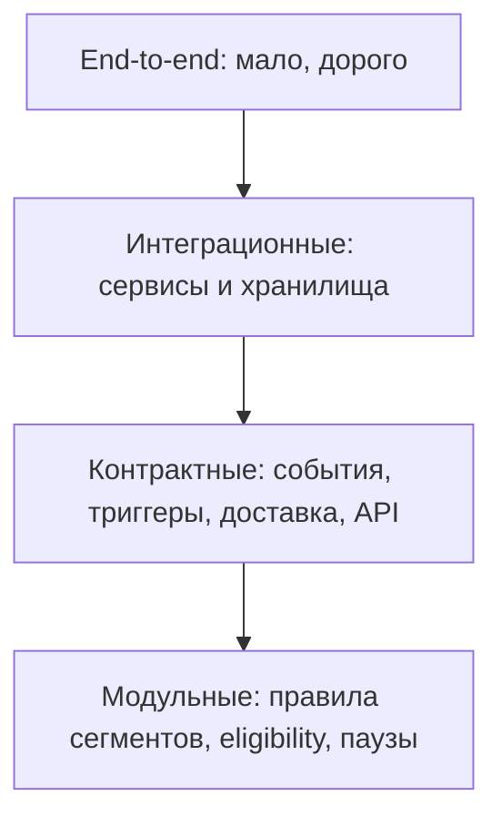

# 11. Тестирование

## Стратегия

Архитектура проверяется снизу вверх: быстрые модульные тесты доменных правил, контрактные тесты событий/сообщений и API, интеграционные тесты границ с инфраструктурой, тесты отказов и идемпотентности, отдельные проверки конкурентных сценариев и прав доступа, нагрузочные проверки целей скорости и редкая ручная приёмка. Большинство правил проактивного контура (eligibility, пауза, точность таймера) проверяемы детерминированно — это сознательный выбор в пользу воспроизводимости.

## Матрица критичных проверок

| Область | Что проверить | Тип проверки |
|---|---|---|
| Разрешение сущностей | «Две записи → один пассажир?», приоритет якоря, обратимость merge | Unit + integration |
| Идемпотентность приёма | Повтор `source_event_id` не дублирует и не применяется дважды | Integration / failure |
| Согласие как gate | Без согласия мультимодальные признаки и уведомления не создаются | Integration |
| Признаки и ось мобильности | Расчёт RFM и оси мобильности, вклад оси в различимость | Unit + offline-эксперимент |
| Сегментация | Воспроизводимость при seed, выбор k по silhouette/Davies — Bouldin, устойчивость bootstrap-ARI | Golden + статистическая |
| Холодный старт | Онлайн-инференс зарегистрированной transfer-модели в `profile-service`, `segment_source = transfer`, переход в `native` | Integration / E2E |
| Точность «нужного момента» | Таймер срабатывает в окне ±30 с; пересчёт при задержке | Integration |
| Durable-таймеры | После рестарта `trigger-service` таймеры восстановлены, без потери и дублей | Failure test |
| Eligibility и пауза | «Слать/не слать»: согласие, право класса, пауза, тихие часы, лимит на поездку | Unit + integration |
| Скоринг выбора действия | Golden-тест `Kop`/`Kpref`: фиксированные входы и версия весов → фиксированный показатель и решение; порог отсекает (`suppressed: below_threshold`); журнал решения полон (входы, веса, показатель) — FR-024 [ADR-0018] | Golden + unit |
| Доставка | At-least-once, дедуп по `dedupe_key` (платформа) и `intent_id` (идемпотентный приёмник канала), DLQ | Contract + failure |
| Удаление данных | Крипто-шреддинг: после удаления ключа субъекта данные невосстановимы в `data-lake` и бэкапах | Integration |
| Права доступа | Пользователь/канал не получает чужой профиль или уведомление | Integration / E2E |
| Границы модулей `online-core` | Fitness-тест архитектуры: запрещённые зависимости между модулями (например, recommendation → внутренности identity в обход интерфейса) валят CI (ArchUnit / Spring Modulith) [40] | Статический анализ в CI [ADR-0016] |

## Контрактные тесты

Настоящие контрактные тесты нужны на **границах процессов**: сообщения `event-bus`, доставка в каналы, внешние API (Госуслуги/ЕБС, контекст поездки), API чтения профиля и интерфейс `online-core` ↔ `trigger-service`/`notification-service`. Внутри `online-core` границы между модулями проверяются **тестами интерфейсов модулей** (контрактом вызова в процессе), а не сетевыми контрактами (см. [ADR-0016]). Конкретные схемы (`trip_event`, profile-read API, `NotificationIntent`, `ConsentChanged`) — в приложении раздела [07](07-данные-и-хранилища.md).

- **События источников и шины:** формат канонического события, версия схемы, обязательные поля, идемпотентный ключ `source_event_id`; обратная совместимость при добавлении полей.
- **События поездки → триггеры:** контракт `trip-context` (ETA, этап, события задержки/посадки/отмены) и реакция `trigger-service`.
- **Намерение и доставка:** контракт `NotificationIntent` (`intent_id`, `dedupe_key`, `action_class`, окно актуальности), контракт квитанции `DeliveryReceipt` и **контракт идемпотентного приёмника канала** (повтор по `intent_id` не показывается пассажиру дважды).
- **Отклики:** контракт `RecommendationResponse` (показ/клик/конверсия/отказ) и его влияние на `SuppressionState`.
- **API профиля:** контракт чтения профиля/сегмента с проверкой scope и владения.

## Тесты отказов и конкуренции

- Падение потребителя Kafka на середине обработки → продолжение с последнего offset, отсутствие потери и двойного применения.
- Ядовитое (битое) событие у потребителя → уход в retry-топик с backoff, затем в DLQ-топик и пропуск; партиция не блокируется (нет head-of-line blocking).
- Простой потребителя дольше retention Kafka → не resume с offset, а перестроение витрины из `data-lake`.
- Перезапуск `trigger-service` с активными таймерами → восстановление таймеров из бакетов `fire_time` в `trip-context-store`, точность окна сохранена.
- Недоступность канала доставки → повтор, DLQ, истечение окна (`expired`); повтор гасится идемпотентным приёмником по `intent_id`.
- Таймаут или недоступность `online-core` (модуль recommendation) на пути отправки → деградация: `дополнительный` пропускается или берёт дефолт из кэша, `операционный` идёт в обход рекомендаций.
- Параллельные срабатывания таймера и события по одной поездке → один `dedupe_key`, один intent.
- Параллельные поездки одного пассажира и счётчик паузы → партиция по `passenger_id` и атомарный апдейт `SuppressionState`, корректный `decline_count` без гонок.
- Одновременная смена согласия и обработка → атомарность gate (NFR-011), отсутствие «проскочившего» признака.

## Нагрузочные проверки

- p95/p99 чтения профиля (NFR-006) и ответа рекомендации (NFR-007).
- Сквозная задержка «событие → онлайн-профиль» (NFR-016) под пиковой нагрузкой.
- Точность окна таймера под массой одновременных поездок (NFR-008).
- Поведение при росте consumer lag и автоскейле потребителей.

## Критерии приёмки качества (ML и бизнес-эффект)

Пороги — целевые учебные значения, финально калибруются на данных апробации; именно они подтверждают научную новизну (вклад оси мобильности) и пользу персонализации.

| Метрика | Что измеряет | Целевой порог | Как проверить |
|---|---|---|---|
| silhouette | Различимость сегментов | ≥ 0,30 абсолютно и +0,05 к RFM-only | Офлайн на апробации |
| Davies — Bouldin | Различимость (ниже — лучше) | Ниже бейзлайна RFM-only | Офлайн |
| bootstrap-ARI | Устойчивость сегментов | ≥ 0,70 | Bootstrap-прогоны, разные seed |
| Вклад оси мобильности (H1) | Прирост различимости vs RFM-only | Статистически значим | Сравнение моделей |
| cold-start lift | Польза предсегмента vs дефолт | > 0 | Офлайн на холодных пользователях |
| Точность eligibility | Корректность решения «слать / не слать» (право класса, согласие, пауза, тихие часы) | ≥ 0,99 на тест-кейсах | Unit / integration |
| Покрытие правил | Доля активных сегментов с заданной сервисной стратегией | 100% активных сегментов | Проверка таблицы стратегий |
| Lift принятия допуслуг | Бизнес-прокси полезности (правиловый MVP) | Положительный vs бейзлайн | Офлайн-симуляция |
| Precision@k / Recall@k / NDCG@k (вне MVP) | Качество обучаемого ранжирования — для будущего ML-рекомендатора, не для правилового MVP | Выше «холодного» бейзлайна | Офлайн-симуляция (при появлении разметки релевантности) |
| Precision/recall связывания | Качество разрешения сущностей | precision ≥ 0,98 (ложные слияния редки), recall — целевой по апробации | Размеченная тестовая популяция |
| False-merge rate | Доля ошибочных слияний разных лиц | ≈ 0 на тест-кейсах общих билетов | Тест-кейсы + аудит серой зоны |

## Тестовые данные

- Синтетический генератор пассажиров и поездок, калибруемый по открытым данным мобильности (GeoLife, MATSim Open Berlin) [20, 21] — для воспроизводимости без реальных ПДн.
- Фейки/моки внешних систем: Госуслуги/ЕБС, контекст поездки, каналы доставки.
- Эталонные выборки (golden) для нормализации признаков и сегментации.

## Что проверяется вручную

- Читаемость и интерпретируемость профилей сегментов экспертом (критерий новизны).
- Внешний вид и уместность проактивных уведомлений на этапах поездки в демо-сценарии.

## Открытые вопросы

- Объём и протокол офлайн-симуляции, достаточные для статистической значимости порогов lift/NDCG из критериев приёмки.
- Нужна ли отдельная среда для нагрузочного теста проактивного контура с эмуляцией массовых поездок.
