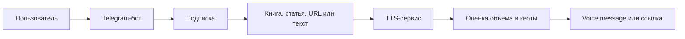

# 01. Описание системы

## Краткое описание

Система синтеза речи преобразует книги, статьи и короткие тексты в аудиофайлы. Основной пользовательский интерфейс MVP - Telegram-бот: пользователь оформляет подписку, отправляет исходный материал, получает оценку объема, подтверждает синтез и получает результат в Telegram.

## Проблема

Длинные тексты неудобно озвучивать вручную: нужно извлечь текст из разных форматов, привести его к произносимому виду, разбить на безопасные для TTS фрагменты, проверить подписку и недельную квоту, обработать ошибки синтеза, собрать аудио и доставить результат пользователю. MVP должен автоматизировать этот pipeline, сделать результат воспроизводимым и выдать его через привычный Telegram-интерфейс.

## Пользователи

- Автор или читатель, который хочет превратить книгу или статью в аудио.
- Пользователь, которому нужно быстро озвучить короткий текст, пост или сообщение.
- Подписчик базового или приоритетного тарифа, который расходует недельную квоту аудио.
- Администратор сервиса, который разбирает сбои обработки и контролирует очередь задач.

## Границы MVP

Входит в MVP:

- прием заданий через Telegram-бота и внутренний API;
- оформление, продление и отмена месячной подписки через Telegram-бота;
- два тарифа: базовый с лимитом 30 часов аудио в неделю и приоритетный с лимитом 60 часов аудио в неделю;
- проверка активной подписки и доступной недельной квоты перед запуском синтеза;
- поддержка входов `fb2`, `epub`, `url_article`, `plain_text`;
- нормализация текста и разбиение на фрагменты для TTS;
- оценка будущей длительности аудио и списания недельной квоты по нормализованному тексту;
- подтверждение задания перед синтезом;
- раздельные очереди synthesis для базового и приоритетного тарифов;
- пакетный синтез фрагментов;
- сборка итогового `m4b` для книг и `opus` для коротких материалов;
- отправка результата до 50 МБ как Telegram voice message;
- выдача результата больше 50 МБ ссылкой на presigned S3 URL сроком на 30 дней;
- хранение состояния задания и ссылок на артефакты;
- cleanup итоговых артефактов в S3 после 30 дней.

Не входит в MVP:

- полноценный публичный web-интерфейс;
- интеграции с мессенджерами, кроме Telegram;
- маркетплейс голосов;
- сложная организация команд и ролей;
- ручной редактор произношения;
- корпоративные тарифы, промокоды и ручные счета.

## Критерии успеха MVP

- Пользователь может оформить подписку, создать задание, подтвердить оценку квоты и получить аудиофайл в Telegram.
- Система не запускает синтез без активной подписки и достаточного остатка недельной квоты.
- Длинные задания обрабатываются асинхронно и не блокируют API.
- Приоритетный тариф получает большую долю synthesis capacity без жесткой гарантии мгновенной обработки.
- При сбое worker задача не теряется и может быть повторена.
- Расчет потребления квоты объясним через сохраненный preprocessing manifest.
- Архитектура допускает добавление новых моделей, входных форматов и пользовательских интерфейсов без полной переработки pipeline.

## Как пользователь получает результат

