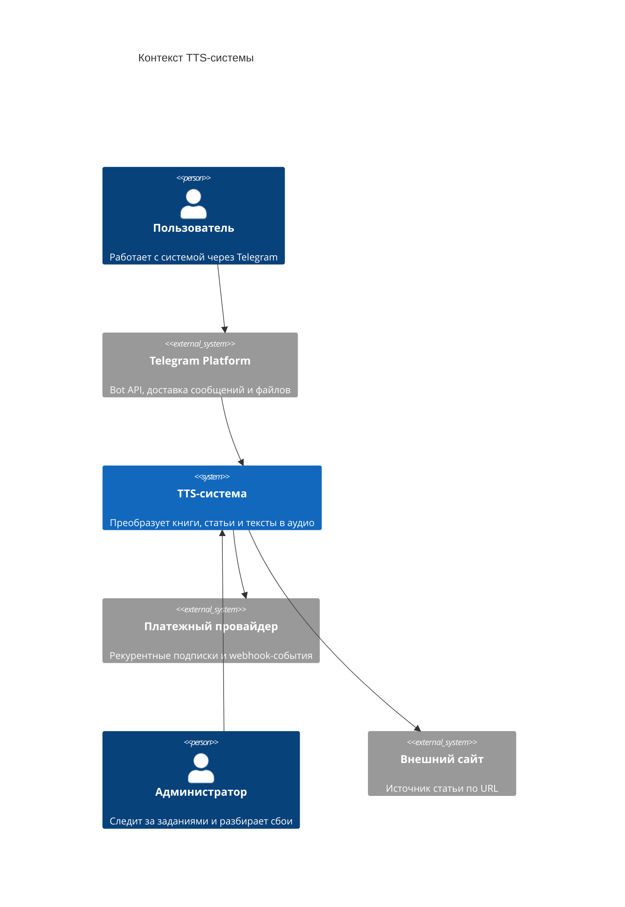

# 02. Контекст и границы

## Системная граница

В этом примере система рассматривается как backend-сервис синтеза речи с Telegram-ботом в качестве основного пользовательского интерфейса MVP. Telegram Platform остается внешней системой, а stateless-адаптер бота входит в границу MVP и использует API control plane. Подписка оформляется через Telegram-бота, но рекурентные списания выполняет внешний платежный провайдер.

## Внешние акторы и системы

- Пользователь создает задания и получает результаты через Telegram.
- Администратор смотрит состояние задач и разбирает сбои.
- Telegram Platform доставляет bot updates и отправляет пользователю сообщения, voice message и ссылки.
- Платежный провайдер создает месячные рекурентные подписки и присылает webhook-события о списаниях, отменах и ошибках оплаты.
- Внешние сайты используются как источник статей, если пользователь отправляет URL.

## C4 Context

| Откуда | Куда | Зачем |
|---|---|---|
| Пользователь | Telegram Platform | Отправляет текст, URL или файл; получает voice message или ссылку |
| Telegram Platform | TTS-система | Доставляет updates, команды подписки и callback queries через Telegram Bot API |
| TTS-система | Платежный провайдер | Создает подписку, получает webhook-события о рекурентных списаниях и отмене |
| Администратор | TTS-система | Проверяет состояние заданий и разбирает сбои |
| TTS-система | Внешний сайт | Загружает статью по URL |

## Внутри границы MVP

- `telegram-bot-adapter` для приема Telegram updates и отправки результата.
- API управления заданиями.
- Управление подписками, тарифами, платежными событиями и недельными квотами.
- Фоновые worker-процессы обработки текста, синтеза и сборки аудио.
- Состояние заданий и метаданные.
- Выбор synthesis-очереди по тарифу пользователя.
- Артефакты обработки: исходники, manifest, архивы синтеза, итоговые аудиофайлы.
- Встроенный ONNX Runtime в `synthesis-worker`.

## За пределами MVP

- Пользовательский web-интерфейс.
- Мессенджеры, кроме Telegram.
- Корпоративные тарифы, промокоды, ручные счета и возвраты.
- Собственная разработка TTS-модели.
