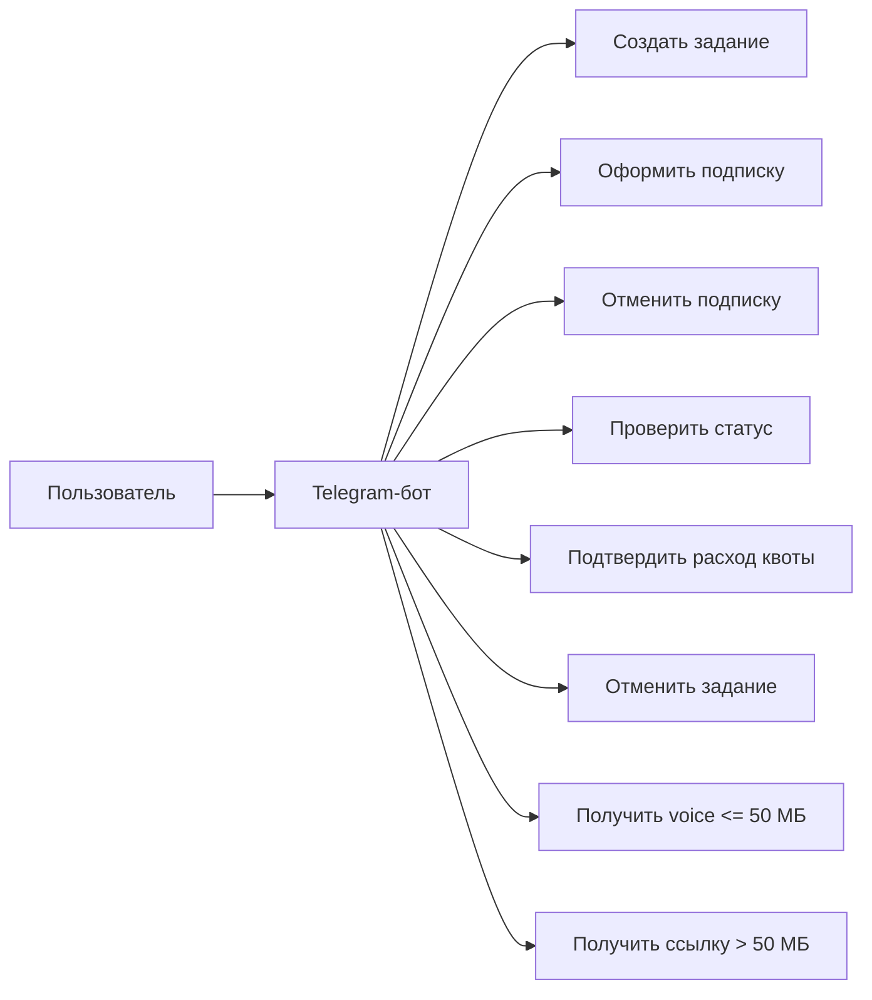

# 03. Требования

## Функциональные требования

| Код | Требование | Приоритет | Проверка |
|---|---|---|---|
| FR-001 | Пользователь может создать задание через Telegram из файла, URL или plain text | Must | E2E-сценарий Telegram update -> Job |
| FR-002 | Система сохраняет исходный материал или ссылку на него | Must | Проверка записи задания и source artifact |
| FR-003 | Пользователь может оформить базовую или приоритетную месячную подписку через Telegram-бота | Must | E2E-сценарий `/subscribe` -> payment checkout -> active subscription |
| FR-004 | Пользователь может отменить подписку через Telegram-бота | Must | E2E-сценарий `/unsubscribe` -> cancel at provider -> subscription cancelled |
| FR-005 | Система обрабатывает webhook-события платежного провайдера по рекурентным списаниям, отменам и ошибкам оплаты | Must | Contract test webhook payload и idempotency key |
| FR-006 | Система выполняет предобработку: извлечение текста, нормализацию и разбиение на фрагменты | Must | Интеграционный тест preprocessing |
| FR-007 | Система рассчитывает оценку будущей длительности аудио и расхода недельной квоты до синтеза | Must | Проверка manifest и quota summary |
| FR-008 | Пользователь подтверждает задание в Telegram перед запуском синтеза | Must | Сценарий перехода `awaiting_confirmation` -> `queued_for_synthesis` |
| FR-009 | Система не запускает синтез без активной подписки и достаточного остатка недельной квоты | Must | Сценарии inactive subscription и quota exceeded |
| FR-010 | Система относит batch-задачи synthesis к обычной или приоритетной очереди по тарифу пользователя | Must | Проверка routing key и queue name |
| FR-011 | Система синтезирует текст пакетами | Must | Проверка batch task и batch result |
| FR-012 | Система собирает итоговый аудиофайл по output profile | Must | Проверка `audiobook_m4b` и `message_opus` |
| FR-013 | Пользователь может смотреть статус и прогресс задания | Must | API-сценарий получения статуса |
| FR-014 | Пользователь получает итог до 50 МБ как Telegram voice message, а итог больше 50 МБ как ссылку на presigned S3 URL | Must | E2E-сценарии `telegram_voice` и `presigned_link` |
| FR-015 | Пользователь может отменить задание до завершения | Should | Сценарии отмены до синтеза и во время обработки |
| FR-016 | Система удаляет итоговые артефакты из S3 после 30 дней | Must | Тест cleanup policy |

## Тарифы и квоты

| Тариф | Период | Недельный лимит | Очередь synthesis | Влияние на обработку |
|---|---|---|---|---|
| Базовый | 1 месяц, рекурентное списание | 30 часов аудио | `synthesis.standard` | Обрабатывается обычной очередью |
| Приоритетный | 1 месяц, рекурентное списание | 60 часов аудио | `synthesis.priority` | Получает большую долю worker capacity |

Правило планирования synthesis: worker выбирает `synthesis.priority` с вероятностью 70% и `synthesis.standard` с вероятностью 30%. Если `synthesis.priority` пуста, worker берет задачи из `synthesis.standard` на всех доступных worker-процессах. Если выбранная очередь пуста, worker может сразу проверить другую очередь, чтобы не простаивать.

## Нефункциональные требования

| Код | Требование | Приоритет | Проверка |
|---|---|---|---|
| NFR-001 | API не должен выполнять тяжелую обработку текста и аудио синхронно | Must | Архитектурное ревью и интеграционные тесты |
| NFR-002 | Потеря задания после успешного создания недопустима | Must | Тесты отказов API, очереди и worker |
| NFR-003 | Состояние задания хранится в MongoDB как источник истины | Must | Проверка переходов состояния |
| NFR-004 | Артефакты хранятся в S3-совместимом хранилище | Must | Проверка source, manifest, batch archive, output artifact |
| NFR-005 | Повторная доставка сообщения из очереди не должна ломать состояние задания | Must | Тест идемпотентности worker |
| NFR-006 | Предобработка одного и того же входа с той же конфигурацией должна быть воспроизводимой | Should | Golden tests normalization/chunking |
| NFR-007 | Система должна позволять горизонтально масштабировать worker-процессы | Should | Проверка независимости worker и отсутствия локального состояния |
| NFR-008 | `telegram-bot-adapter` должен быть stateless | Must | Архитектурное ревью и тест перезапуска adapter |
| NFR-009 | Presigned S3 URL для крупных результатов должен жить 30 дней | Must | Проверка `expires_at` и параметров подписи |
| NFR-010 | Обработка webhook-событий платежного провайдера должна быть идемпотентной | Must | Повтор одного payment event не меняет состояние повторно |
| NFR-011 | Учет недельной квоты должен быть атомарным относительно подтверждения задания | Must | Конкурентный тест подтверждения нескольких заданий |
| NFR-012 | Взвешенный выбор очередей не должен оставлять worker в простое при пустой приоритетной очереди | Must | Интеграционный тест scheduler fallback |

## Основные сценарии

## Ошибочные сценарии первой итерации

- Исходный файл поврежден или формат не поддержан.
- URL недоступен или возвращает неподходящий контент.
- Предобработка завершилась ошибкой нормализации или извлечения текста.
- Встроенный ONNX Runtime или модель временно недоступны.
- Один пакет синтеза завершился ошибкой, остальные пакеты уже готовы.
- Сборка аудио не смогла прочитать один из batch archive.
- У пользователя нет активной подписки.
- Подтверждение задания превышает недельную квоту тарифа.
- Рекурентное списание не прошло, подписка стала неактивной.
- Пользователь пытается получить чужой результат.
- Telegram Bot API временно недоступен при выдаче результата.
- Пользователь открывает ссылку после cleanup итогового артефакта.

## Открытые вопросы

- Нужна ли квота на максимальный размер книги в первой версии?
- Какого платежного провайдера использовать для рекурентных списаний?
- Какие лимиты Telegram Bot API, кроме размера voice message, критичны для MVP?
- Какой уровень SLA требуется для учебного MVP?
