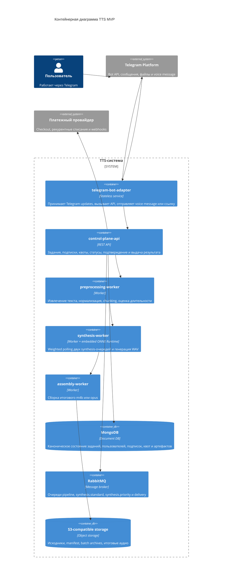
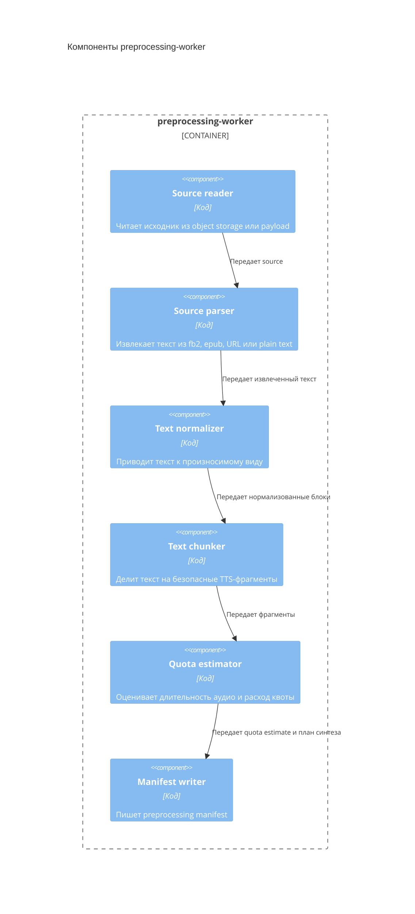

# 05. Архитектура

## Архитектурный стиль

MVP строится как асинхронный backend pipeline с Telegram-ботом как основным пользовательским интерфейсом. `telegram-bot-adapter` принимает Telegram updates и отправляет пользователю ответы, но не хранит состояние. Control plane принимает команды от adapter, управляет заданиями, подписками и недельными квотами. Долгие операции выполняются worker-процессами через очередь. MongoDB хранит каноническое состояние, RabbitMQ доставляет работу, S3-совместимое хранилище хранит durable artifacts, платежный провайдер выполняет рекурентные списания.

## Основные контейнеры

На C4-схеме оставлены ключевые связи. Детальные обращения worker-процессов к MongoDB, RabbitMQ и object storage описаны в разделе данных и на диаграмме развертывания, чтобы контейнерная диаграмма оставалась читаемой.

## Ответственность контейнеров

| Контейнер | Ответственность |
|---|---|
| `telegram-bot-adapter` | Прием Telegram updates, команды подписки и отписки, преобразование команд пользователя во внутренние API-вызовы, отправка voice message или ссылки, обработка delivery-задач |
| `control-plane-api` | API, пользователи, подписки, тарифы, недельные квоты, владение заданиями, состояния, подтверждение оценки, оркестрация |
| `preprocessing-worker` | Извлечение текста из источника, нормализация, chunking, manifest, оценка будущей длительности аудио и расхода квоты |
| `synthesis-worker` | Пакетный синтез фрагментов через встроенный ONNX Runtime, weighted polling очередей `synthesis.priority` и `synthesis.standard`, batch result archives |
| `assembly-worker` | Сборка итогового аудио по output profile, расчет `delivery_mode`, публикация delivery-задачи |
| `MongoDB` | Источник истины по заданиям, пользователям, статусам, подпискам, квотам, платежным событиям и ссылкам на артефакты |
| `RabbitMQ` | Доставка задач между стадиями, двумя synthesis-очередями и delivery-задачами, но не хранение истины |
| `S3-compatible storage` | Долговременное хранение файлов и артефактов |

## Политика synthesis-очередей

- Для базового тарифа `control-plane-api` публикует batch-задачи в `synthesis.standard`.
- Для приоритетного тарифа `control-plane-api` публикует batch-задачи в `synthesis.priority`.
- `synthesis-worker` выбирает `synthesis.priority` с вероятностью 70% и `synthesis.standard` с вероятностью 30%.
- Если `synthesis.priority` пуста, все доступные worker-процессы берут задачи из `synthesis.standard`.
- Если при случайном выборе выбранная очередь пуста, worker проверяет вторую очередь, чтобы не простаивать.
- Взвешенная схема дает приоритетному тарифу большую долю capacity, но не обещает фиксированное время завершения.

## Компоненты preprocessing-worker

## Правила зависимостей

- Нормализация и chunking не зависят от HTTP, очереди, хранилищ, ONNX Runtime и интерфейсов пользователя.
- Control plane не выполняет тяжелую обработку текста и аудио inline.
- Worker-процессы не принимают пользовательские HTTP-запросы напрямую.
- `telegram-bot-adapter` не хранит состояние заданий и может быть перезапущен без потери прогресса.
- RabbitMQ не считается источником истины.
- Подписка, платежные события и недельная квота проверяются в `control-plane-api`, а не внутри worker-процессов.
- `synthesis-worker` доверяет routing key, но перед выполнением batch сверяет состояние задания в MongoDB.
- Итоговый формат аудио определяется explicit output profile, а не типом входного источника.
