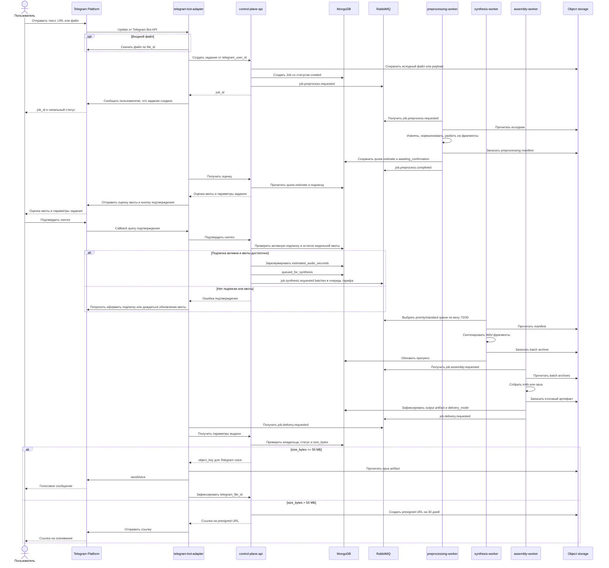
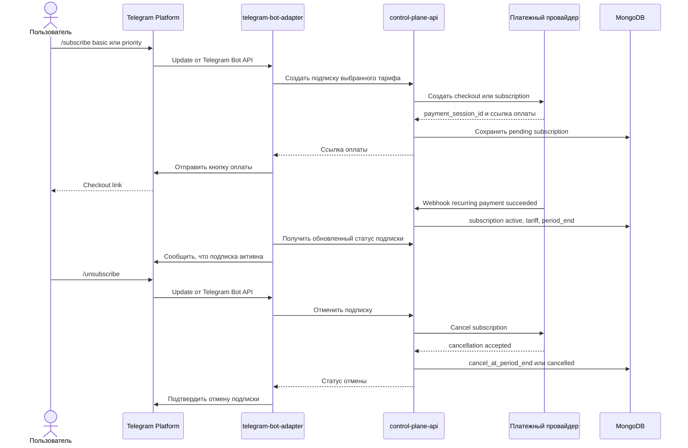
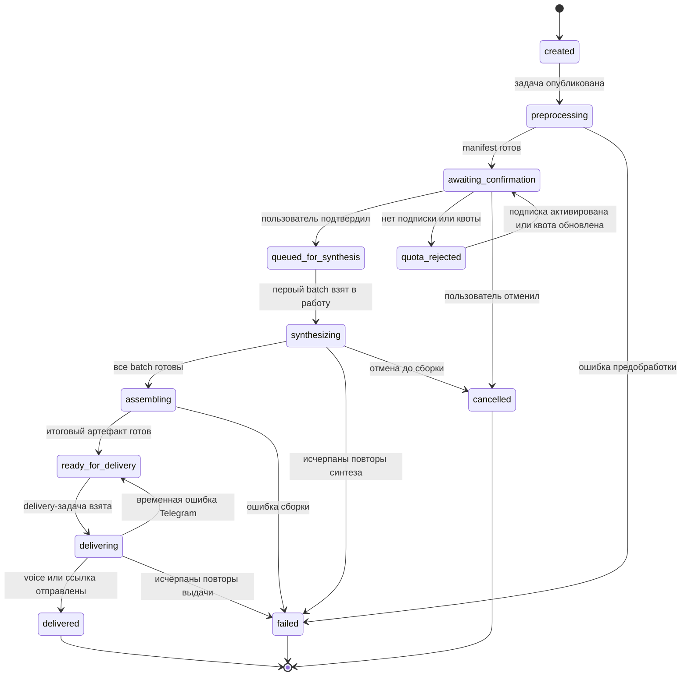
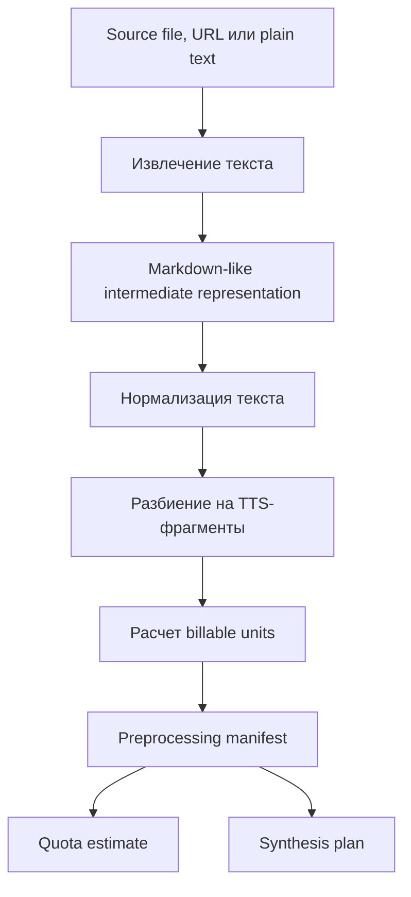

# 06. Сценарии и потоки

## Создание задания и получение результата

## Подписка и отписка

## Жизненный цикл задания

## Поток предобработки текста

## Правила повторов

- Повторное сообщение из RabbitMQ должно сверяться с текущим состоянием Job в MongoDB.
- Если стадия уже завершена, worker не должен выполнять ее повторно без явной причины.
- Batch synthesis можно повторять на уровне отдельного batch, если итоговый batch archive не был успешно зафиксирован.
- Assembly запускается только после того, как все ожидаемые batch results зарегистрированы.
- Резервирование недельной квоты выполняется атомарно при подтверждении задания; при окончательном отказе синтеза резерв освобождается или корректируется.
- Повторный webhook платежного провайдера должен обрабатываться идемпотентно по external event id.

## Открытые вопросы

- Нужен ли отдельный статус `partially_failed` для задания с частично готовыми batch results?
- Где хранить историю переходов состояния: внутри Job или отдельной коллекцией событий?
- Снимать ли резерв квоты сразу после сборки результата или после успешной доставки в Telegram?
