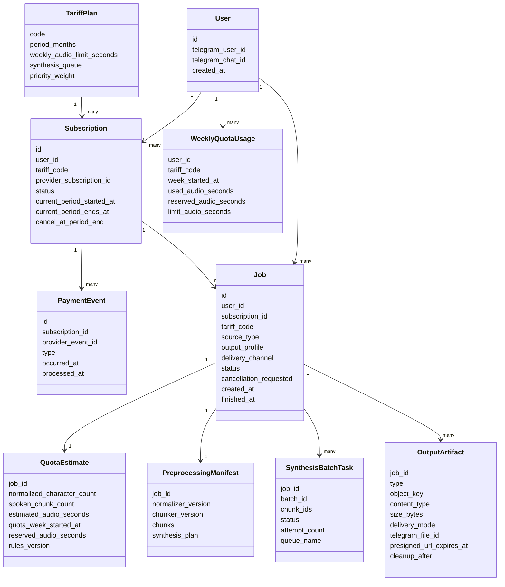

# 07. Данные и хранилища

## Источник истины

MongoDB хранит каноническое состояние задания, пользователя, подписки, платежных событий, недельной квоты, оценки объема, прогресса, delivery mode и ссылок на артефакты. RabbitMQ доставляет работу, но не считается источником истины. S3-совместимое хранилище хранит большие файлы и durable artifacts, которые удаляются cleanup-процессом после 30 дней.

## Основные сущности

## Хранилища

| Хранилище | Что хранит | Почему здесь |
|---|---|---|
| MongoDB | Job, User, TariffPlan, Subscription, PaymentEvent, WeeklyQuotaUsage, QuotaEstimate, progress, delivery mode, artifact references | Гибкая структура состояния и быстрый доступ по job_id/telegram_user_id |
| RabbitMQ | Сообщения о работе между стадиями, очереди `synthesis.standard`, `synthesis.priority` и delivery-задачи | Доставка задач и backpressure между worker и adapter |
| Object storage | Исходники, preprocessing manifest, synthesis batch archives, final artifacts | Большие файлы и артефакты не должны храниться в БД |

## Тарифы и квоты

| Тариф | `weekly_audio_limit_seconds` | `synthesis_queue` | `priority_weight` |
|---|---:|---|---:|
| `basic` | 108000 | `synthesis.standard` | 0.30 |
| `priority` | 216000 | `synthesis.priority` | 0.70 |

`WeeklyQuotaUsage` хранит использованную и зарезервированную длительность аудио на календарную неделю. Подтверждение задания атомарно увеличивает `reserved_audio_seconds`; после успешной сборки система переносит резерв в `used_audio_seconds` или корректирует его по фактической длительности результата.

## Артефакты

| Артефакт | Формат | Назначение |
|---|---|---|
| Source artifact | Оригинальный файл или normalized payload | Повторная обработка и аудит |
| Preprocessing manifest | JSON | Контракт для синтеза и объяснение расчета квоты |
| Synthesis batch archive | tar с WAV и manifest | Результат одного batch synthesis |
| Output artifact | `m4b` или `opus` | Пользовательский результат |
| Telegram voice delivery | `opus`, `telegram_file_id` | Результат до 50 МБ, отправленный как voice message |
| Presigned link delivery | URL, `expires_at` | Результат больше 50 МБ, доступный по ссылке 30 дней |

## Правила хранения

- Chunk texts хранятся внутри preprocessing manifest, а не отдельными объектами.
- WAV используется как промежуточный формат, чтобы assembly не выполнял повторное перекодирование из lossy-формата.
- Final artifact доступен пользователю только после проверки владельца задания.
- Синтез доступен только при активной `Subscription` и достаточном остатке `WeeklyQuotaUsage`.
- `PaymentEvent.provider_event_id` должен быть уникальным, чтобы повторный webhook не менял состояние повторно.
- `SynthesisBatchTask.queue_name` фиксирует очередь, выбранную на момент подтверждения задания, чтобы повторы не меняли тарифную семантику.
- Для результата до 50 МБ `telegram-bot-adapter` отправляет `opus` как Telegram voice message и сохраняет `telegram_file_id` для диагностики повторной выдачи.
- Для результата больше 50 МБ `control-plane-api` создает presigned S3 URL сроком на 30 дней.
- Cleanup удаляет final artifacts и временные batch archives из S3 после 30 дней; MongoDB сохраняет метаданные задания и факт удаления артефакта.
- Удаление пользователя должно учитывать исходники, manifest, batch archives, final artifacts и Telegram delivery metadata.
