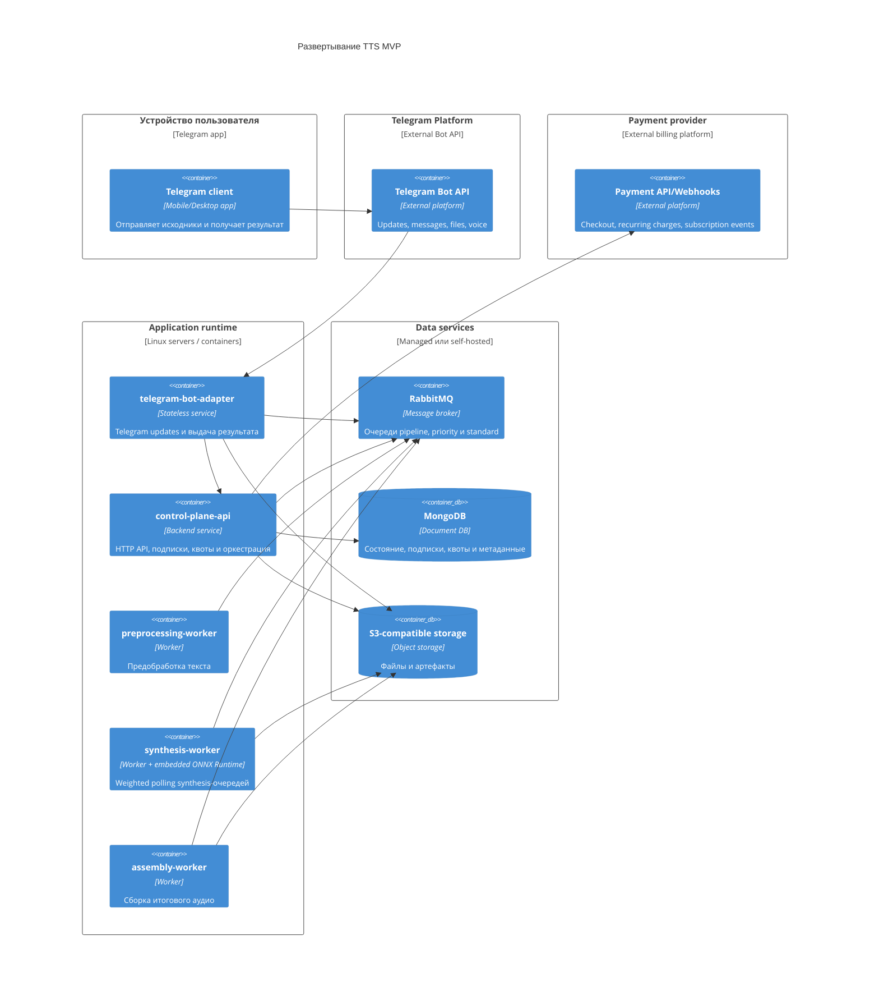

# 08. Развертывание

## Целевая среда MVP

MVP можно развернуть как набор backend-процессов в одной серверной среде или в Kubernetes-подобной среде. Важно, чтобы stateless-процессы API и worker можно было масштабировать независимо, а stateful-компоненты имели надежное хранение данных.

## C4 Deployment

`synthesis-worker` содержит встроенный ONNX Runtime, поэтому отдельный inference runtime не показан как сервис развертывания.

На схеме показаны основные маршруты между узлами развертывания. Назначение связей и протоколы вынесены в таблицу, чтобы не перегружать C4-диаграмму подписями стрелок.

| Откуда | Куда | Протокол | Зачем |
|---|---|---|---|
| `Telegram client` | `Telegram Bot API` | Telegram protocol | Отправка пользователем текста, URL или файла |
| `Telegram Bot API` | `telegram-bot-adapter` | HTTPS webhook или long polling | Доставка updates и callback queries |
| `telegram-bot-adapter` | `control-plane-api` | HTTPS | Создание заданий, подписка, отписка, подтверждение, статусы, параметры выдачи |
| `telegram-bot-adapter` | `RabbitMQ` | AMQP | Получение delivery-задач |
| `telegram-bot-adapter` | `S3-compatible storage` | S3 API | Чтение результата до 50 МБ для отправки voice message |
| `telegram-bot-adapter` | `Telegram Bot API` | HTTPS | Отправка сообщений, voice message и ссылок |
| `control-plane-api` | `Payment API/Webhooks` | HTTPS | Создание и отмена месячных подписок, прием webhook-событий |
| `control-plane-api` | `MongoDB` | Mongo protocol | Чтение и запись состояния заданий, подписок, квот и платежных событий |
| `control-plane-api` | `RabbitMQ` | AMQP | Публикация команд pipeline и batch-задач в очередь тарифа |
| `control-plane-api` | `S3-compatible storage` | S3 API | Сохранение source и создание presigned URL на 30 дней |
| `preprocessing-worker` | `RabbitMQ` | AMQP | Получение preprocessing-задач и публикация следующей стадии |
| `preprocessing-worker` | `MongoDB` | Mongo protocol | Обновление состояния и quota estimate |
| `preprocessing-worker` | `S3-compatible storage` | S3 API | Чтение исходника и запись manifest |
| `synthesis-worker` | `RabbitMQ` | AMQP | Weighted polling `synthesis.priority` и `synthesis.standard` |
| `synthesis-worker` | `S3-compatible storage` | S3 API | Запись batch archives |
| `assembly-worker` | `RabbitMQ` | AMQP | Получение задачи сборки |
| `assembly-worker` | `S3-compatible storage` | S3 API | Чтение batch archives и запись итогового файла |
| `assembly-worker` | `MongoDB` | Mongo protocol | Фиксация результата и delivery mode |
| `assembly-worker` | `RabbitMQ` | AMQP | Публикация delivery-задачи |

## Масштабирование

- `telegram-bot-adapter` масштабируется горизонтально, потому что состояние хранится в MongoDB, а delivery-задачи доставляет RabbitMQ.
- `control-plane-api` масштабируется горизонтально, потому что состояние хранится в MongoDB.
- `preprocessing-worker` масштабируется по очереди preprocessing-задач.
- `synthesis-worker` масштабируется отдельно, потому что это самая дорогая стадия и может требовать GPU; все worker-процессы используют одинаковую weighted-политику выбора priority/standard очереди.
- `assembly-worker` масштабируется по числу заданий, готовых к сборке.
- MongoDB, RabbitMQ и object storage требуют отдельной стратегии резервного копирования и мониторинга.
- Cleanup-процесс удаляет итоговые артефакты из S3 после 30 дней.

## Конфигурация и секреты

- Строки подключения к MongoDB, RabbitMQ и object storage, Telegram bot token, ключи платежного провайдера и webhook secret передаются через переменные окружения или secret store.
- Ключи доступа к object storage не должны попадать в логи.
- Секреты платежного провайдера и payload webhook-событий не должны попадать в логи без маскирования.
- Конфигурация ONNX Runtime и версии моделей должны быть версионированы, потому что они влияют на воспроизводимость результата.
