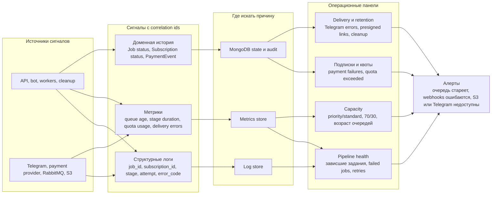

# 09. Надежность и эксплуатация

## Основные принципы

- MongoDB хранит каноническое состояние задания.
- RabbitMQ доставляет задачи, но не является источником истины.
- MongoDB хранит каноническое состояние подписки, тарифов, платежных событий и недельной квоты.
- Worker перед выполнением стадии проверяет текущее состояние Job.
- `telegram-bot-adapter` stateless: при перезапуске он восстанавливает работу по MongoDB и delivery-задачам из RabbitMQ.
- Повторное сообщение должно быть безопасным.
- Повторное webhook-событие платежного провайдера должно быть безопасным и идемпотентным.
- Резервирование недельной квоты выполняется атомарно при подтверждении задания.
- Артефакт считается готовым только после записи в object storage и фиксации ссылки в MongoDB.
- Выдача результата считается завершенной только после успешной отправки voice message или ссылки в Telegram.
- Итоговые артефакты удаляются cleanup-процессом после 30 дней.

## Отказы и реакция

| Отказ | Ожидаемое поведение |
|---|---|
| API упал после записи Job, но до публикации сообщения | Фоновый reconciler или повторная команда должны найти `created` без preprocessing task |
| preprocessing-worker упал во время обработки | Сообщение вернется в очередь или задача будет повторена по состоянию |
| synthesis-worker упал после записи WAV, но до фиксации batch result | Повтор batch должен проверить существование batch archive и состояние batch |
| RabbitMQ временно недоступен | API не должен подтверждать переход, если задача не опубликована или не запланирована на восстановление |
| Очередь `synthesis.priority` пуста | `synthesis-worker` сразу берет задачи из `synthesis.standard`, чтобы capacity не простаивала |
| Очередь `synthesis.standard` растет при постоянной priority-нагрузке | Алерт по возрасту задач и доле выбора очередей; при необходимости временное изменение весов |
| Object storage недоступен | Стадия завершается временной ошибкой и повторяется позже |
| Платежный провайдер временно недоступен при создании подписки | Пользователь получает сообщение о временной ошибке, подписка остается `pending` или не создается |
| Webhook платежного провайдера доставлен повторно | Событие игнорируется по уже обработанному `provider_event_id` |
| Рекурентное списание не прошло | Подписка переводится в неактивное или grace-состояние по правилам провайдера, новые synthesis-задачи не запускаются |
| Два задания одновременно подтверждаются на остаток одной квоты | Только одно атомарное резервирование проходит, второе получает `quota exceeded` |
| Assembly не нашел один batch archive | Задание не переводится в `completed`, ошибка фиксируется для диагностики |
| Telegram Bot API временно недоступен | Delivery-задача повторяется, Job остается готовым к выдаче |
| Отправка voice message не удалась | Adapter повторяет отправку; при исчерпании повторов фиксируется ошибка delivery |
| Presigned URL истек через 30 дней | Пользователь получает сообщение, что артефакт удален по retention policy |
| Cleanup удалил артефакт, но MongoDB не обновилась | Фоновая проверка сверяет S3 и artifact metadata, затем помечает artifact как удаленный |

## Наблюдаемость

Схема показывает минимальную диагностическую цепочку: от runtime и внешних зависимостей до сигналов, хранилищ наблюдаемости, операционных панелей и алертов. Главная идея - все сигналы должны связываться через `job_id`, `subscription_id`, `payment_event_id` и стадию обработки, иначе разбор зависших заданий и платежных ошибок будет ручным и долгим.

## Минимальные метрики

- Количество заданий по статусам.
- Количество подписок по тарифам и статусам.
- Количество платежных webhook-событий по типам и результатам обработки.
- Количество отказов подтверждения из-за отсутствия подписки или превышения квоты.
- Использованная и зарезервированная недельная квота по тарифам.
- Размер очередей по стадиям, включая `synthesis.priority` и `synthesis.standard`.
- Доля выбора priority/standard очереди synthesis-worker и возраст задач в каждой очереди.
- Время preprocessing, synthesis и assembly.
- Количество failed jobs по причинам.
- Количество повторов batch synthesis.
- Количество успешных и ошибочных Telegram delivery.
- Доля выдачи через `telegram_voice` и `presigned_link`.
- Количество удаленных cleanup-процессом артефактов.
- Размер object storage по типам артефактов.

## Минимальные логи

- `job_id`, `user_id`, `stage`, `status`, `attempt`, `error_code`.
- `subscription_id`, `tariff_code`, `payment_event_id`, `quota_week`, `quota_reserved_seconds` без платежных реквизитов.
- Переходы состояния Job.
- Переходы состояния Subscription и результаты обработки webhook-событий.
- Начало и завершение каждой worker-стадии.
- Начало и результат delivery-задачи без содержимого пользовательского текста и без полного presigned URL.
- Начало и результат cleanup по artifact id.
- Ошибки внешних зависимостей.

## Открытые вопросы

- Нужен ли отдельный reconciler в MVP или достаточно ручной команды восстановления?
- Сколько попыток повторов допустимо для каждой стадии?
- Сколько попыток отправки в Telegram допустимо до перевода delivery в failed?
- Нужно ли хранить полный audit trail переходов состояния?
- Нужен ли grace period после неуспешного рекурентного списания?
