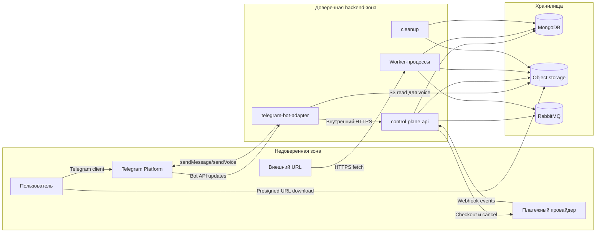

# 10. Безопасность

## Защищаемые данные

- Исходные файлы пользователя.
- Нормализованный текст и preprocessing manifest.
- Итоговые аудиофайлы.
- Telegram user id, chat id и данные учетной записи.
- Данные подписки, тариф, остаток недельной квоты и платежные события.
- Telegram bot token, presigned S3 URL, ключи доступа к MongoDB, RabbitMQ, object storage, ключи платежного провайдера и webhook secret.

## Границы доверия

## Базовые правила безопасности MVP

- Каждый Job принадлежит конкретному пользователю.
- В MVP пользователь связывается с Job через `telegram_user_id` и `telegram_chat_id`.
- Любой доступ к статусу, оценке и артефактам проверяет `user_id`.
- Любая подписка и недельная квота привязаны к `user_id`; пользователь не может управлять чужой подпиской.
- Webhook платежного провайдера проверяется по подписи, времени события и уникальному external event id.
- Система не хранит номера карт и другие платежные реквизиты, только идентификаторы подписки и события у провайдера.
- Подтверждение задания атомарно проверяет активную подписку и резервирует недельную квоту.
- Presigned S3 URL выдается только после проверки владельца и живет 30 дней.
- Cleanup удаляет итоговые артефакты из S3 после 30 дней.
- Исходные URL нужно валидировать, чтобы снизить риск SSRF.
- В логи нельзя писать содержимое исходного текста, полный manifest, Telegram bot token, полный presigned URL, платежные данные и секреты.
- Worker не должен принимать произвольные команды от пользователя напрямую.
- `telegram-bot-adapter` должен проверять, что callback query относится к Job того же Telegram-пользователя.

## Угрозы первой итерации

| Угроза | Мера снижения |
|---|---|
| Пользователь получает чужой аудиофайл | Проверка владельца перед выдачей ссылки |
| Пользователь подтверждает чужое задание через callback query | Проверка `telegram_user_id` перед изменением состояния |
| Вредоносный URL при загрузке статьи | Валидация схемы, запрет внутренних адресов, таймауты |
| Утечка исходного текста через логи | Структурные логи без пользовательского содержимого |
| Утечка presigned URL через логи | Маскирование ссылок и запрет логирования query string |
| Поддельный webhook платежного провайдера активирует подписку | Проверка подписи webhook, timestamp и allowlist endpoint |
| Повторный webhook повторно продлевает подписку или меняет квоту | Уникальность `provider_event_id` и идемпотентная обработка |
| Пользователь пытается отменить чужую подписку | Проверка `telegram_user_id`, `user_id` и `subscription_id` |
| Пользователь обходит недельную квоту параллельными подтверждениями | Атомарное резервирование квоты в MongoDB |
| Повторное подтверждение задания | Идемпотентный переход состояния в MongoDB |
| Компрометация Telegram bot token, ключей object storage или платежного провайдера | Секреты вне кода, ротация ключей, минимальные права |
| Слишком долгое хранение пользовательского аудио | Retention 30 дней и cleanup в S3 |

## Открытые вопросы

- Нужна ли изоляция заданий на уровне отдельных bucket/prefix?
- Нужно ли хранить исходники меньше 30 дней, если итог уже доставлен?
- Нужны ли разные роли кроме пользователя и администратора?
- Требуется ли отдельный audit log для платежных операций и изменений подписки?
