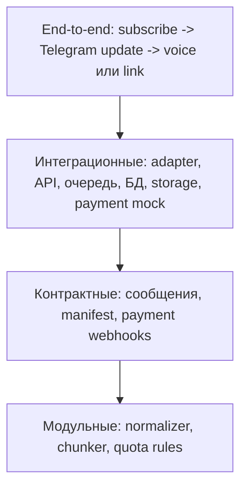

# 11. Тестирование

## Стратегия

Тестирование строится вокруг pipeline, подписок, квот и Telegram delivery. Самые дешевые и стабильные проверки должны покрывать нормализацию текста, chunking и доменные правила. Интеграционные тесты проверяют взаимодействие adapter, API, MongoDB, RabbitMQ, object storage, Telegram Bot API mock и payment provider mock. Реальные ONNX-модели по возможности заменяются fake runtime, чтобы тесты оставались быстрыми.

## Тестовая пирамида

## Что тестируем

| Уровень | Что проверяет |
|---|---|
| Unit | Нормализация чисел, дат, ссылок, пунктуации, языковых переключений, chunking invariants, quota rules |
| Golden | Стабильное преобразование входного текста в preprocessing manifest |
| Contract | Формат сообщений RabbitMQ, структура manifest, batch result manifest, webhook payload платежного провайдера |
| Integration | Переходы Job, подписки, квоты, запись артефактов, публикация задач, delivery-задачи, повторные сообщения |
| E2E | Полный сценарий с Telegram Bot API mock, payment provider mock, fake ONNX Runtime и fake assembly output |
| Failure tests | Недоступность storage, Telegram Bot API, платежного провайдера, повтор webhook, повтор batch, падение worker, отмена задания |

## Критичные проверки MVP

- Preprocessing manifest воспроизводим для одинакового входа и конфигурации.
- Quota estimate считается из нормализованных фрагментов.
- Подписка становится активной только после валидного webhook-события платежного провайдера.
- Повторный webhook не меняет состояние повторно.
- Отписка через Telegram-бота отменяет подписку у провайдера и меняет локальный статус.
- Нельзя начать synthesis до `awaiting_confirmation`, подтверждения пользователя, активной подписки и успешного резервирования недельной квоты.
- Недельные лимиты работают отдельно для базового тарифа 30 часов и приоритетного тарифа 60 часов.
- Параллельные подтверждения заданий не могут превысить недельную квоту.
- Batch-задачи базового тарифа публикуются в `synthesis.standard`, приоритетного - в `synthesis.priority`.
- `synthesis-worker` выбирает очереди по правилу 70/30 и не простаивает при пустой priority-очереди.
- Повторное сообщение не создает дублирующие batch results.
- Пользователь не может получить чужой artifact.
- Assembly не завершает Job, если отсутствует хотя бы один batch archive.
- Telegram update создает Job с корректным `telegram_user_id` и `telegram_chat_id`.
- Результат до 50 МБ отправляется через `sendVoice`.
- Результат больше 50 МБ отправляется как ссылка на presigned S3 URL.
- Presigned S3 URL создается со сроком жизни 30 дней.
- Cleanup удаляет итоговые артефакты из S3 после 30 дней и помечает metadata.

## Открытые вопросы

- Какие golden datasets нужны для русскоязычных и англоязычных текстов?
- На каком этапе подключать реальные ONNX Runtime integration tests?
- Нужны ли нагрузочные тесты в рамках учебного MVP?
- Как проверять статистическое распределение 70/30 без нестабильных flaky-тестов?
