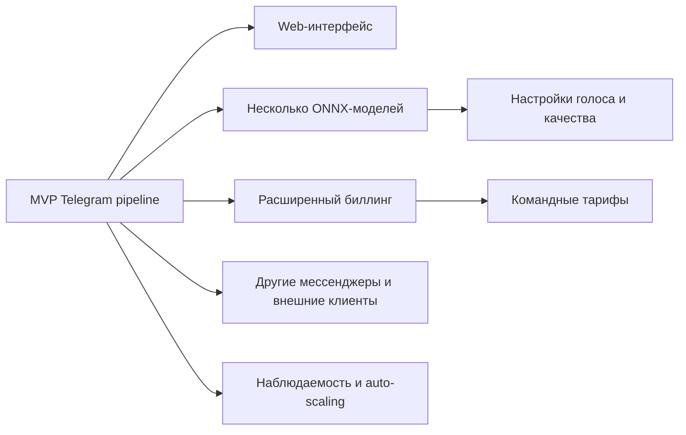

# 12. Риски и развитие

## Риски

| Риск | Вероятность | Влияние | Мера снижения |
|---|---|---|---|
| Нормализация текста дает неестественную речь | Высокая | Высокое | Golden tests, словари, ручной анализ примеров |
| Встроенный ONNX Runtime медленный или нестабильный | Средняя | Высокое | Batch retries, отдельное масштабирование synthesis-worker, очередь |
| Стоимость хранения аудио растет быстрее ожиданий | Средняя | Среднее | Retention policy, архивирование, удаление временных batch artifacts |
| Сложность асинхронного pipeline выше возможностей MVP | Средняя | Среднее | Минимальный набор статусов, fake ONNX Runtime, короткие сценарии |
| Ошибки в расчетах недельной квоты | Средняя | Высокое | Manifest как источник расчета, версии правил, тесты |
| Ошибка рекурентного списания или webhook обработки | Средняя | Высокое | Идемпотентные webhooks, статусы подписки, мониторинг платежных ошибок |
| Пользователь превышает недельную квоту из-за гонки подтверждений | Низкая | Высокое | Атомарное резервирование quota usage |
| Приоритетная очередь вытесняет обычную при высокой нагрузке | Средняя | Среднее | Веса 70/30, метрики возраста задач, возможность менять веса |
| URL article extraction нестабилен | Высокая | Среднее | Ограничить поддержку сайтов или вынести как экспериментальную функцию |
| Telegram Bot API недоступен или меняет лимиты | Средняя | Высокое | Delivery retries, очередь delivery-задач, fallback на presigned link |
| Пользователь открывает ссылку после cleanup | Средняя | Среднее | Явно показывать срок 30 дней в сообщении со ссылкой |

## Ограничения MVP

- Нет полноценного web-интерфейса.
- Нет корпоративных тарифов, промокодов, ручных счетов и возвратов.
- Нет пользовательского редактора произношения.
- Нет гарантированного качества для всех входных форматов и языков.
- Нет автоматического масштабирования GPU как обязательного требования.
- Нет поддержки мессенджеров, кроме Telegram.

## План развития

## Что стоит пересмотреть позже

- Нужно ли оставаться на MongoDB при усложнении транзакционной модели.
- Нужен ли отдельный workflow engine вместо ручной оркестрации через состояния и очереди.
- Нужно ли выделять ONNX Runtime в отдельный сервис с собственным API.
- Как долго хранить исходники и промежуточные WAV.
- Нужно ли давать пользователю ручное продление presigned URL до cleanup.
- Нужны ли отдельные worker pools вместо weighted polling при росте доли приоритетных пользователей.
- Нужен ли grace period после неуспешного рекурентного списания.
- Какие языки и входные форматы поддерживать официально.

## Следующая итерация документации

- Выбрать конкретного платежного провайдера и описать формат webhook-событий.
- Расписать формат `PreprocessingManifest` и `SynthesisBatchResult`.
- Добавить sequence-диаграмму отмены задания.
- Добавить ADR по выбору формата промежуточного аудио.
- Добавить ADR по Telegram delivery и retention policy.
- Добавить runbook для зависших заданий.
