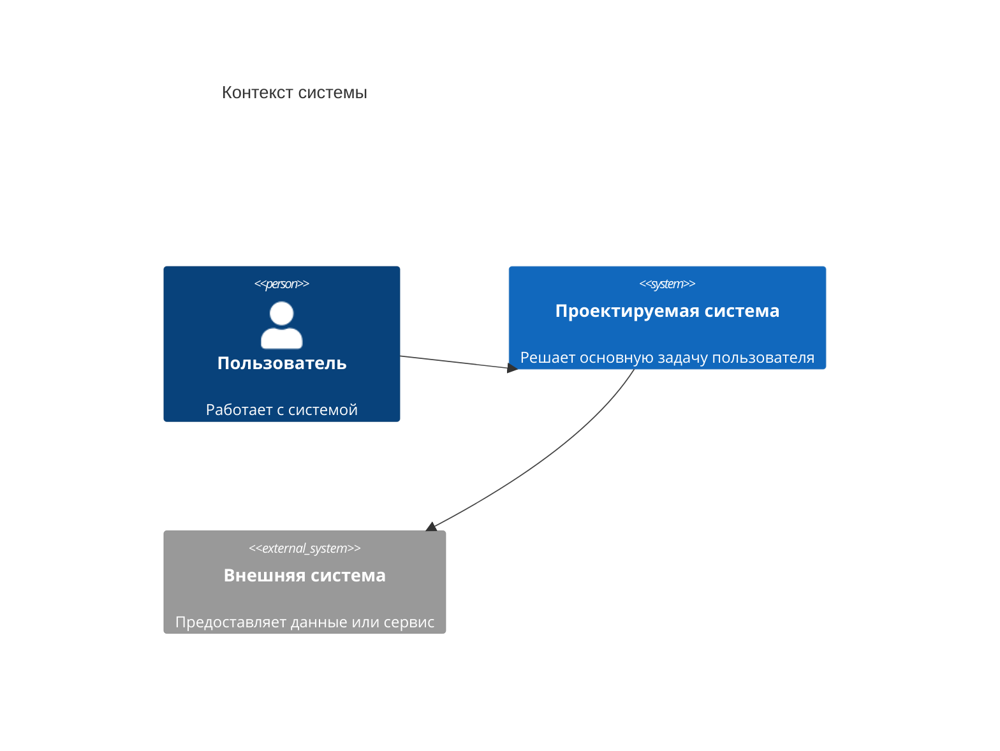

# 02. Контекст и границы

## Цель раздела

Показать систему в окружении: пользователи, внешние сервисы, источники данных, каналы доставки и границы ответственности. Это защищает архитектуру от расползания и помогает понять, что система делает сама, а на что опирается.

## Что нужно описать

- Пользователей и внешних акторов.
- Внешние системы и сервисы.
- Входы и выходы системы.
- Основные потоки данных через границу системы.
- Что находится внутри границ системы.
- Что считается внешней зависимостью.
- Какие интеграции входят в MVP, а какие оставлены на будущее.

## Вопросы для проработки

- Кто инициирует работу системы?
- Какие внешние системы нужны для ключевого сценария?
- Какие данные входят в систему и выходят из нее?
- Где проходит граница ответственности вашей команды?
- Какие внешние зависимости могут отказать?
- Какие внешние системы входят в MVP, а какие являются будущим расширением?
- Какие связи лучше показать в таблице, а не перегружать ими схему?
- Какие интеграции не нужны в MVP?

## Рекомендуемые схемы

Используйте C4 Context. На контекстной схеме показывайте только пользователей, проектируемую систему и внешние системы. Если подписи стрелок становятся длинными, оставьте на схеме короткие связи, а назначение связей вынесите в таблицу под диаграммой.

| Откуда | Куда | Зачем |
|---|---|---|
| Пользователь | Проектируемая система | Выполняет основной сценарий и получает результат |
| Проектируемая система | Внешняя система | Получает данные, отправляет уведомления или вызывает внешний сервис |

## Проверочный список

- Все пользователи и внешние системы названы явно.
- Граница системы понятна по тексту и схеме.
- Нет внутренних компонентов на контекстной диаграмме.
- Внешние зависимости MVP отделены от будущих расширений.
- Под схемой есть таблица связей, если на C4-диаграмме не помещаются детали.
- Указано, какие интеграции входят в MVP.
- Указано, что сознательно оставлено за пределами MVP.

## Типичные ошибки

- Смешивать контекстную диаграмму с внутренней архитектурой.
- Не показывать внешние зависимости.
- Не отделять пользователей от внутренних ролей системы.
- Делать границы настолько широкими, что система начинает отвечать за все.
- Показывать будущие интеграции как уже обязательные зависимости MVP.
