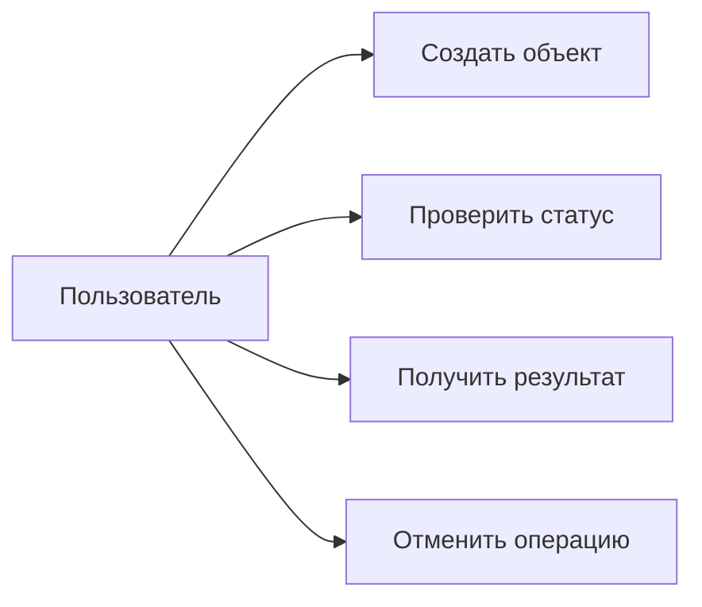

# 03. Требования

## Цель раздела

Зафиксировать, что система должна делать и какими свойствами обладать. Требования должны быть достаточно конкретными, чтобы по ним можно было проверить архитектуру.

## Что нужно описать

- Функциональные требования.
- Нефункциональные требования.
- Ограничения MVP.
- Пользовательские сценарии.
- Ошибочные и альтернативные сценарии.
- Продуктовые правила: тарифы, лимиты, квоты, сроки хранения, политики доступа, если они есть.
- Допущения и открытые вопросы.

## Вопросы для проработки

- Какие операции пользователь должен выполнить в MVP?
- Какие сценарии являются критичными?
- Какие объемы данных ожидаются?
- Какой уровень доступности нужен?
- Какие задержки допустимы?
- Какие ошибки должны быть обработаны явно?
- Что произойдет при повторной отправке запроса?
- Есть ли тарифы, лимиты, квоты или сроки хранения результата?
- Какие ограничения внешних платформ влияют на требования?
- Какие операции должны быть идемпотентными?

## Рекомендуемые схемы

Для верхнеуровневого обзора можно использовать use-case-подобную схему.

## Шаблон таблицы требований

| Код | Требование | Приоритет | Как проверить |
|---|---|---|---|
| FR-001 | Система должна ... | Must | Интеграционный тест / демонстрация сценария |
| NFR-001 | Система должна ... | Should | Нагрузочный тест / расчет / ограничение архитектуры |

## Шаблон таблицы продуктовых правил

| Правило | Значение | Где применяется | Как проверить |
|---|---|---|---|
| Лимит / квота / срок хранения | Например, 30 дней или 100 запросов в неделю | API, worker, cleanup, UI | Unit / integration / E2E test |
| Тариф или режим обслуживания | Например, базовый и приоритетный | Очереди, планировщик, права доступа | Проверка маршрутизации и ограничений |

## Проверочный список

- Требования проверяемы.
- Есть не только счастливые сценарии.
- Нефункциональные требования связаны с архитектурой.
- Лимиты, квоты, сроки хранения и тарифы описаны как проверяемые правила, а не как комментарии.
- Указаны приоритеты.
- Открытые вопросы не замаскированы под факты.

## Типичные ошибки

- Писать требования в стиле "система должна быть удобной" без критерия проверки.
- Забывать про ошибки, отмену, повторы и частичные сбои.
- Не различать требования MVP и будущие возможности.
- Добавлять требования, которые не используются дальше в архитектуре.
- Описывать тарифы, квоты или retention policy в одном разделе и забывать про них в данных, эксплуатации и тестах.
