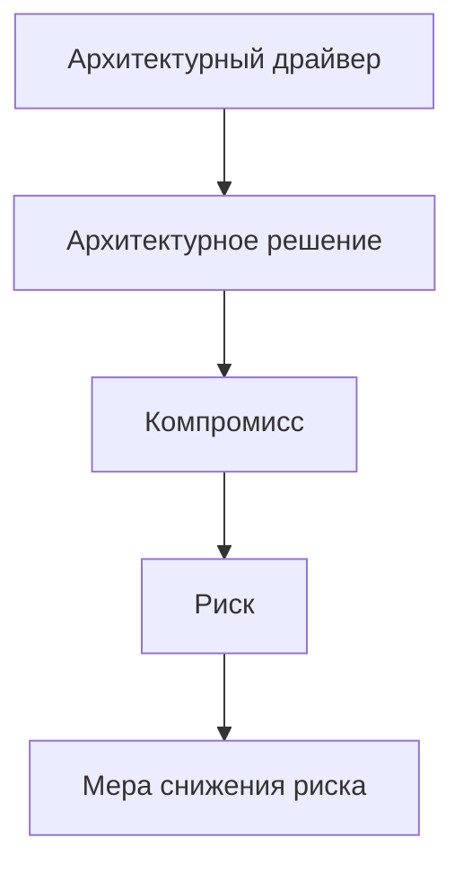

# 04. Архитектурные драйверы

## Цель раздела

Показать, какие требования и ограничения сильнее всего влияют на архитектуру. Драйверы объясняют, почему архитектура получилась именно такой, а не просто перечисляют пожелания.

## Что нужно описать

- Ключевые качества системы: надежность, масштабируемость, безопасность, стоимость, сопровождаемость.
- Ограничения команды, сроков, инфраструктуры и технологий.
- Бизнес-ограничения.
- Продуктовые политики, которые меняют архитектуру: тарифы, приоритеты, квоты, лимиты внешних платформ.
- Компромиссы.
- Решения, которые требуют ADR.

## Вопросы для проработки

- Что сломает продукт, если будет сделано плохо?
- Где ожидается наибольшая нагрузка?
- Какие данные наиболее ценные или чувствительные?
- Какие операции должны быть быстрыми, а какие могут выполняться асинхронно?
- Что дешевле упростить в MVP?
- Какие решения будет сложно изменить позже?
- Какие правила продукта требуют отдельной архитектурной поддержки?
- Какие ограничения внешних систем придется учитывать в архитектуре?

## Шаблон таблицы драйверов

| Драйвер | Почему важен | Влияние на архитектуру | Как проверять |
|---|---|---|---|
| Надежная обработка задач | Потеря задачи недопустима | Нужны состояния, очередь, повторы | Интеграционные тесты отказов |

## Рекомендуемые схемы

Можно использовать простую карту влияния, если она добавляет ясность. Если диаграмма повторяет таблицу драйверов, лучше оставить только таблицу и текст компромиссов.

## Проверочный список

- Драйверы не дублируют все требования подряд.
- Для каждого драйвера понятно влияние на архитектуру.
- Компромиссы названы явно.
- Продуктовые правила с архитектурным влиянием отражены как драйверы или явно отнесены к требованиям.
- Важные решения связаны с ADR.
- Есть критерии проверки.

## Типичные ошибки

- Называть драйвером любую желаемую возможность.
- Не показывать последствия решений.
- Скрывать компромиссы.
- Не объяснять, почему выбранная архитектура соответствует требованиям.
- Оставлять декоративную схему, которая только пересказывает таблицу и ухудшает читаемость.
