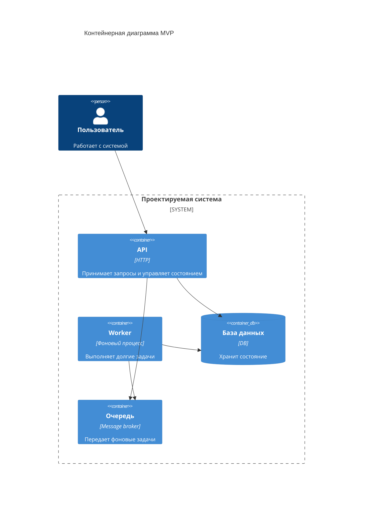
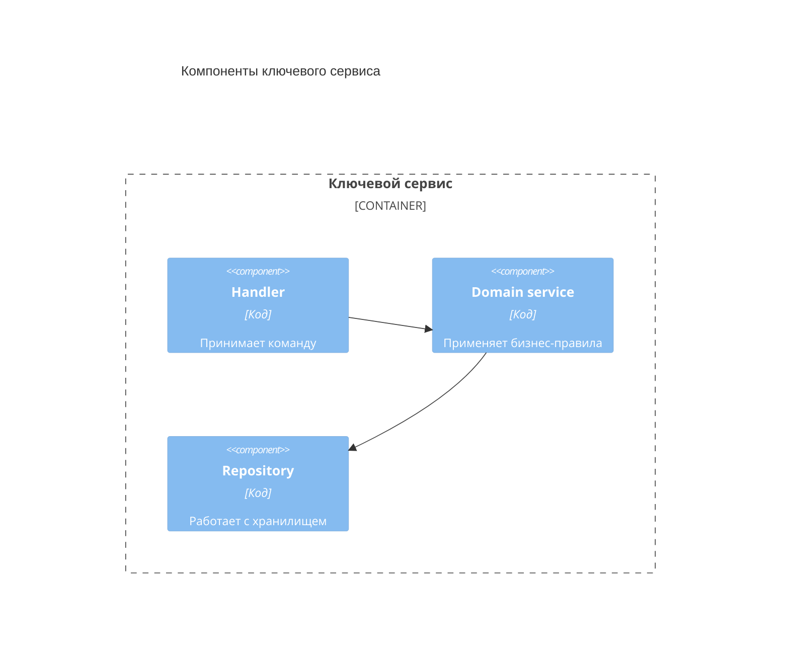

# 05. Архитектура

## Цель раздела

Описать целевую архитектуру MVP: основные приложения, сервисы, хранилища, очереди и границы ответственности. Раздел должен объяснять, как требования превращаются в структуру системы.

## Что нужно описать

- Архитектурный стиль.
- Основные контейнеры системы.
- Ответственность каждого контейнера.
- Внутреннее устройство самого важного контейнера.
- Правила зависимостей.
- Ключевые архитектурные политики: маршрутизация задач, квоты, приоритеты, retry policy, ownership checks, если они важны для системы.
- Что остается монолитом, а что выделяется отдельно.
- Какие решения зафиксированы в ADR.

## Вопросы для проработки

- Какие части системы должны развиваться независимо?
- Где нужна асинхронная обработка?
- Где хранится источник истины?
- Какие компоненты не должны знать друг о друге?
- Какие зависимости допустимы внутри MVP?
- Что можно не разделять в первой версии?
- Какие правила должны выполняться централизованно, а какие можно оставить внутри worker или UI?
- Где проверяются права доступа, квоты, лимиты и идемпотентность?

## Рекомендуемые схемы

Используйте C4 Container для общей структуры.

Если C4 Container перегружается связями, оставьте на схеме только ключевые зависимости без длинных подписей, а детальные протоколы и назначения связей вынесите в таблицу.

| Откуда | Куда | Зачем |
|---|---|---|
| Пользователь | API | Выполняет пользовательские команды |
| API | База данных | Хранит состояние и проверяет права доступа |
| API | Очередь | Публикует фоновые задачи |
| Worker | Очередь | Получает работу и создает backpressure |
| Worker | База данных | Обновляет состояние фоновой обработки |

Для важного контейнера добавьте C4 Component.

| Откуда | Куда | Зачем |
|---|---|---|
| Handler | Domain service | Передает команду в бизнес-логику |
| Domain service | Repository | Сохраняет результат или читает состояние |

## Шаблон ключевых политик

| Политика | Где реализуется | Почему здесь | Как проверить |
|---|---|---|---|
| Проверка владельца объекта | API / domain service | Все пользовательские операции проходят через эту границу | Unit и integration tests |
| Маршрутизация фоновых задач | API / scheduler / worker | Очереди и приоритеты должны быть воспроизводимы | Contract и integration tests |
| Идемпотентность повторов | API и worker | Повтор запроса или сообщения не должен ломать состояние | Тесты отказов |

## Проверочный список

- У каждого контейнера есть четкая ответственность.
- Нет контейнеров без причины.
- Архитектура соответствует требованиям и драйверам.
- Источник истины назван явно.
- Асинхронные границы объяснены.
- Ключевые политики названы и привязаны к конкретным компонентам.
- Сложные решения вынесены в ADR.

## Типичные ошибки

- Рисовать слишком много микросервисов без необходимости.
- Смешивать бизнес-логику, интерфейс и инфраструктуру.
- Не объяснять, почему нужна очередь или отдельный сервис.
- Показывать технологии без ответственности компонентов.
- Прятать важные бизнес-правила в worker-процессах без описания, где они проверяются.
