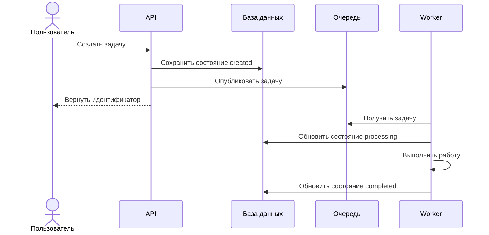
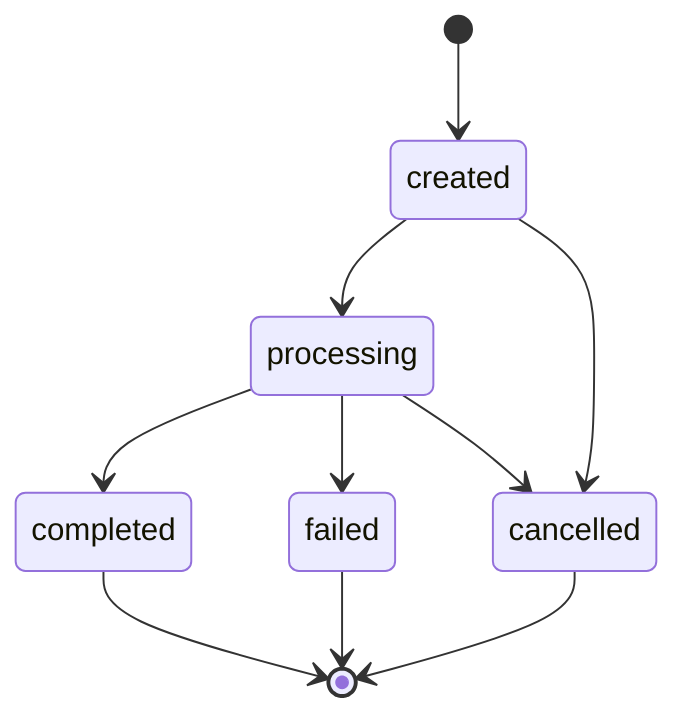

# 06. Сценарии и потоки

## Цель раздела

Показать, как система работает во времени: какие шаги выполняются, какие компоненты взаимодействуют, где меняется состояние и что происходит при ошибках.

## Что нужно описать

- Основные пользовательские сценарии.
- Внутренние технические потоки.
- Асинхронные шаги.
- Внешние асинхронные события: webhooks, callbacks, повторная доставка сообщений, отложенная выдача результата.
- Изменения состояния главных сущностей.
- Ошибочные и альтернативные ветки.
- Правила повторов и идемпотентности.

## Вопросы для проработки

- Что происходит после пользовательского действия?
- Какие операции выполняются синхронно, а какие асинхронно?
- Где создаются и обновляются состояния?
- Что произойдет при повторном запросе?
- Что произойдет, если worker упал посередине задачи?
- Какие шаги можно безопасно повторить?
- Какие внешние события могут прийти повторно или в неожиданном порядке?
- Где резервируются лимиты, квоты или ресурсы, если они есть?

## Рекомендуемые схемы

Используйте sequence diagram для ключевого сценария.

Если сценарий зависит от внешнего webhook или callback, опишите его отдельной sequence-диаграммой или отдельным фрагментом. Не смешивайте пользовательский happy path и обработку внешних событий, если от этого схема становится нечитаемой.

Используйте state diagram для жизненного цикла главной сущности.

## Проверочный список

- Описан хотя бы один полный end-to-end сценарий.
- Есть жизненный цикл главной сущности.
- Указаны ошибочные переходы.
- Асинхронные шаги понятны.
- Внешние webhooks, callbacks и повторные сообщения описаны явно.
- Правила повторов не противоречат состояниям.
- Для критичных переходов понятно, какие проверки выполняются атомарно.

## Типичные ошибки

- Описывать только счастливый путь.
- Не показывать, где меняется состояние.
- Забывать про повторные сообщения и сетевые ошибки.
- Смешивать пользовательский сценарий и внутреннюю реализацию без пояснения.
- Не описывать, что происходит с зарезервированными ресурсами при отмене или окончательном отказе.
