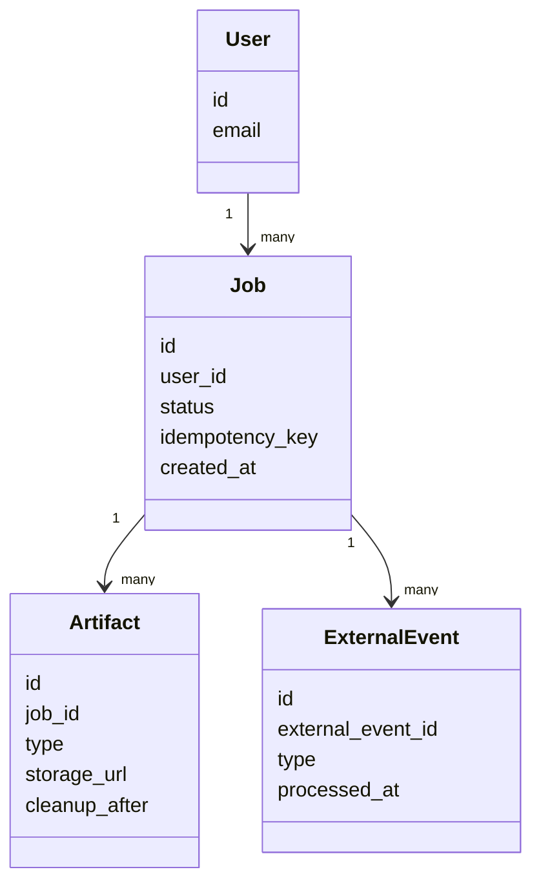

# 07. Данные и хранилища

## Цель раздела

Описать основные данные системы, их жизненный цикл, владельцев, связи и хранилища. Раздел должен показать, какие данные являются источником истины и какие артефакты можно восстановить или пересоздать.

## Что нужно описать

- Основные сущности предметной области.
- Связи между сущностями.
- Хранилища и ответственность каждого хранилища.
- Источник истины.
- Временные и долговременные артефакты.
- Правила хранения, удаления и восстановления.
- Идентификаторы идемпотентности, external event id, audit trail и metadata для cleanup, если система работает с очередями, webhooks или внешними файлами.
- Миграции и совместимость данных.

## Вопросы для проработки

- Какие данные нельзя потерять?
- Какие данные можно пересчитать?
- Где хранится текущее состояние процесса?
- Какие файлы или артефакты создает система?
- Как данные связаны с пользователем?
- Что нужно для аудита или расследования ошибок?
- Как изменится модель данных при развитии системы?
- Какие внешние идентификаторы нужно хранить, чтобы безопасно обрабатывать повторы?
- Какие данные нужны для проверки владельца объекта и выдачи результата?
- Какие артефакты удаляются автоматически и где хранится факт удаления?

## Рекомендуемые схемы

Используйте class diagram или ER-подобную диаграмму.

## Шаблон правил хранения

| Данные или артефакт | Источник истины | Срок хранения | Как удалить или восстановить |
|---|---|---|---|
| Состояние процесса | База данных | Дольше артефактов | Восстановить по audit trail или ручной операции |
| Внешнее событие | База данных | До окончания периода аудита | Нельзя повторно применить из-за `external_event_id` |
| Файл или результат | Object storage | По retention policy | Cleanup удаляет файл, metadata остается |

## Проверочный список

- Главные сущности названы и связаны.
- У каждого хранилища есть назначение.
- Источник истины указан явно.
- Понятно, какие данные долговременные, а какие временные.
- Повторы внешних событий и сообщений поддержаны моделью данных.
- Retention policy отражена в данных, а не только в тексте требований.
- Есть правила обработки ошибок хранения.

## Типичные ошибки

- Рисовать модель данных отдельно от сценариев.
- Не указывать владельца данных.
- Хранить крупные файлы в базе данных без причины.
- Не думать о миграциях и изменении форматов.
- Не хранить external event id и поэтому применять один webhook или сообщение несколько раз.
- Удалять артефакт без сохранения metadata, нужной для диагностики и объяснения пользователю.
