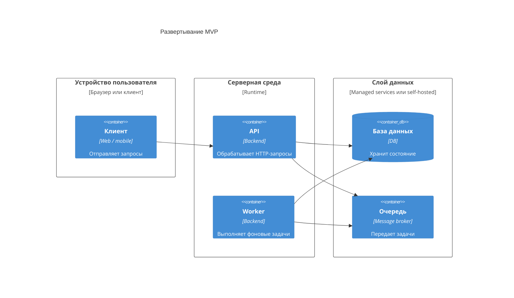

# 08. Развертывание

## Цель раздела

Показать, как целевой MVP будет запущен в реальной среде: какие процессы, узлы, сети, базы, очереди и внешние зависимости нужны для работы системы.

## Что нужно описать

- Целевую среду запуска.
- Развертываемые приложения и фоновые процессы.
- Хранилища, очередь, объектное хранилище, внешние сервисы.
- Сетевые связи.
- Конфигурацию и секреты.
- Масштабирование.
- Какие компоненты stateless, а какие stateful.
- Где находятся внешние платформы и управляемые сервисы.
- Отличия локальной, тестовой и production-среды, если они важны.

## Вопросы для проработки

- Какие процессы нужно запустить для MVP?
- Какие компоненты масштабируются горизонтально?
- Какие компоненты являются stateful?
- Где хранятся секреты?
- Какие порты и протоколы используются?
- Что произойдет при перезапуске worker?
- Как обновлять систему без потери задач?
- Какие компоненты с состоянием нужно визуально отделить от серверной среды?
- Какие протоколы и назначения связей лучше вынести из схемы в таблицу?

## Рекомендуемые схемы

Используйте C4 Deployment. Для читаемости держите пользовательские устройства и внешние платформы отдельно от серверной среды, а компоненты с состоянием отделяйте визуально от процессов без состояния. Если стрелок много, не подписывайте каждую длинным текстом: вынесите протоколы и назначение связей в таблицу.

| Откуда | Куда | Протокол | Зачем |
|---|---|---|---|
| Клиент | API | HTTPS | Пользовательские команды |
| API | База данных | DB protocol | Чтение и запись состояния |
| API | Очередь | Message broker protocol | Публикация фоновых задач |
| Worker | Очередь | Message broker protocol | Получение работы |

## Проверочный список

- Все deployable-компоненты показаны.
- Stateful-компоненты отделены от stateless-компонентов.
- Сетевые связи понятны.
- Компоненты с состоянием не спрятаны внутри серверной среды.
- Протоколы, секреты и назначение связей описаны в таблице, если схема перегружена.
- Описаны секреты и конфигурация.
- Понятно, что нужно для запуска MVP.

## Типичные ошибки

- Путать архитектурную диаграмму с диаграммой развертывания.
- Не показывать инфраструктурные зависимости.
- Не думать о конфигурации и секретах.
- Не объяснять, как масштабируются worker-процессы.
- Делать deployment-схему копией container-схемы без узлов, окружений и stateful-границ.
