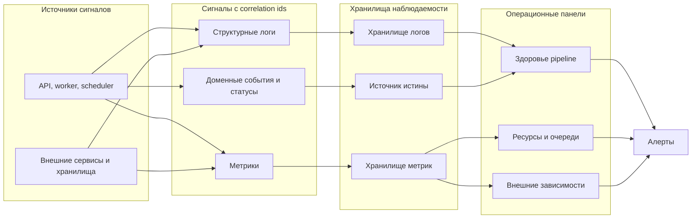

# 09. Надежность и эксплуатация

## Цель раздела

Показать, как система будет работать не только в идеальных условиях: что происходит при сбоях, как выполнять повторы, как наблюдать за системой и как разбирать инциденты.

## Что нужно описать

- Возможные отказы компонентов.
- Повторы, таймауты и идемпотентность.
- Обработка зависших задач.
- Логи, метрики и трассировка.
- Correlation ids для связи логов, метрик, событий и состояния в БД.
- Алерты.
- Резервное копирование и восстановление.
- Ручные действия оператора или разработчика при проблемах.

## Вопросы для проработки

- Что произойдет, если API перезапустится во время запроса?
- Что произойдет, если worker упадет во время обработки?
- Что произойдет, если очередь временно недоступна?
- Как найти зависшую задачу?
- Какие метрики показывают, что система деградирует?
- Какие данные нужно сохранить для расследования ошибки?
- По каким идентификаторам оператор найдет все события одного процесса?
- Какие панели нужны отдельно для pipeline, внешних зависимостей, очередей, квот или delivery?

## Рекомендуемые схемы

Покажите диагностическую цепочку: источники сигналов, типы сигналов, хранилища наблюдаемости, панели и алерты. Схема должна объяснять, как искать причину инцидента, а не просто говорить, что «будут логи».

## Минимальный набор сигналов

| Тип сигнала | Что включить | Зачем |
|---|---|---|
| Логи | `request_id`, `job_id`, `user_id`, `stage`, `attempt`, `error_code` | Разбор одного сбоя по цепочке вызовов |
| Метрики | Размер и возраст очередей, длительность стадий, число ошибок, повторы | Раннее обнаружение деградации |
| Доменные события | Переходы статусов, внешние события, ручные операции | Восстановление истории процесса |

## Проверочный список

- Для ключевых отказов описана реакция системы.
- Есть правила повторов.
- Есть признаки зависших задач.
- Описаны базовые метрики и логи.
- Понятно, какие correlation ids связывают логи, метрики и состояние.
- Операционные панели связаны с конкретными решениями оператора.
- Понятно, как восстановиться после сбоя.

## Типичные ошибки

- Считать, что все операции всегда завершаются успешно.
- Не учитывать повторную доставку сообщений.
- Не проектировать идемпотентность.
- Ограничиться фразой "будут логи" без конкретики.
- Рисовать схему наблюдаемости, где все компоненты просто указывают на один прямоугольник "логи".
