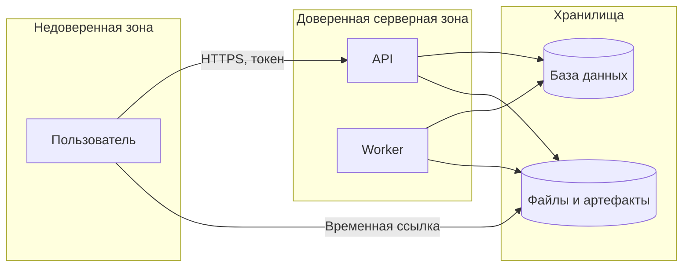

# 10. Безопасность

## Цель раздела

Описать, какие данные и операции нужно защищать, кто имеет доступ к системе, где проходят границы доверия и какие угрозы важны для MVP.

## Что нужно описать

- Пользователей и роли.
- Аутентификацию и авторизацию.
- Владение данными.
- Защиту файлов и артефактов.
- Секреты и конфигурацию.
- Внешние входы и валидацию.
- Все пересечения границ доверия: пользовательские запросы, webhooks, callbacks, прямой доступ к файлам по временным ссылкам.
- Основные угрозы и меры снижения риска.

## Вопросы для проработки

- Какие данные нельзя показать другому пользователю?
- Какие операции требуют авторизации?
- Какие входные данные могут быть вредоносными?
- Где хранятся секреты?
- Как ограничивается доступ к файлам?
- Какие внешние сервисы получают пользовательские данные?
- Что логировать нельзя?
- Есть ли прямой доступ пользователя к object storage или внешним файлам?
- Какие временные ссылки, токены и webhook secrets нужно защищать?

## Рекомендуемые схемы

Используйте схему потоков данных и границ доверия.

## Проверочный список

- Есть список защищаемых данных.
- Описаны роли и права.
- Понятно, как проверяется доступ к объектам.
- На схеме показаны все потоки через границы доверия, включая временные ссылки на файлы.
- Секреты не хранятся в коде.
- Внешние входы валидируются.
- Указано, какие данные нельзя писать в логи.

## Типичные ошибки

- Описывать безопасность только как "нужен JWT".
- Не проверять владение объектами.
- Давать прямые публичные ссылки на приватные файлы без контроля доступа.
- Логировать чувствительные данные.
- Не показывать на security-схеме прямой download/upload путь, если он идет мимо API.
