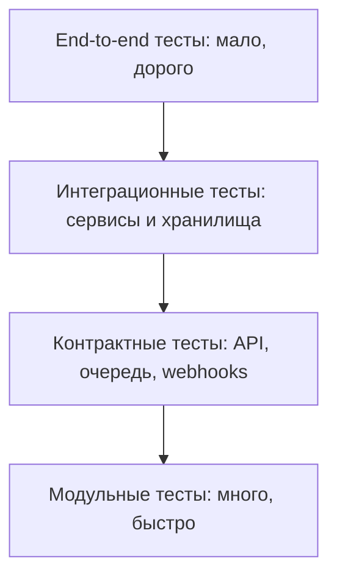

# 11. Тестирование

## Цель раздела

Показать, как проверять архитектуру и реализацию: от маленьких модульных тестов до интеграционных сценариев, контрактов, нагрузочных проверок и ручной приемки MVP.

## Что нужно описать

- Модульные тесты.
- Интеграционные тесты.
- Контрактные тесты между сервисами.
- Тесты сценариев end-to-end.
- Тесты отказов и повторов.
- Контрактные тесты для сообщений очередей, webhook-событий, callback payload и внешних API.
- Проверки идемпотентности, конкурентных операций и прав доступа.
- Нагрузочные проверки.
- Что проверяется вручную.

## Вопросы для проработки

- Какие правила можно проверить модульно?
- Какие границы требуют интеграционных тестов?
- Какие внешние сервисы нужно заменять фейками?
- Какие сценарии должны проходить перед релизом?
- Как проверить идемпотентность?
- Как проверить, что данные пользователя не доступны другому пользователю?
- Какие внешние сервисы нужно заменить mock или fake-реализацией?
- Какие конкурентные сценарии могут сломать квоты, лимиты или состояние?
- Какие проверки должны запускаться часто, а какие достаточно запускать перед релизом?

## Рекомендуемые схемы

Можно показать тестовую пирамиду.

## Шаблон матрицы критичных проверок

| Область | Что проверить | Тип проверки |
|---|---|---|
| Доменное правило | Расчет лимита, квоты, цены, доступности операции | Unit |
| Сообщение или webhook | Формат, подпись, версия, идемпотентность | Contract |
| Инфраструктурная граница | База, очередь, object storage, внешний API mock | Integration |
| Отказ | Повтор сообщения, падение worker, timeout внешнего сервиса | Failure test |
| Права доступа | Пользователь не получает чужие данные или файл | Integration / E2E |

## Проверочный список

- Для ключевых требований есть способ проверки.
- Тесты не зависят от недоступных внешних сервисов без необходимости.
- Есть проверки ошибок и повторов.
- Есть contract tests для очередей, webhooks и внешних API.
- Есть проверки конкурентных операций, если система резервирует лимиты, квоты или ресурсы.
- Есть стратегия тестовых данных.
- Понятно, какие тесты запускаются часто, а какие реже.

## Типичные ошибки

- Ограничиться ручной проверкой интерфейса.
- Не тестировать отказ внешних зависимостей.
- Не проверять контракты сообщений и API.
- Делать end-to-end тесты единственным способом проверки.
- Проверять только happy path и не проверять повторную доставку webhook или сообщения.
