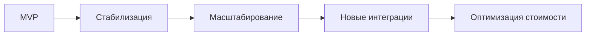

# 12. Риски и развитие

## Цель раздела

Честно зафиксировать риски, ограничения MVP, технический долг и возможные направления развития. Хорошая архитектура не скрывает проблемы, а показывает, какие из них осознаны и как с ними работать.

## Что нужно описать

- Главные технические и продуктовые риски.
- Операционные риски: внешние платформы, очереди, лимиты, стоимость хранения, ручное восстановление.
- Ограничения MVP.
- Корнер-кейсы, которые требуют проверки.
- Возможный технический долг.
- План развития.
- Решения, которые могут быть пересмотрены.

## Вопросы для проработки

- Что может оказаться самым сложным при реализации?
- Какие требования пока основаны на допущениях?
- Какие части архитектуры сложнее всего изменить?
- Какие внешние зависимости несут риск?
- Что будет первым узким местом при росте нагрузки?
- Какие функции можно добавить после MVP без полной переработки архитектуры?
- Какие внешние лимиты или тарифы могут изменить поведение системы?
- Что будет сигналом, что архитектурное решение пора пересмотреть?

## Рекомендуемые схемы

Используйте матрицу рисков или дорожную карту.

## Шаблон таблицы рисков

| Риск | Вероятность | Влияние | Мера снижения |
|---|---|---|---|
| Внешний сервис недоступен | Средняя | Высокое | Повторы, очередь, деградация сценария |
| Лимит внешней платформы меняется | Средняя | Среднее | Явно хранить лимиты в требованиях и тестировать fallback |
| Стоимость хранения растет быстрее ожиданий | Средняя | Среднее | Retention policy, cleanup, метрики объема данных |
| Приоритетный режим вытесняет обычный | Низкая | Среднее | Метрики возраста очередей и возможность менять веса |

## Шаблон решений для пересмотра

| Решение | Когда пересмотреть | Что смотреть |
|---|---|---|
| Выбранная БД или очередь | Рост нагрузки, сложные транзакции, частые ручные восстановления | Метрики отказов, сложность поддержки, стоимость |
| Граница сервисов | Компонент часто меняется отдельно или мешает масштабированию | Частота изменений, bottleneck, инциденты |
| Политика хранения | Стоимость или требования приватности меняются | Объем storage, обращения к старым артефактам |

## Проверочный список

- Риски конкретны и связаны с системой.
- Для важных рисков есть меры снижения.
- MVP не выдается за финальный продукт.
- План развития не противоречит текущей архитектуре.
- Есть условия пересмотра ключевых решений.
- Операционные и продуктовые риски не спрятаны в открытых вопросах.
- Технический долг назван явно.

## Типичные ошибки

- Писать, что рисков нет.
- Указывать только организационные риски и забывать технические.
- Не связывать риски с архитектурными решениями.
- Планировать развитие, которое ломает текущую модель без объяснения.
- Не указывать сигнал, по которому станет понятно, что риск начал реализовываться.
