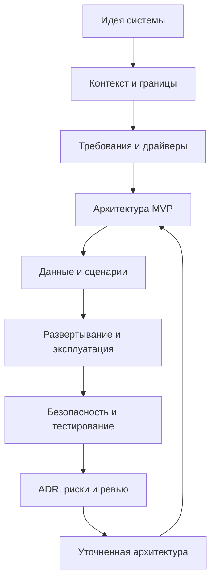

# Шаблон курсовой работы

Этот каталог содержит структуру архитектурной документации, которую студент адаптирует под свою систему. Документы можно копировать в свой проект и постепенно заполнять по мере уточнения идеи, требований и архитектурных решений.

Курсовая работа описывает целевую архитектуру MVP. Работающий код на момент подготовки может отсутствовать. Главное - показать, что автор понимает будущую систему, ее границы, сценарии, данные, риски и условия эксплуатации.

## Как пользоваться шаблоном

1. Сначала заполните разделы `01-04`: описание системы, контекст, требования и архитектурные драйверы.
2. Затем сделайте первый вариант архитектуры в `05-08`: контейнеры, основные потоки, данные и развертывание.
3. После этого добавьте эксплуатационные разделы `09-12`: надежность, безопасность, тестирование, риски и развитие.
4. Все существенные решения фиксируйте в `adr/`.
5. Используйте LLM-агента для критики, поиска противоречий и уточнения корнер-кейсов, но не передавайте ему ответственность за решения.

## Разделы

- [00. Как писать с LLM-агентом](00-как-писать-с-llm-агентом.md)
- [01. Описание системы](01-описание-системы.md)
- [02. Контекст и границы](02-контекст-и-границы.md)
- [03. Требования](03-требования.md)
- [04. Архитектурные драйверы](04-архитектурные-драйверы.md)
- [05. Архитектура](05-архитектура.md)
- [06. Сценарии и потоки](06-сценарии-и-потоки.md)
- [07. Данные и хранилища](07-данные-и-хранилища.md)
- [08. Развертывание](08-развертывание.md)
- [09. Надежность и эксплуатация](09-надежность-и-эксплуатация.md)
- [10. Безопасность](10-безопасность.md)
- [11. Тестирование](11-тестирование.md)
- [12. Риски и развитие](12-риски-и-развитие.md)
- [ADR](adr/README.md)

## Правила оформления

- Пишите короткими инженерными формулировками.
- Отделяйте факты от допущений.
- Размещайте Mermaid-схемы прямо в Markdown-разделах рядом с текстом.
- После изменения Mermaid-схемы проверяйте локальный рендер, особенно для C4-диаграмм; если рендер невозможен, явно укажите причину.
- Не дублируйте одну и ту же информацию в нескольких местах без необходимости.
- Если C4-схема становится перегруженной, переносите протоколы, назначения связей и ограничения в таблицу под схемой.
- Если решение влияет на архитектуру, стоимость, надежность, безопасность или сроки разработки, оформляйте ADR.
- Если есть неопределенность, явно пишите, как ее планируется проверить.

## Итерации

## Минимальный набор диаграмм

- C4 Context - кто взаимодействует с системой и какие внешние системы важны.
- C4 Container - основные приложения, сервисы, хранилища и очереди.
- C4 Component - внутреннее устройство самого важного сервиса.
- Sequence diagram - один или два ключевых пользовательских сценария.
- State diagram - жизненный цикл главной сущности.
- Class или ER diagram - основные данные и связи.
- C4 Deployment - целевое развертывание MVP.

## Финальная проверка перед сдачей

- Mermaid-схемы рендерятся без ошибок.
- Названия компонентов, внешних систем, статусов и сущностей одинаковы во всех разделах.
- Контекст, требования, архитектура, данные, развертывание, безопасность и тестирование не противоречат друг другу.
- Для каждого сложного решения есть ADR или явное объяснение в разделе архитектуры.
- Открытые вопросы отделены от принятых решений.
